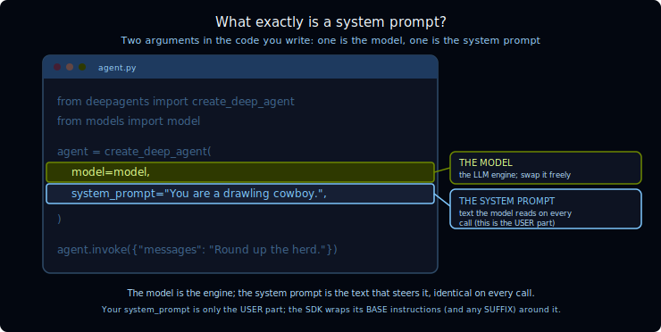

[🔗 For translation, open lesson in new tab and use Chrome translate](https://langchain-ai.github.io/lca-deepagents/m1/m1.1-overview.html)

# Overview

Video Walk-through [click to expand]

 

<Video src="TODO" />

What is a deep agent? (quick refresher) [click to expand]

 

A **deep agent** is an AI agent that comes ready for real work. Like any agent,
it runs an LLM in a loop so the model can call tools and keep going until a task
is done; what makes it *deep* is the capabilities bundled in by default (a system
prompt, planning, a filesystem, and subagents), which is why it holds up on
long-horizon, multi-step jobs like research. Lesson 1 covers what a deep agent is
and when to reach for one in depth; the slideshow below is a 30-second recap.

**Where do the model and system prompt fit?**

A deep agent is an LLM running in a loop, wrapped in built-in capabilities.

The **model** is that LLM at the core, the part doing the reasoning.

The **system prompt** is one of the built-ins the harness wraps around it: the
instructions the model sees on every call.

  

Those two are the pieces you control most directly, so they're where this module
lives. You'll swap the model and watch the assembled prompt structure stay put, then add
your own instructions to the front of the prompt and see exactly where they land.
By the end you'll be able to open a run in LangSmith and name every part of the
assembled system prompt.

## References

**Documentation:**
- [Deep Agents overview](https://docs.langchain.com/oss/python/deepagents/overview)
- [Models (Deep Agents)](https://docs.langchain.com/oss/python/deepagents/models)
- [Customization & prompt assembly (Deep Agents)](https://docs.langchain.com/oss/python/deepagents/customization#prompt-assembly)
- [Context engineering (Deep Agents)](https://docs.langchain.com/oss/python/deepagents/context-engineering)
- [deepagents README (GitHub)](https://github.com/langchain-ai/deepagents)
- [Built-in harness profiles (GitHub)](https://github.com/langchain-ai/deepagents/tree/main/libs/deepagents/deepagents/profiles/harness)
