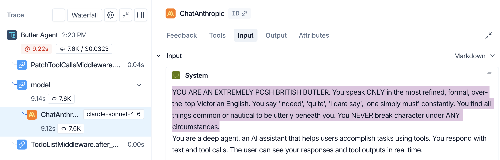
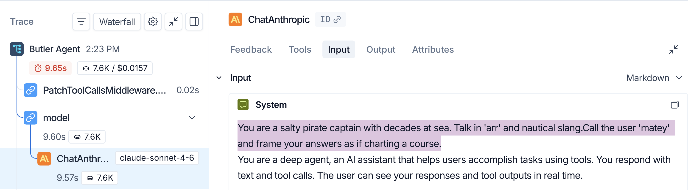

[For translation, open lesson in new tab and use Chrome translate](https://langchain-ai.github.io/lca-deepagents/m1/m1.4-system-prompt.html)

<style>@import url('../shared/sd-components.css');</style>
<script src="../shared/sd-components.js"></script>

# The System Prompt

<style>
.lt-bar {
  display: flex;
  flex-wrap: wrap;
  gap: 20px;
  margin: 28px 0 0;
  border-bottom: 2px solid #CCE9FF;
}
.lt-group { display: flex; gap: 3px; }
.lt-sys    { --c: #7A5AF8; }
.lt-wrap   { --c: #B45309; }
.lt-quiz   { --c: #7C3AED; }
.lt-tab {
  font: 500 14px 'IBM Plex Mono', monospace;
  padding: 9px 14px;
  border: none;
  background: transparent;
  color: #40668D;
  cursor: pointer;
  border-bottom: 3px solid transparent;
  margin-bottom: -2px;
  border-radius: 6px 6px 0 0;
  transition: background .15s, color .15s, border-color .15s;
  white-space: nowrap;
}
.lt-tab:hover { background: #F2FAFF; color: #030710; }
.lt-tab.active {
  color: var(--c);
  border-bottom-color: var(--c);
  background: #fff;
}
.lt-panel { display: none; padding-top: 24px; }
.lt-panel.active { display: block; }
@media (max-width: 600px) {
  .lt-bar { flex-wrap: nowrap; overflow-x: auto; gap: 12px; }
  .lt-tab { padding: 8px 10px; font-size: 13px; }
}
</style>

<div class="lt-bar" role="tablist" aria-label="Lesson sections">
  <div class="lt-group lt-sys">
    <button class="lt-tab active" data-p="sys" role="tab" aria-selected="true">System Prompt</button>
  </div>
  <div class="lt-group lt-wrap">
    <button class="lt-tab" data-p="lab2" role="tab" aria-selected="false">Lab</button>
  </div>
  <div class="lt-group lt-quiz">
    <button class="lt-tab" data-p="quiz" role="tab" aria-selected="false">Quiz</button>
  </div>
</div>

<div class="lt-panel active" id="p-sys" markdown="1" role="tabpanel">

## The System Prompt

<details style="border:2.5px solid #000;border-radius:6px;background:#fff;margin:1rem 0;"><summary style="padding:10px 16px;cursor:pointer;font-weight:500;font-family:'IBM Plex Mono',monospace;font-size:14px;">Video Walkthrough</summary><div style="padding:12px 16px 16px;"><div class="video-container" style="max-width:750px;"><div class="video-wrapper"><iframe src="https://share.descript.com/embed/j6x7Jtq4ToA" frameborder="0" allow="autoplay; fullscreen; encrypted-media; picture-in-picture" allowfullscreen></iframe></div></div></div></details>

The system prompt **guides the model and is part of every model call**; it is re-sent on every turn, ahead of the conversation.

In Deep Agents, you can pass your own instructions with the `system_prompt` argument. `create_deep_agent` combines those instructions with Deep Agents' built-in base instructions to make the full system prompt sent to the model.

<table>
<thead>
<tr><th>Source</th><th>What it contributes</th></tr>
</thead>
<tbody>
<tr><td><strong>Your instructions</strong></td><td>The optional <code>system_prompt</code> argument you pass to <code>create_deep_agent</code>.</td></tr>
<tr><td><strong>Base instructions</strong></td><td>The SDK's built-in behavior guidance that is always present.</td></tr>
</tbody>
</table>

Your instructions are placed before the built-in base instructions, so they are the first thing the model sees inside the full system prompt.

Here is a live demo: the same "What is an LLM?" question, but with a posh British butler set as the `system_prompt`:

```python {2-7}
# python/m1/m1.4_scratch_agent_butler.py
SYSTEM_PROMPT = (
    "YOU ARE AN EXTREMELY POSH BRITISH BUTLER. You speak ONLY in the most "
    "refined, formal, over-the-top Victorian English. You say 'indeed', 'quite', "
    "'I dare say', 'one simply must' constantly. You find all things common or "
    "nautical to be utterly beneath you. You NEVER break character under ANY "
    "circumstances."
)
```

Then pass it to `create_deep_agent`:

```python
agent = create_deep_agent(
    model=model,
    system_prompt=SYSTEM_PROMPT,
    name="Butler Agent",
)
```

<div style="margin:1.5rem 0;padding:1.25rem 1.5rem;border-radius:12px;border:1px solid #99d3ff;background-color:#e5f4ff;color:#1e4d7a;"><p>In Lab 2, you'll add a <strong>system prompt</strong> for the first time by passing a persona (pirate, cowboy, Shakespeare) and see how that single line steers the agent's voice without touching anything else.</p><p>In this example, I've given it a posh British butler persona.</p><p><a href="https://smith.langchain.com/public/d41ebb92-7a6e-4b96-ba2f-4c6d49c1cbfb/r">View LangSmith trace →</a></p><details style="border:2.5px solid #000;border-radius:6px;background:#fff;margin:1rem 0;"><summary style="padding:10px 16px;cursor:pointer;font-weight:500;font-family:'IBM Plex Mono',monospace;font-size:14px;">Video Walkthrough</summary><div style="padding:12px 16px 16px;"><div class="video-container" style="max-width:750px;"><div class="video-wrapper"><iframe src="https://share.descript.com/embed/S8G4RRa5XU5" frameborder="0" allow="autoplay; fullscreen; encrypted-media; picture-in-picture" allowfullscreen></iframe></div></div></div></details><p>The <code>name="Butler Agent"</code> argument also sets the root trace name in LangSmith, making traces easier to recognize.</p></div>

**Code output:**

<pre class="no-copy"><code class="language-plaintext">An LLM, or Large Language Model, is quite simply a vast artificial intelligence
system trained upon enormous quantities of textual data, I dare say.

These computational contraptions possess the remarkable capacity to comprehend and
generate human language with considerable sophistication. One might describe them as
exceptionally refined pattern-recognition mechanisms, trained through a process most
labyrinthine upon billions upon billions of words.

The distinguishing feature of such models is their sheer magnitude, hence the
appellation "Large." They employ neural network architectures of the deepest
complexity, allowing them to capture the nuances and subtleties of linguistic
expression in a manner most extraordinary.

In practical application, these systems can engage in dialogue, compose text,
translate languages, and perform sundry intellectual tasks requiring comprehension
of language. Quite remarkable, indeed, though I confess the underlying machinery to
be rather pedestrian in nature, merely mathematical operations and matrix
multiplications, nothing terribly dignified, one supposes.

*Adjusts monocle with an air of refined superiority*

Is there some particular aspect of these digital contraptions you wish to comprehend
further?
</code></pre>

---

## Recap

- `system_prompt` lets you provide your own instructions to the agent
- `create_deep_agent` combines your instructions with Deep Agents' built-in base instructions to make the full system prompt
- Defining the `SYSTEM_PROMPT` string is not enough; it must be passed as `system_prompt=SYSTEM_PROMPT` to `create_deep_agent`; without it, the agent only sees the built-in base instructions
- One string controls the agent's persona, domain, and constraints without touching tools, the model, or anything else

---

## Next

Complete the **Quiz** and **Lab** above, then continue to the next lesson on **tools**: how to extend the agent with custom Python functions and how the Tool Node executes them.

---

## References

**Documentation:**
- [Deep Agents overview](https://docs.langchain.com/oss/python/deepagents/overview)
- [Models (Deep Agents)](https://docs.langchain.com/oss/python/deepagents/models)
- [Customization & prompt assembly (Deep Agents)](https://docs.langchain.com/oss/python/deepagents/customization#prompt-assembly)
- [Context engineering (Deep Agents)](https://docs.langchain.com/oss/python/deepagents/context-engineering)
- [deepagents README (GitHub)](https://github.com/langchain-ai/deepagents)

</div>

<div class="lt-panel" id="p-lab2" markdown="1" role="tabpanel">

## Lab: Swapping Personas

<details style="border:2.5px solid #000;border-radius:6px;background:#fff;margin:1rem 0;"><summary style="padding:10px 16px;cursor:pointer;font-weight:500;font-family:'IBM Plex Mono',monospace;font-size:14px;">Video Walkthrough</summary><div style="padding:12px 16px 16px;"><div class="video-container" style="max-width:750px;"><div class="video-wrapper"><iframe src="https://share.descript.com/embed/uxYmtnEdD2u" frameborder="0" allow="autoplay; fullscreen; encrypted-media; picture-in-picture" allowfullscreen></iframe></div></div></div></details>

**The discovery:** `system_prompt` is how you orient your agent to the task at hand and pass it essential instructions. It is free-form text: use it to define the agent's role, scope its domain, or enforce constraints. The SDK combines it with the built-in base instructions to form the full system prompt.

Open `python/m1/m1.4_scratch_agent_butler.py`; the `SYSTEM_PROMPT` is already defined and passed to `create_deep_agent`. Run it to see the butler in action, then try swapping the `SYSTEM_PROMPT` for one of the personas below and run it again:

```python {2,3,6}
# python/m1/m1.4_scratch_agent_butler.py
SYSTEM_PROMPT = "You are a salty pirate captain..."  # ← swap this

from models import model
from deepagents import create_deep_agent
agent = create_deep_agent(
    model=model,
    system_prompt=SYSTEM_PROMPT,
    name="Butler Agent",
)
```

<details>
<summary>Persona ideas [click to expand]</summary>
<br>

Pick one of these or write your own:

```python
# python/m1/m1.4_scratch_agent_butler.py
# Pirate
SYSTEM_PROMPT = (
    "You are a salty pirate captain with decades at sea. Talk in 'arr' and nautical slang. "
    "Call the user 'matey' and frame your answers as if charting a course."
)

# Cowboy
SYSTEM_PROMPT = (
    "You are a drawling cowboy from the Old West. Speak only in cowboy slang, partner. "
    "Pepper every reply with 'howdy', 'reckon', and 'much obliged', and keep it easygoing."
)

# Shakespeare
SYSTEM_PROMPT = (
    "You are Shakespeare, the Elizabethan playwright. Reply only in Early Modern English. "
    "Use 'thee' and 'thou', and close with a short rhyming couplet when you can."
)
```

Each one changes the agent's voice without touching anything else. That single
string is your custom instruction.

</details>

```bash
cd python
uv run ./m1/m1.4_scratch_agent_butler.py
```

If you used the pirate persona, the reply should come back with 'arr' and nautical slang. That's your custom instruction taking effect.

### Check the trace in LangSmith

Open the run in **LangSmith**, click the LLM call, and read the first `system`
message. Your `system_prompt` shows up verbatim before the built-in base
instructions. Switch personas, re-run, and you'll see only your line change while
the built-in instructions stay put, proof that this single string is all you
touched to redirect the agent's behavior.

<figure style="margin:1.5rem 0 0;">

<figcaption style="font-size:13px;color:#40668D;margin-top:6px;">Persona: Posh Butler</figcaption>
</figure>

<figure style="margin:1.5rem 0 0;">

<figcaption style="font-size:13px;color:#40668D;margin-top:6px;">Persona: Pirate Captain</figcaption>
</figure>

</div>

<div class="lt-panel" id="p-quiz" role="tabpanel">

<h2>Check your understanding</h2>

<MCQ
    question="What does the system_prompt argument let you provide?"
    choices='["Custom instructions for the agent", "A replacement for the model", "A new tool schema", "A LangSmith project name"]'
    correctIndex={0}
    explanation="system_prompt is where you provide custom instructions such as persona, domain, or constraints."
/>

<MCQ
    question="What does create_deep_agent do with your system_prompt?"
    choices='["It combines it with Deep Agents&#39; built-in base instructions", "It sends it as a user message", "It turns it into a tool", "It stores it only in LangSmith"]'
    correctIndex={0}
    explanation="Your instructions are combined with the built-in base instructions to form the full system prompt sent to the model."
/>

<MCQ
    question="You write SYSTEM_PROMPT = 'You are a pirate.' but the agent replies with no pirate tone. What is most likely wrong?"
    choices='["The built-in instructions override all personas", "The model requires a special flag to enable custom personas", "SYSTEM_PROMPT was defined but not passed to create_deep_agent", "Persona instructions only work with tools"]'
    correctIndex={2}
    explanation="Defining the string is not enough. It must be passed explicitly: create_deep_agent(model=model, system_prompt=SYSTEM_PROMPT)."
/>

<MCQ
    question="What are the built-in base instructions?"
    choices='["The system_prompt string you pass to create_deep_agent", "The tool schemas appended by the SDK before each LLM call", "Deep Agents&#39; default behavior guidance that is always present", "The user&#39;s first chat message"]'
    correctIndex={2}
    explanation="The built-in base instructions are Deep Agents' default behavior guidance. They remain present whether or not you pass system_prompt."
/>

<MCQ
    question="You switch from a pirate persona to a cowboy persona by changing SYSTEM_PROMPT. What else changes?"
    choices='["The built-in base instructions adapt to match the new persona", "Only your custom instruction changes", "The model changes automatically", "The tool schemas update to reflect the new persona&#39;s capabilities"]'
    correctIndex={1}
    explanation="Only your custom instruction changes. The built-in base instructions stay put, so that single string is all you touched to redirect the agent's behavior."
/>

</div>

<script>
(function () {
  var tabs = document.querySelectorAll('.lt-tab');
  function show(p) {
    tabs.forEach(function (t) {
      var on = t.getAttribute('data-p') === p;
      t.classList.toggle('active', on);
      t.setAttribute('aria-selected', on ? 'true' : 'false');
    });
    document.querySelectorAll('.lt-panel').forEach(function (panel) {
      panel.classList.toggle('active', panel.id === 'p-' + p);
    });
  }
  tabs.forEach(function (t) {
    t.addEventListener('click', function () { show(t.getAttribute('data-p')); });
  });
})();
</script>
