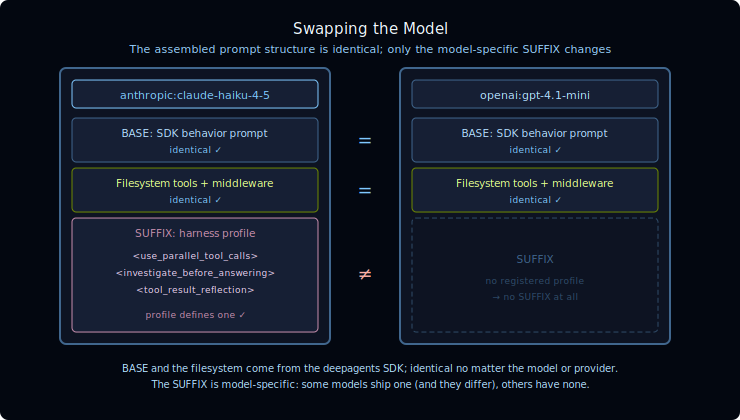

[🔗 For translation, open lesson in new tab and use Chrome translate](https://langchain-ai.github.io/lca-deepagents/m1/m1.l3-models.html)

<style>@import url('../shared/sd-components.css');</style>
<script src="../shared/sd-components.js"></script>

# Models & the Base Prompt

<style>
.lt-bar {
  display: flex;
  flex-wrap: wrap;
  gap: 20px;
  margin: 28px 0 0;
  border-bottom: 2px solid #CCE9FF;
}
.lt-group { display: flex; gap: 3px; }
.lt-models { --c: #0E9F6E; }
.lt-wrap   { --c: #B45309; }
.lt-tab {
  font: 500 14px 'IBM Plex Mono', monospace;
  padding: 9px 14px;
  border: none;
  background: transparent;
  color: #40668D;
  cursor: pointer;
  border-bottom: 3px solid transparent;
  margin-bottom: -2px;
  border-radius: 6px 6px 0 0;
  transition: background .15s, color .15s, border-color .15s;
  white-space: nowrap;
}
.lt-tab:hover { background: #F2FAFF; color: #030710; }
.lt-tab.active {
  color: var(--c);
  border-bottom-color: var(--c);
  background: #fff;
}
.lt-panel { display: none; padding-top: 24px; }
.lt-panel.active { display: block; }
@media (max-width: 600px) {
  .lt-bar { flex-wrap: nowrap; overflow-x: auto; gap: 12px; }
  .lt-tab { padding: 8px 10px; font-size: 13px; }
}
</style>

<div class="lt-bar" role="tablist" aria-label="Lesson sections">
  <div class="lt-group lt-models">
    <button class="lt-tab active" data-p="models" role="tab" aria-selected="true">Models</button>
  </div>
  <div class="lt-group lt-wrap">
    <button class="lt-tab" data-p="lab1" role="tab" aria-selected="false">Lab 1</button>
  </div>
</div>

<div class="lt-panel active" id="p-models" markdown="1" role="tabpanel">

## Models: Use Any Provider

Every lab gets its model from a single shared file, **`python/models.py`**. It
exports a `model` object built with `init_chat_model(...)`, and the lab scripts
simply do `from models import model`. To use a different model or provider, edit
*that one file*, commenting out the active line and uncommenting another:

```python
# python/models.py
model = init_chat_model("anthropic:claude-haiku-4-5")   # workshop default, fast & cheap
# model = init_chat_model("anthropic:claude-sonnet-4-6")
# model = init_chat_model("openai:gpt-4.1-mini")
# model = init_chat_model("openai:gpt-4.1")
```

Anthropic and OpenAI work out of the box. Azure, Bedrock, and Google need an
extra install (`uv sync --extra azure|bedrock|google`) and a few env vars; see
the notes at the top of `models.py`.

Head to **Lab 1** to run this yourself and see how the output changes across models.

</div>

<div class="lt-panel" id="p-lab1" markdown="1" role="tabpanel">

## Lab 1: Models & the Base System Prompt

Run your scratch agent (the file you created in the previous lesson) if you haven't already:

<RunCode>
:::python
```bash
uv run ./python/m1/scratch_agent.py
```
:::
</RunCode>

Now **switch the model in `python/models.py`** (comment the current line for
Haiku and uncomment another line for the model you want to use) and run it
again, so you have two runs to compare.

<RunCode>
:::python
```bash
uv run ./python/m1/scratch_agent.py
```
:::
</RunCode>

The SDK (Software Development Kit) wraps the same base instructions and file tools around every model; the model itself still determines how it responds.

Here are two real responses to "What is an LLM?", one from each model:

<div style="display:flex;gap:20px;align-items:flex-start;margin:1.5rem 0;">

<details style="flex:1;border:1px solid #e5e7eb;border-radius:8px;padding:0.75rem 1rem;">
<summary style="cursor:pointer;font-weight:600;font-family:'Monaco','Courier New',monospace;font-size:0.875em;list-style:none;">▶ claude-haiku-4-5</summary>
<div style="margin-top:1rem;">
<p>An LLM (Large Language Model) is a type of artificial intelligence system trained on vast amounts of text data to predict and generate human language.</p>
<p><strong>Key characteristics:</strong></p>
<ul>
<li><strong>Scale</strong>: Contains billions to hundreds of billions of parameters (learnable weights), which is why they're "large"</li>
<li><strong>Training</strong>: Learns patterns from massive text datasets using transformer-based neural networks</li>
<li><strong>Capability</strong>: Can perform tasks like answering questions, writing, summarizing, translating, coding, and reasoning</li>
<li><strong>Generative</strong>: Produces text one word (or "token") at a time, based on patterns learned during training</li>
<li><strong>Context-aware</strong>: Maintains understanding of conversation history and context within a session</li>
</ul>
<p><strong>Common examples</strong>: ChatGPT, Claude, Gemini, Llama, and Mistral are all LLMs.</p>
<p>LLMs don't truly "understand" in the human sense; they're sophisticated pattern-matching systems that are remarkably effective at tasks requiring language comprehension and generation.</p>
</div>
</details>

<details style="flex:1;border:1px solid #e5e7eb;border-radius:8px;padding:0.75rem 1rem;">
<summary style="cursor:pointer;font-weight:600;font-family:'Monaco','Courier New',monospace;font-size:0.875em;list-style:none;">▶ claude-sonnet-4-6</summary>
<div style="margin-top:1rem;">
<p>An <strong>LLM (Large Language Model)</strong> is a type of AI model trained on massive amounts of text data to understand and generate human language.</p>
<p><strong>Key characteristics:</strong></p>
<ul>
<li><strong>Scale</strong>: Billions of parameters, trained on hundreds of billions of words</li>
<li><strong>Architecture</strong>: Based on the Transformer architecture (attention mechanisms)</li>
<li><strong>Training</strong>: Self-supervised learning, predicting the next token in a sequence</li>
<li><strong>Capabilities</strong>: Text generation, summarization, translation, reasoning, code writing, Q&amp;A, and more</li>
</ul>
<p><strong>How they work (briefly):</strong></p>
<ol>
<li>Text is broken into <strong>tokens</strong> (words or subwords)</li>
<li>The model learns statistical patterns across massive corpora</li>
<li>At inference time, it predicts the most likely next token given context</li>
<li>This repeats to generate coherent, contextually relevant output</li>
</ol>
<p><strong>Examples:</strong></p>
<table>
<thead><tr><th>Model</th><th>Creator</th></tr></thead>
<tbody>
<tr><td>GPT-4</td><td>OpenAI</td></tr>
<tr><td>Claude</td><td>Anthropic</td></tr>
<tr><td>Gemini</td><td>Google</td></tr>
<tr><td>LLaMA</td><td>Meta</td></tr>
<tr><td>Mistral</td><td>Mistral AI</td></tr>
</tbody>
</table>
</div>
</details>

</div>

<hr style="border:none;border-top:1px solid #e5e7eb;margin:2rem 0;" />

Both models received the same starting message before they ever saw your question, assembled by the SDK, not by you. That pre-built message is the scaffolding: the behavior rules and file tools Deep Agents injects automatically, identical regardless of which model you pick.

<Image src="images/m1.l3-scaffolding.svg" width="740px" alt="LangSmith-style view of what the model receives: a system message assembled by the SDK (Core Behavior, Professional Objectivity, Doing Tasks, and more) followed by the user's question. The system section is identical for every model; only the engine reading it changes." />

Different model, different output style, but same scaffolding. Haiku answers
directly; Sonnet structures its response with headers, numbered steps, and a
comparison table. **That's the model's character, not the SDK's.**

<div style="margin:1.5rem 0;padding:1.25rem 1.5rem;border-radius:12px;border:1px solid #99d3ff;background-color:#e5f4ff;color:#1e4d7a;display:flex;gap:1.25rem;align-items:flex-start;">

<div>
<p style="margin:0 0 0.5rem;">LangChain's model-agnostic design means you can swap in whatever fits your needs:</p>
<ul style="margin:0;padding-left:1.2rem;">
<li>a cheaper model to cut costs</li>
<li>an open-source model for privacy</li>
<li>a more capable one for complex reasoning</li>
</ul>
</div>
</div>

**The discovery:** Deep Agents always injects a BASE system prompt and a
filesystem backend automatically, *regardless of what arguments you pass*. The
key insight is that these come from the **SDK**, not the model provider, so
swapping the model leaves the scaffolding identical. The details of what the
SDK injects and why are covered in the next lesson; for now, just observe that
the scaffolding doesn't change when you swap models.

<p align="center">
  
</p>

### Check the trace in LangSmith

Open both runs in **LangSmith**, click the LLM call, and compare the first
`system` message and the tool list:

- The **BASE prompt** and the **file tools** are identical. That's the SDK
  scaffolding, and it doesn't care which model you picked.
- The one part that tracks the model is the **SUFFIX**: `claude-haiku-4-5` and
  `claude-sonnet-4-6` each ship one (and they differ), while `gpt-4.1-mini` has
  no registered profile, so it shows no SUFFIX at all.

<Tip>

**Swapping providers.** The default in `models.py` uses Anthropic so the lab
runs with just `ANTHROPIC_API_KEY`. To see the scaffolding survive a *provider*
change, set `OPENAI_API_KEY` and uncomment the `openai:gpt-4.1-mini` line. The
BASE prompt and file tools won't budge; only the model-specific SUFFIX does.

</Tip>

</div>

## References

**Documentation:**
- [Deep Agents overview](https://docs.langchain.com/oss/python/deepagents/overview)
- [Models (Deep Agents)](https://docs.langchain.com/oss/python/deepagents/models)
- [Customization & prompt assembly (Deep Agents)](https://docs.langchain.com/oss/python/deepagents/customization#prompt-assembly)
- [Context engineering (Deep Agents)](https://docs.langchain.com/oss/python/deepagents/context-engineering)
- [deepagents README (GitHub)](https://github.com/langchain-ai/deepagents)
- [Built-in harness profiles (GitHub)](https://github.com/langchain-ai/deepagents/tree/main/libs/deepagents/deepagents/profiles/harness)

<script>
(function () {
  var tabs = document.querySelectorAll('.lt-tab');
  function show(p) {
    tabs.forEach(function (t) {
      var on = t.getAttribute('data-p') === p;
      t.classList.toggle('active', on);
      t.setAttribute('aria-selected', on ? 'true' : 'false');
    });
    document.querySelectorAll('.lt-panel').forEach(function (panel) {
      panel.classList.toggle('active', panel.id === 'p-' + p);
    });
  }
  tabs.forEach(function (t) {
    t.addEventListener('click', function () { show(t.getAttribute('data-p')); });
  });
})();
</script>
