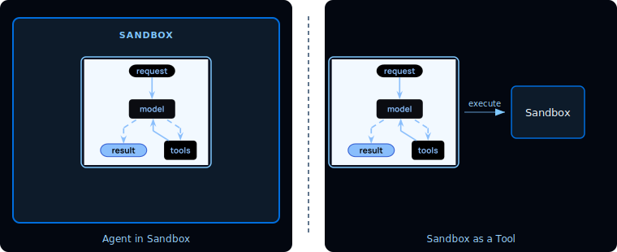
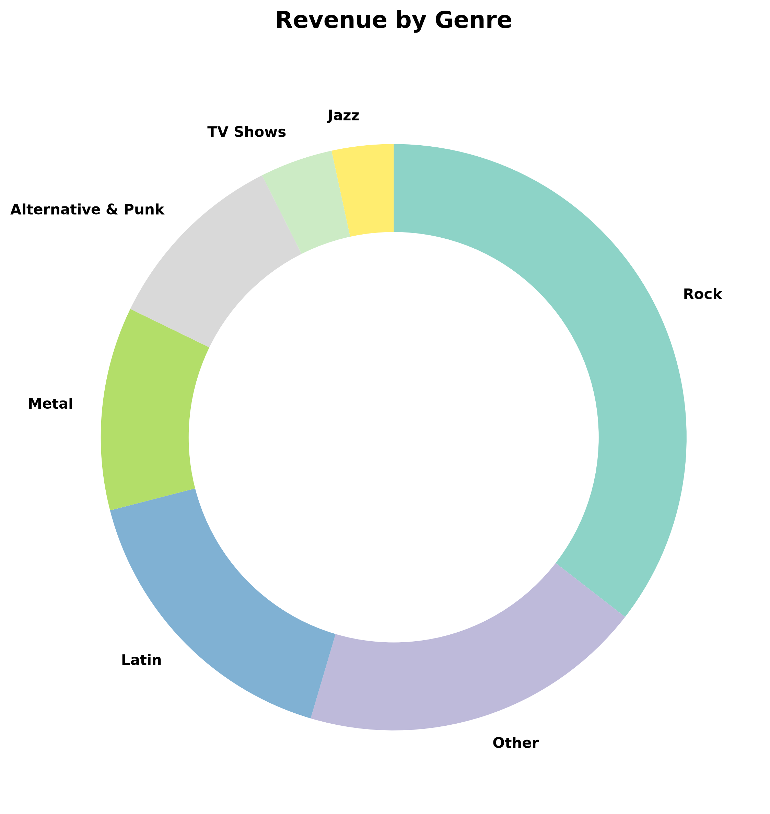

[🔗 For translation, open lesson in new tab and use Chrome translate](https://langchain-ai.github.io/lca-deepagents/m2/m2.3-execution-backends.html)

<style>@import url('../shared/sd-components.css');</style>
<script src="../shared/sd-components.js"></script>
<script src="https://cdn.jsdelivr.net/npm/mermaid@11/dist/mermaid.min.js"></script>
<script>mermaid.initialize({ startOnLoad: false, theme: 'base', themeVariables: { background: '#F2FAFF', primaryColor: '#E5F4FF', primaryBorderColor: '#006DDD', primaryTextColor: '#030710', lineColor: '#2F4B68' } });
document.addEventListener('DOMContentLoaded', function() { mermaid.run(); });</script>

# Shell and Sandbox Backends

<style>
.lt-bar {
  display: flex;
  flex-wrap: wrap;
  gap: 20px;
  margin: 28px 0 0;
  border-bottom: 2px solid #CCE9FF;
}
.lt-group { display: flex; gap: 3px; }
.lt-exec { --c: #7C3AED; }
.lt-wrap { --c: #B45309; }
.lt-tab {
  font: 500 14px 'IBM Plex Mono', monospace;
  padding: 9px 14px;
  border: none;
  background: transparent;
  color: #40668D;
  cursor: pointer;
  border-bottom: 3px solid transparent;
  margin-bottom: -2px;
  border-radius: 6px 6px 0 0;
  transition: background .15s, color .15s, border-color .15s;
  white-space: nowrap;
}
.lt-tab:hover { background: #F2FAFF; color: #030710; }
.lt-tab.active {
  color: var(--c);
  border-bottom-color: var(--c);
  background: #fff;
}
.lt-panel { display: none; padding-top: 24px; }
.lt-panel.active { display: block; }
@media (max-width: 600px) {
  .lt-bar { flex-wrap: nowrap; overflow-x: auto; gap: 12px; }
  .lt-tab { padding: 8px 10px; font-size: 13px; }
}
</style>

<div class="lt-bar" role="tablist" aria-label="Lesson sections">
  <div class="lt-group lt-exec">
    <button class="lt-tab active" data-p="exec" role="tab" aria-selected="true">Execution</button>
  </div>
  <div class="lt-group lt-wrap">
    <button class="lt-tab" data-p="lab1" role="tab" aria-selected="false">Lab</button>
  </div>
</div>

<div class="lt-panel active" id="p-exec" markdown="1" role="tabpanel">

The filesystem backends from the last lesson give the agent file tools: `ls`, `read_file`, `write_file`, `edit_file`, `glob`, `grep`. `LocalShellBackend` and sandbox backends add one more: **`execute`**, which runs shell commands.

---

<div class="mermaid">
graph TB
    Tools[Filesystem Tools] --> Backend[Backend]

    Backend --> LocalShell[Local Shell]
    Backend --> Sandbox[Sandbox Backend]

    LocalShell --> Execute["+ execute tool"]
    Sandbox --> Execute

    classDef trigger fill:#CCE9FF,stroke:#006DDD,stroke-width:2px,color:#030710
    classDef hub fill:#7FC8FF,stroke:#006DDD,stroke-width:2px,color:#030710
    classDef process fill:#E5F4FF,stroke:#006DDD,stroke-width:1px,color:#030710
    classDef output fill:#030710,stroke:#030710,stroke-width:1px,color:#F2FAFF

    class Tools trigger
    class Backend hub
    class LocalShell,Sandbox process
    class Execute output
</div>

---

## The `execute` tool

`LocalShellBackend` and sandbox backends both expose an `execute(command)` tool. The agent calls it to run scripts it has written, invoke CLI tools, and compile and test code. The output (stdout, stderr, and an exit code) comes back as a tool result on the next LLM call.

---

## How do you choose?

Sandboxes are used for security. They let agents execute arbitrary code, access files, and use the network without compromising your credentials, local files, or host system. This isolation is essential when agents run autonomously.

Sandboxes are especially useful for:

- **Coding agents:** Agents that run autonomously can use shell, git, clone repositories (many providers offer native git APIs, e.g., Daytona's git operations), and run Docker-in-Docker for build and test pipelines
- **Data analysis agents:** Load files, install data analysis libraries (pandas, numpy, etc.), run statistical calculations, and create outputs like PowerPoint presentations in a safe, isolated environment

`LocalShellBackend` gives the agent access to the local filesystem and shell. Even with `root_dir` set, the `execute` tool runs with full host permissions; file scoping does not limit what shell commands can do. Unless your intention is to build a desktop agent designed to work and operate on local files and commands, a sandbox is a better choice.

---

## Sandbox Backends

A sandbox is a temporary, isolated workspace containing a filesystem, command execution environment, and other resources that an agent can use safely. Sandbox backends run commands on a sandbox.

There are two models for using a sandbox with an agent:



**Agent in Sandbox:** The agent itself runs inside the sandbox. API keys must live inside the sandbox and updates require rebuilding the image. This is useful when you want the execution environment to mirror your production infrastructure closely.

**Sandbox as a Tool:** The agent runs outside and calls the sandbox via `execute` and filesystem tools. API keys stay on your host, agent code is easy to update, and sandbox failures don't affect agent state. This is the model used in this course.

---

## Configuring a LangSmith sandbox as a tool

Here's an example of a LangSmith sandbox being configured as a backend:

<Tabs>
<Tab title="Python">

```python {1-2,5-7,11}
# python/m2/sandbox_agent.py
from langsmith.sandbox import SandboxClient
from deepagents.backends.langsmith import LangSmithSandbox

client = SandboxClient()
ls_sandbox = client.create_sandbox(name="lca-deepagents-lab", template_name="deepagents-deploy")
backend = LangSmithSandbox(sandbox=ls_sandbox)

agent = create_deep_agent(
    model=model,
    backend=backend,
)

try:
    result = agent.invoke({"messages": [{"role": "user", "content": "..."}]})
    print(result["messages"][-1].content)
finally:
    client.delete_sandbox(ls_sandbox.name)
```

</Tab>
</Tabs>

The `try/finally` block ensures the sandbox is deleted even if the agent raises. Sandboxes are billed resources; always clean them up.

`create_sandbox(template_name="deepagents-deploy")` provisions a sandbox image that includes Python and common packages. The sandbox starts fresh each run; no state persists between invocations unless you upload files first.

---

## LocalShellBackend

`LocalShellBackend` runs commands directly on the host machine. It scopes filesystem *tools* to a `root_dir`, but `execute` itself runs with full host permissions; no process isolation is applied.

| Parameter | Default | Description |
|---|---|---|
| `root_dir` | `.` | Root of the agent's filesystem tool scope |
| `timeout` | `30` | Max seconds per `execute` call |
| `inherit_env` | `True` | Inherit the current process environment |
| `env` | `{}` | Additional env vars to set for executed commands |

`root_dir` scopes the filesystem tools (`ls`, `read_file`, `write_file`, etc.): the agent can only see files within that directory through those tools. It does not restrict the `execute` tool, which runs shell commands with full host permissions regardless of `root_dir`. The sandbox boundary is only on the file-access tools, not on execution. That's why it's unsuitable for production; the agent can still run `rm -rf /` via `execute` even if `root_dir` is set to a subdirectory.

<details style="border:1px solid #FCD34D;border-radius:6px;background:#FFFBEB;margin:20px 0;">
<summary style="padding:10px 16px;cursor:pointer;font-weight:600;color:#92400E;list-style:none;border-radius:6px;">&#9888; Security Warning</summary>
<div style="padding:4px 16px 16px;font-size:15px;line-height:1.6;color:#1c1c1c;">
<p>This backend grants agents direct filesystem read/write access and unrestricted shell execution on your host. Use with extreme caution and only in appropriate environments.</p>
<p><strong>Appropriate use cases:</strong></p>
<ul>
<li>Local development CLIs (coding assistants, development tools)</li>
<li>Personal development environments where you trust the agent's code</li>
<li>CI/CD pipelines with proper secret management</li>
</ul>
<p><strong>Inappropriate use cases:</strong></p>
<ul>
<li>Production environments (such as web servers, APIs, multi-tenant systems)</li>
<li>Processing untrusted user input or executing untrusted code</li>
</ul>
<p><strong>Security risks:</strong></p>
<ul>
<li>Agents can execute arbitrary shell commands with your user's permissions</li>
<li>Agents can read any accessible file, including secrets (API keys, credentials, <code>.env</code> files)</li>
<li>Secrets may be exposed</li>
<li>File modifications and command execution are permanent and irreversible</li>
<li>Commands run directly on your host system</li>
<li>Commands can consume unlimited CPU, memory, disk</li>
</ul>
<p><strong>Recommended safeguards:</strong></p>
<ul>
<li>Enable Human-in-the-Loop (HITL) middleware to review and approve operations before execution. This is strongly recommended.</li>
<li>Run in dedicated development environments only. Never use on shared or production systems.</li>
<li>Use a sandbox backend for production environments requiring shell execution.</li>
</ul>
<p><strong>Note:</strong> <code>virtual_mode=True</code> provides no security with shell access enabled, since commands can access any path on the system.</p>
</div>
</details>

---

## Recap

- `execute` is added by `LocalShellBackend` and sandbox backends on top of the standard filesystem surface
- **LocalShellBackend:** no isolation, for local development only
- **Sandbox backends:** fully isolated; multiple providers available, this course uses LangSmith
- The agent sees the same tools regardless of which backend you use

## Next

The next lesson covers message history and how the agent's context window grows and compresses across turns.

---

## References

**Documentation:**
- [Execution Backends](https://docs.langchain.com/oss/python/deepagents/sandboxes)
- [LangSmith Sandboxes](https://docs.langchain.com/langsmith/sandboxes)

</div>

<div class="lt-panel" id="p-lab1" markdown="1" role="tabpanel">

## Lab 1: Sandbox Agent

Build an agent that writes a Python script to a sandbox, executes it, and reports the output. You will see the write → execute sequence in LangSmith as a chain of tool calls.

This lab uses `LangSmithSandbox`; commands run in an isolated LangSmith-managed environment, not on your local machine.

---

Create `python/m2/sandbox_agent.py`:

```python
# python/m2/sandbox_agent.py
import sys
from pathlib import Path
sys.path.insert(0, str(Path(__file__).resolve().parent.parent))
from models import model
from deepagents import create_deep_agent
from deepagents.backends.langsmith import LangSmithSandbox
from langsmith.sandbox import SandboxClient

client = SandboxClient()
ls_sandbox = client.create_sandbox(name="lca-deepagents-lab", template_name="deepagents-deploy")
backend = LangSmithSandbox(sandbox=ls_sandbox)

agent = create_deep_agent(
    model=model,
    backend=backend,
    system_prompt=(
        "You are a coding assistant. When asked to run code, write the script "
        "to a file first, then execute it. Show the output in your final answer."
    ),
)

try:
    result = agent.invoke(
        {
            "messages": [
                {
                    "role": "user",
                    "content": (
                        "Write a Python script that prints the first 15 Fibonacci numbers, "
                        "save it to fib.py, and run it."
                    ),
                }
            ]
        }
    )
    print(result["messages"][-1].content)
finally:
    client.delete_sandbox(ls_sandbox.name)
```

```bash
cd python
uv run ./m2/sandbox_agent.py
```

---

**What to check:**

Open **LangSmith** and look at the tool call sequence:

1. `write_file`: agent writes `fib.py` into the sandbox
2. `execute`: agent runs `python fib.py` inside the sandbox
3. The tool result carries the stdout back to the LLM
4. The LLM includes the output in its final answer

If the script had an error, you will see the agent call `edit_file` to fix it and `execute` again. This self-correction loop is one of the key behaviors a sandbox enables.

**Try a different task:**

- `"Write a Python script that counts word frequencies in a short paragraph of your choice, save it to wordcount.py, and run it."`
- `"Write a Python script that generates a multiplication table for numbers 1 to 5, save it to times_table.py, and run it."`

</div>

<div class="lt-panel" id="p-lab2" markdown="1" role="tabpanel">

## Lab 2: Sales Chart Agent

Build an agent that queries the Chinook music store database inside a sandbox and generates a chart. The agent installs its own dependencies, writes and runs Python, and you retrieve the output file from the sandbox.

This lab introduces two new patterns: **uploading files** to a sandbox before the agent runs, and **reading files** back from the sandbox after it finishes.

---

```python {13,14,16,17,55,56,57}
# python/m2/m2_3_sales_agent.py
import sys
from pathlib import Path
sys.path.insert(0, str(Path(__file__).resolve().parent.parent))
from models import model
from deepagents import create_deep_agent
from deepagents.backends.langsmith import LangSmithSandbox
from langsmith.sandbox import SandboxClient

DB_PATH = Path(__file__).resolve().parent / "chinook.db"

client = SandboxClient()
ls_sandbox = client.create_sandbox(name="lca-deepagents-lab")
print(f"Sandbox: {ls_sandbox.name}  (id: {ls_sandbox.id})")

backend = LangSmithSandbox(sandbox=ls_sandbox)
with open(DB_PATH, "rb") as f:
    backend.upload_files([("/chinook.db", f.read())])

agent = create_deep_agent(
    model=model,
    backend=backend,
    system_prompt=(
        "You are a sales data analyst with access to the Chinook music store database "
        "at /chinook.db. Use sqlite3 and matplotlib to answer questions with charts. "
        "Install any packages you need with pip before importing them. "
        "When asked to produce a chart, write a Python script, execute it, and confirm "
        "the output file was created."
    ),
)

try:
    result = agent.invoke(
        {
            "messages": [
                {
                    "role": "user",
                    "content": (
                        "Query the Chinook database at /chinook.db to get total revenue "
                        "by genre. Create a clean donut chart showing each genre's share "
                        "of total sales revenue. Group any genres that individually "
                        "account for less than 3% of total revenue into a single 'Other' "
                        "slice. Label each slice with the genre name and percentage. "
                        "Use a visually distinct color palette, leave a white center hole, "
                        "and make sure no labels overlap with each other or with the title. "
                        "Add enough top padding so the title is fully visible. "
                        "Save the chart to /genre_revenue.png."
                    ),
                }
            ]
        }
    )
    print(result["messages"][-1].content)

    png_bytes = ls_sandbox.read("/genre_revenue.png")
    out_path = Path(__file__).parent / "genre_revenue.png"
    out_path.write_bytes(png_bytes)
    print(f"Chart saved to {out_path}")

finally:
    client.delete_sandbox(ls_sandbox.name)
```

```bash
cd python
uv run ./m2/m2_3_sales_agent.py
open m2/genre_revenue.png
```

---

**Expected output:**

<pre style="max-height:260px;overflow-y:auto;background:#0d1117;color:#e6edf3;padding:16px;border-radius:6px;font-size:12px;font-family:'IBM Plex Mono',monospace;line-height:1.6;white-space:pre-wrap;">Sandbox: lca-deepagents-lab  (id: 510c7cfa-7809-4317-a272-715c05221a24)
Done! I've successfully created your donut chart showing revenue by genre.

Data Summary:
- Total Revenue: $2,328.60
- Rock: 35.5% ($826.65)
- Latin: 16.4% ($382.14)
- Metal: 11.2% ($261.36)
- Alternative & Punk: 10.4% ($241.56)
- TV Shows: 4.0% ($93.53)
- Jazz: 3.4% ($79.20)
- Other (&lt;3%): 19.1% ($444.16)

Chart saved to python/m2/genre_revenue.png</pre>

The chart is saved locally as `genre_revenue.png`. Open it with `open m2/genre_revenue.png`.

<details>
<summary>📊 Expected chart [click to expand]</summary>
<br>

</details>

</div>

---

## Check your understanding

<MCQ
    question="What does the execute tool return to the agent?"
    choices='["stdout, stderr, and an exit code", "The script file contents", "A boolean success or failure", "stdout only"]'
    correctIndex={0}
    explanation="execute returns stdout, stderr, and an exit code as a tool result. The LLM sees all three on the next call, which lets it diagnose errors and retry."
/>

<MCQ
    question="What does root_dir limit in LocalShellBackend?"
    choices='["All shell commands executed via execute", "Filesystem tool access — ls, read_file, write_file, and similar", "Network access from the agent", "Which Python packages the agent can import"]'
    correctIndex={1}
    explanation="root_dir scopes the filesystem tools only. The execute tool still runs with full host permissions regardless of root_dir — that's why LocalShellBackend is unsuitable for production."
/>

<MCQ
    question="Which sandbox model does this course use?"
    choices='["Agent in Sandbox — the agent runs inside the sandbox", "Both models equally", "Neither — the course uses LocalShellBackend", "Sandbox as a Tool — the agent runs outside and calls the sandbox via execute"]'
    correctIndex={3}
    explanation="This course uses the Sandbox as a Tool pattern: the agent runs on the host and calls the sandbox via execute and filesystem tools. API keys stay on the host and the agent code is easy to update."
/>

<MCQ
    question="How do you make a local file available inside a LangSmith sandbox before the agent runs?"
    choices='["Pass the file path in the system prompt", "The sandbox automatically syncs the local filesystem", "Call backend.upload_files() with the file contents before invoking the agent", "Write the file to /tmp — the sandbox reads it from there"]'
    correctIndex={2}
    explanation="upload_files() seeds the sandbox filesystem before the agent starts. Without it the sandbox starts empty — the agent has no access to local files unless you explicitly upload them."
/>

<script>
(function () {
  var tabs = document.querySelectorAll('.lt-tab');
  function show(p) {
    tabs.forEach(function (t) {
      var on = t.getAttribute('data-p') === p;
      t.classList.toggle('active', on);
      t.setAttribute('aria-selected', on ? 'true' : 'false');
    });
    document.querySelectorAll('.lt-panel').forEach(function (panel) {
      panel.classList.toggle('active', panel.id === 'p-' + p);
    });
  }
  tabs.forEach(function (t) {
    t.addEventListener('click', function () { show(t.getAttribute('data-p')); });
  });
})();
</script>
