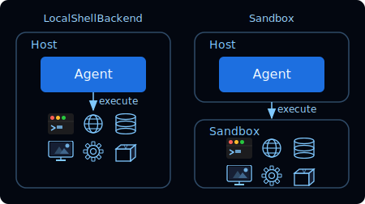

[For translation, open lesson in new tab and use Chrome translate](https://langchain-ai.github.io/lca-deepagents/m2/m2.3-sandboxes-and-localshell.html)

<style>@import url('../shared/sd-components.css');</style>
<script src="../shared/sd-components.js"></script>
<script src="https://cdn.jsdelivr.net/npm/mermaid@11/dist/mermaid.min.js"></script>
<script>mermaid.initialize({ startOnLoad: false, theme: 'base', themeVariables: { background: '#F2FAFF', primaryColor: '#E5F4FF', primaryBorderColor: '#006DDD', primaryTextColor: '#030710', lineColor: '#2F4B68' } });
document.addEventListener('DOMContentLoaded', function() { mermaid.run(); });</script>

# Sandboxes and LocalShell

<style>
.lt-bar {
  display: flex;
  flex-wrap: wrap;
  gap: 20px;
  margin: 28px 0 0;
  border-bottom: 2px solid #CCE9FF;
}
.lt-group { display: flex; gap: 3px; }
.lt-exec { --c: #7C3AED; }
.lt-quiz { --c: #7C3AED; }
.lt-wrap { --c: #B45309; }
.lt-homework { --c: #0E9F6E; }
.lt-tab {
  font: 500 14px 'IBM Plex Mono', monospace;
  padding: 9px 14px;
  border: none;
  background: transparent;
  color: #40668D;
  cursor: pointer;
  border-bottom: 3px solid transparent;
  margin-bottom: -2px;
  border-radius: 6px 6px 0 0;
  transition: background .15s, color .15s, border-color .15s;
  white-space: nowrap;
}
.lt-tab:hover { background: #F2FAFF; color: #030710; }
.lt-tab.active {
  color: var(--c);
  border-bottom-color: var(--c);
  background: #fff;
}
.lt-panel { display: none; padding-top: 24px; }
.lt-panel.active { display: block; }
@media (max-width: 600px) {
  .lt-bar { flex-wrap: nowrap; overflow-x: auto; gap: 12px; }
  .lt-tab { padding: 8px 10px; font-size: 13px; }
}
</style>

<div class="lt-bar" role="tablist" aria-label="Lesson sections">
  <div class="lt-group lt-exec">
    <button class="lt-tab active" data-p="exec" role="tab" aria-selected="true">Sandboxes and LocalShell</button>
  </div>
  <div class="lt-group lt-wrap">
    <button class="lt-tab" data-p="lab1" role="tab" aria-selected="false">Lab 1</button>
    <button class="lt-tab" data-p="lab2" role="tab" aria-selected="false">Lab 2</button>
  </div>
  <div class="lt-group lt-quiz">
    <button class="lt-tab" data-p="quiz" role="tab" aria-selected="false">Quiz</button>
  </div>
  <div class="lt-group lt-homework">
    <button class="lt-tab" data-p="homework" role="tab" aria-selected="false">Homework</button>
  </div>
</div>

<div class="lt-panel active" id="p-exec" markdown="1" role="tabpanel">

<details style="border:2.5px solid #000;border-radius:6px;background:#fff;margin:1rem 0;"><summary style="padding:10px 16px;cursor:pointer;font-weight:500;font-family:'IBM Plex Mono',monospace;font-size:14px;">Video Walkthrough</summary><div style="padding:12px 16px 16px;"><div class="video-container" style="max-width:750px;"><div class="video-wrapper"><iframe src="https://share.descript.com/embed/DqVrvWvTB5e" frameborder="0" allow="autoplay; fullscreen; encrypted-media; picture-in-picture" allowfullscreen></iframe></div></div></div></details>

The filesystem backends from the last lesson give the agent file tools: `ls`, `read_file`, `write_file`, `edit_file`, `glob`, `grep`. `LocalShellBackend` and sandbox backends add one more: **`execute`**, which runs shell commands.

---

<style>.mermaid-sm svg { max-width: 100% !important; height: auto !important; }</style>
<div class="mermaid-sm" style="max-width: 75%;">
<div class="mermaid">
graph TB
    Tools[Filesystem Tools] --> Backend[Backend]

    Backend --> LocalShell[Local Shell]
    Backend --> Sandbox[Sandbox Backend]

    LocalShell --> Execute["+ execute tool"]
    Sandbox --> Execute

    classDef trigger fill:#CCE9FF,stroke:#006DDD,stroke-width:2px,color:#030710
    classDef hub fill:#7FC8FF,stroke:#006DDD,stroke-width:2px,color:#030710
    classDef process fill:#E5F4FF,stroke:#006DDD,stroke-width:1px,color:#030710
    classDef output fill:#030710,stroke:#030710,stroke-width:1px,color:#F2FAFF

    class Tools trigger
    class Backend hub
    class LocalShell,Sandbox process
    class Execute output
</div>
</div>

---

## The `execute` tool

Shell-capable backends expose an `execute(command)` tool. The agent calls it to run scripts it has written, invoke CLI tools, and compile and test code. The combined command output, exit code, and execution metadata come back as a tool result on the next LLM call.

---

## How do you choose?

Two shell-capable backends are available: `LocalShellBackend` and sandbox backends. The deciding factor is isolation.



**Use a sandbox.** Agent generated code and packages the agent may load are untrusted by nature. Use a sandbox to isolate that code from your infrastructure.

**Use `LocalShellBackend`** when building a local tool where the agent working directly on your machine is the point, such as a coding assistant or desktop agent. It is not appropriate for production or untrusted input.

---

## Sandbox Backends

A sandbox is a temporary, isolated workspace containing a filesystem, command execution environment, and other resources. Sandbox backends run commands inside that workspace instead of on your host machine.

There are two models for using a sandbox with an agent:


**Agent in Sandbox:** The agent itself runs inside the sandbox. The LLM API key(s) live inside the sandbox. To update the agent, you must rebuild the sandbox image. This is useful when you want the execution environment to mirror your production infrastructure.

**Sandbox as a Tool:** The agent runs outside and calls the sandbox via `execute` and filesystem tools. The LLM API keys stay on your host, agent code is easy to update, and sandbox failures don't affect agent state. This is the model used in this course.

### Managing credentials in a sandbox

Sandbox-as-a-tool keeps the LLM API key safely on the host away from the untrusted code execution within the sandbox, but what about other keys? An agent may need to access resources on behalf of the user to accomplish tasks. A feature in LangSmith Sandboxes allows these keys to be applied to requests without passing them into the insecure sandbox environment. The slideshow below shows how that is done:

<div class="sd-wrap" id="ss-sandbox-flow"></div>

<script>
buildSlideshow({
  id: 'ss-sandbox-flow',
  slides: [
    {
      src: 'images/m2.3-sandbox-flow-1.svg',
      tag: 'Step 1 of 6 · Isolation from the host',
      caption: `The agent spawns sandboxed code away from the host isolating code execution.`
    },
    {
      src: 'images/m2.3-sandbox-flow-2.svg',
      tag: 'Step 2 of 6 · The credential gap',
      caption: `The External API box is whatever third-party service the code is trying to reach, such as Stripe or GitHub. A request has no credentials to send, and putting an API key inside the sandbox so it could send one would expose that key to the agent's own generated code.`
    },
    {
      src: 'images/m2.3-sandbox-flow-3.svg',
      tag: 'Step 3 of 6 · Auth proxy sidecar',
      caption: `LangSmith Sandboxes add an auth proxy sidecar inside the sandbox boundary. It is a separate process from the code the agent writes, and for now it holds no secret either.`
    },
    {
      src: 'images/m2.3-sandbox-flow-4.svg',
      tag: 'Step 4 of 6 · Code calls the proxy, not the API',
      caption: `Instead of calling the external API directly, the sandboxed code sends its request to the local proxy.`
    },
    {
      src: 'images/m2.3-sandbox-flow-5.svg',
      tag: 'Step 5 of 6 · Secret injected into the proxy',
      caption: `Separately, the proxy is provisioned with the real credential from workspace secrets. The secret now lives in the proxy, still inside the sandbox boundary, but in a separate process.`
    },
    {
      src: 'images/m2.3-sandbox-flow-6.svg',
      tag: 'Step 6 of 6 · Auth proxy closes the gap',
      caption: `The proxy attaches the credential and forwards an authenticated request to the external API. Isolation keeps the code away from the host. The auth proxy keeps the secret away from the code.`
    },
  ]
});
</script>

The auth proxy pattern above is specific to LangSmith Sandboxes, not sandboxes in general. The proxy sidecar holds the secrets inside the sandbox, but the code the agent writes and runs never sees them, so the code cannot exfiltrate them.

---

## Configuring a LangSmith sandbox as a tool

Here's an example of a LangSmith sandbox being configured as a backend:

```python {1-2,5-7,11}
# python/m2/m2.3_sandbox_agent.py
from uuid import uuid4

from deepagents import create_deep_agent
from deepagents.backends.langsmith import LangSmithSandbox
from langsmith.sandbox import SandboxClient

client = SandboxClient()
ls_sandbox = client.create_sandbox(name=f"lca-deepagents-lab-{uuid4().hex[:8]}")
print(f"Sandbox: {ls_sandbox.name}  (id: {ls_sandbox.id})")
backend = LangSmithSandbox(sandbox=ls_sandbox)

agent = create_deep_agent(
    model=model,
    backend=backend,
)

try:
    result = agent.invoke({"messages": [{"role": "user", "content": "..."}]})
    print(result["messages"][-1].content)
finally:
    client.delete_sandbox(ls_sandbox.name)
```

The `try/finally` block ensures the sandbox is deleted even if the agent raises. Sandboxes are billed resources; always clean them up.

`create_sandbox(...)` provisions a fresh sandbox workspace. Files persist within that sandbox until it is deleted; a newly created sandbox starts empty unless you upload files first.

---

## LocalShellBackend

`LocalShellBackend` runs commands directly on the host machine. It can scope filesystem *tools* to a `root_dir`, but `execute` itself runs with host permissions; no process isolation is applied.

Use `virtual_mode=True` when you want filesystem tools (`ls`, `read_file`, `write_file`, etc.) to be path-scoped under `root_dir`. Either way, `root_dir` does not restrict the `execute` tool. Shell commands run with host permissions and can access paths outside the filesystem-tool root. That's why LocalShellBackend is unsuitable for production or untrusted input.

<details style="border:1px solid #FCD34D;border-radius:6px;background:#FFFBEB;margin:20px 0;">
<summary style="padding:10px 16px;cursor:pointer;font-weight:600;color:#92400E;list-style:none;border-radius:6px;">&#9888; Security Warning</summary>
<div style="padding:4px 16px 16px;font-size:15px;line-height:1.6;color:#1c1c1c;">
<p>This backend grants agents direct filesystem read/write access and unrestricted shell execution on your host. Use with extreme caution and only in appropriate environments.</p>
<p><strong>Appropriate use cases:</strong></p>
<ul>
<li>Local development CLIs (coding assistants, development tools)</li>
<li>Personal development environments where you trust the agent's code</li>
<li>CI/CD pipelines with proper secret management</li>
</ul>
<p><strong>Inappropriate use cases:</strong></p>
<ul>
<li>Production environments (such as web servers, APIs, multi-tenant systems)</li>
<li>Processing untrusted user input or executing untrusted code</li>
</ul>
<p><strong>Security risks:</strong></p>
<ul>
<li>Agents can execute arbitrary shell commands with your user's permissions</li>
<li>Agents can read any accessible file, including secrets (API keys, credentials, <code>.env</code> files)</li>
<li>Secrets may be exposed</li>
<li>File modifications and command execution are permanent and irreversible</li>
<li>Commands run directly on your host system</li>
<li>Commands can consume unlimited CPU, memory, disk</li>
</ul>
<p><strong>Recommended safeguards:</strong></p>
<ul>
<li>Enable Human-in-the-Loop (HITL) middleware to review and approve operations before execution. This is strongly recommended.</li>
<li>Run in dedicated development environments only. Never use on shared or production systems.</li>
<li>Use a sandbox backend for production environments requiring shell execution.</li>
</ul>
<p><strong>Note:</strong> <code>virtual_mode=True</code> provides no security with shell access enabled, since commands can access any path on the system.</p>
</div>
</details>

---

## Recap

- `execute` is added by shell-capable backends on top of the standard filesystem surface
- **LocalShellBackend:** no process isolation, for controlled local development only
- **Sandbox backends:** isolated from the host when configured correctly; multiple providers are available, and this course uses LangSmith
- The filesystem tool surface is consistent; `execute` is available when the backend supports shell execution

## Next

Complete the **Labs** and **Quiz** above, then continue to the next lesson on the interpreter and how the agent writes and executes code directly in the main loop.

---

## References

**Documentation:**
- [Execution Backends](https://docs.langchain.com/oss/python/deepagents/backends)
- [LocalShellBackend](https://docs.langchain.com/oss/python/deepagents/backends#localshellbackend-local-shell)
- [Sandboxes](https://docs.langchain.com/oss/python/deepagents/sandboxes)
- [LangSmith Sandboxes](https://docs.langchain.com/langsmith/sandboxes)
- [Sandbox Auth Proxy](https://docs.langchain.com/langsmith/sandbox-auth-proxy)
- [Managing Secrets](https://docs.langchain.com/oss/python/deepagents/going-to-production#managing-secrets)

**Blog:**
- [The Runtime Behind Production Deep Agents](https://www.langchain.com/blog/runtime-behind-production-deep-agents)
- [The two patterns by which agents connect sandboxes](https://www.langchain.com/blog/the-two-patterns-by-which-agents-connect-sandboxes)

</div>

<div class="lt-panel" id="p-lab1" markdown="1" role="tabpanel">

## Lab 1: Sandbox Agent

<Tip>

<details style="border:2.5px solid #000;border-radius:6px;background:#fff;margin:1rem 0;"><summary style="padding:10px 16px;cursor:pointer;font-weight:500;font-family:'IBM Plex Mono',monospace;font-size:14px;">Lab Video Walkthrough</summary><div style="padding:12px 16px 16px;"><div class="video-container" style="max-width:750px;"><div class="video-wrapper"><iframe src="https://share.descript.com/embed/FK3gxyj3QHR" frameborder="0" allow="autoplay; fullscreen; encrypted-media; picture-in-picture" allowfullscreen></iframe></div></div></div></details>

**[View this run here in LangSmith.](https://smith.langchain.com/public/b12e8371-fa1c-4b50-8c95-bb0dc49718f3/r/019f20a0-f47c-7223-afdc-5a48926f182a)** Notice the write → execute sequence running as isolated tool calls inside the LangSmith sandbox.

<details style="border:2.5px solid #000;border-radius:6px;background:#E5F4FF;margin:1rem 0;"><summary style="padding:10px 16px;cursor:pointer;font-weight:500;font-family:'IBM Plex Mono',monospace;font-size:14px;">LangSmith Walkthrough</summary><div style="padding:12px 16px 16px;"><div class="video-container" style="max-width:750px;"><div class="video-wrapper"><iframe src="https://share.descript.com/embed/OfDBEGji0o6" frameborder="0" allow="autoplay; fullscreen; encrypted-media; picture-in-picture" allowfullscreen></iframe></div></div></div></details>

</Tip>

Build an agent that writes a Python script to a sandbox, executes it, and reports the output. You will see the write → execute sequence in LangSmith as a chain of tool calls.

This lab uses `LangSmithSandbox`; commands run in an isolated LangSmith-managed environment, not on your local machine.

> **Note:** LangSmith Sandboxes require a LangSmith Plus account or higher.

Before running it, make sure your model API key and LangSmith sandbox credentials from setup are available in the Python environment.

---

```python
# python/m2/m2.3_sandbox_agent.py
from uuid import uuid4

from deepagents import create_deep_agent
from deepagents.backends.langsmith import LangSmithSandbox
from langsmith.sandbox import SandboxClient
from models import model

client = SandboxClient()
ls_sandbox = client.create_sandbox(name=f"lca-deepagents-lab-{uuid4().hex[:8]}")
print(f"Sandbox: {ls_sandbox.name}  (id: {ls_sandbox.id})")
backend = LangSmithSandbox(sandbox=ls_sandbox)

agent = create_deep_agent(
    model=model,
    backend=backend,
    system_prompt=(
        "You are a coding assistant. When asked to run code, write the script "
        "to a file first, then execute it. Show the output in your final answer."
    ),
)

try:
    result = agent.invoke(
        {
            "messages": [
                {
                    "role": "user",
                    "content": (
                        "Write a Python script that prints the first 15 Fibonacci numbers, "
                        "save it to fib.py, and run it."
                    ),
                }
            ]
        }
    )
    print(result["messages"][-1].content)
finally:
    client.delete_sandbox(ls_sandbox.name)
```

From the repo root:

```bash
cd python
uv run ./m2/m2.3_sandbox_agent.py
```

---

**What to check:**

Open **LangSmith** and look at the tool call sequence:

1. `write_file`: agent writes `fib.py` into the sandbox
2. `execute`: agent runs `python fib.py` inside the sandbox
3. The tool result carries the stdout back to the LLM
4. The LLM includes the output in its final answer

If the script had an error, you will see the agent call `edit_file` to fix it and `execute` again. Shell execution enables this self-correction loop; the sandbox makes it safer to run.

**Try a different task:**

- `"Write a Python script that counts word frequencies in a short paragraph of your choice, save it to wordcount.py, and run it."`
- `"Write a Python script that generates a multiplication table for numbers 1 to 5, save it to times_table.py, and run it."`

</div>

<div class="lt-panel" id="p-lab2" markdown="1" role="tabpanel">

## Lab 2: Sales Chart Agent

<Tip>

<details style="border:2.5px solid #000;border-radius:6px;background:#fff;margin:1rem 0;"><summary style="padding:10px 16px;cursor:pointer;font-weight:500;font-family:'IBM Plex Mono',monospace;font-size:14px;">Lab Video Walkthrough</summary><div style="padding:12px 16px 16px;"><div class="video-container" style="max-width:750px;"><div class="video-wrapper"><iframe src="https://share.descript.com/embed/Jtj7x5djEv6" frameborder="0" allow="autoplay; fullscreen; encrypted-media; picture-in-picture" allowfullscreen></iframe></div></div></div></details>

**[View this run here in LangSmith.](https://smith.langchain.com/public/d183098a-e7cb-4a52-9530-889c0848a722/r/019f20bf-84c5-7c72-bb70-eadb6bb07d85)** Notice the file upload to the sandbox, the query and chart-generation steps, and the file read back at the end.

<details style="border:2.5px solid #000;border-radius:6px;background:#E5F4FF;margin:1rem 0;"><summary style="padding:10px 16px;cursor:pointer;font-weight:500;font-family:'IBM Plex Mono',monospace;font-size:14px;">LangSmith Walkthrough</summary><div style="padding:12px 16px 16px;"><div class="video-container" style="max-width:750px;"><div class="video-wrapper"><iframe src="https://share.descript.com/embed/oFgmZqDf086" frameborder="0" allow="autoplay; fullscreen; encrypted-media; picture-in-picture" allowfullscreen></iframe></div></div></div></details>

</Tip>

Build an agent that queries the Chinook music store database inside a sandbox and generates a chart. The agent installs its own dependencies, writes and runs Python, and you retrieve the output file from the sandbox.

This lab introduces two new patterns: **uploading files** to a sandbox before the agent runs, and **reading files** back from the sandbox after it finishes.

> **Note:** LangSmith Sandboxes require a LangSmith Plus account or higher.

Before running it, make sure your model API key and LangSmith sandbox credentials from setup are available in the Python environment.

---

```python {13,14,16,17,55,56,57}
# python/m2/m2.3_sales_agent.py
from pathlib import Path
from uuid import uuid4

from deepagents import create_deep_agent
from deepagents.backends.langsmith import LangSmithSandbox
from langsmith.sandbox import SandboxClient
from models import model

DB_PATH = Path(__file__).resolve().parent / "chinook.db"

client = SandboxClient()
ls_sandbox = client.create_sandbox(name=f"lca-deepagents-lab-{uuid4().hex[:8]}")
print(f"Sandbox: {ls_sandbox.name}  (id: {ls_sandbox.id})")

backend = LangSmithSandbox(sandbox=ls_sandbox)
with open(DB_PATH, "rb") as f:
    upload_results = backend.upload_files([("/chinook.db", f.read())])

for upload_result in upload_results:
    if upload_result.error:
        raise RuntimeError(f"Failed to upload {upload_result.path}: {upload_result.error}")

agent = create_deep_agent(
    model=model,
    backend=backend,
    system_prompt=(
        "You are a sales data analyst with access to the Chinook music store database "
        "at /chinook.db. Use sqlite3 and matplotlib to answer questions with charts. "
        "Install any packages you need with pip before importing them. "
        "When asked to produce a chart, write a Python script, execute it, and confirm "
        "the output file was created."
    ),
)

try:
    result = agent.invoke(
        {
            "messages": [
                {
                    "role": "user",
                    "content": (
                        "Query the Chinook database at /chinook.db to get total revenue "
                        "by genre. Create a clean donut chart showing each genre's share "
                        "of total sales revenue. Group any genres that individually "
                        "account for less than 3% of total revenue into a single 'Other' "
                        "slice. Label each slice with the genre name and percentage. "
                        "Use a visually distinct color palette, leave a white center hole, "
                        "and make sure no labels overlap with each other or with the title. "
                        "Add enough top padding so the title is fully visible. "
                        "Save the chart to /genre_revenue.png."
                    ),
                }
            ]
        }
    )
    print(result["messages"][-1].content)

    png_bytes = ls_sandbox.read("/genre_revenue.png")
    out_path = Path(__file__).parent / "genre_revenue.png"
    out_path.write_bytes(png_bytes)
    print(f"Chart saved to {out_path}")

finally:
    client.delete_sandbox(ls_sandbox.name)
```

From the repo root:

```bash
cd python
uv run ./m2/m2.3_sales_agent.py
open m2/genre_revenue.png
```

---

**Expected output:**

<pre style="max-height:260px;overflow-y:auto;background:#0d1117;color:#e6edf3;padding:16px;border-radius:6px;font-size:12px;font-family:'IBM Plex Mono',monospace;line-height:1.6;white-space:pre-wrap;">Sandbox: lca-deepagents-lab  (id: 510c7cfa-7809-4317-a272-715c05221a24)
Done! I've successfully created your donut chart showing revenue by genre.

Data Summary:
- Total Revenue: $2,328.60
- Rock: 35.5% ($826.65)
- Latin: 16.4% ($382.14)
- Metal: 11.2% ($261.36)
- Alternative & Punk: 10.4% ($241.56)
- TV Shows: 4.0% ($93.53)
- Jazz: 3.4% ($79.20)
- Other (&lt;3%): 19.1% ($444.16)

Chart saved to python/m2/genre_revenue.png</pre>

The chart is saved locally as `genre_revenue.png`. Open it with `open m2/genre_revenue.png`.

<details>
<summary>Expected chart [click to expand]</summary>
<br>

</details>

</div>

<div class="lt-panel" id="p-quiz" role="tabpanel">

<h2>Check your understanding</h2>

<MCQ
    question="What does the execute tool return to the agent?"
    choices='["Combined command output, exit code, and execution metadata", "The script file contents", "A boolean success or failure", "stdout only"]'
    correctIndex={0}
    explanation="execute returns the command result as a tool message, including combined output, exit code, and execution metadata. The LLM sees that result on the next call, which lets it diagnose errors and retry."
/>

<MCQ
    question="What does root_dir limit in LocalShellBackend?"
    choices='["All shell commands executed via execute", "Filesystem tool access (ls, read_file, write_file, and similar)", "Network access from the agent", "Which Python packages the agent can import"]'
    correctIndex={1}
    explanation="With virtual_mode=True, root_dir scopes the filesystem tools. The execute tool still runs with host permissions regardless of root_dir, which is why LocalShellBackend is unsuitable for production or untrusted input."
/>

<MCQ
    question="Which sandbox model does this course use?"
    choices='["Agent in Sandbox (the agent runs inside the sandbox)", "Both models equally", "Neither - the course uses LocalShellBackend", "Sandbox as a Tool (the agent runs outside and calls the sandbox via execute)"]'
    correctIndex={3}
    explanation="This course uses the Sandbox as a Tool pattern: the agent runs on the host and calls the sandbox via execute and filesystem tools. API keys stay on the host and the agent code is easy to update."
/>

<MCQ
    question="How do you make a local file available inside a LangSmith sandbox before the agent runs?"
    choices='["Pass the file path in the system prompt", "The sandbox automatically syncs the local filesystem", "Call backend.upload_files() with the file contents before invoking the agent", "Write the file to /tmp - the sandbox reads it from there"]'
    correctIndex={2}
    explanation="upload_files() seeds the sandbox filesystem before the agent starts. Without it the sandbox starts empty and the agent has no access to local files unless you explicitly upload them."
/>

<MCQ
    question="What is the key security difference between LocalShellBackend and a sandbox backend?"
    choices='["LocalShellBackend encrypts all file operations; sandbox backends do not", "Sandbox backends require an API key; LocalShellBackend does not", "With LocalShellBackend, the execute tool runs with host permissions and is not isolated from the rest of the system", "LocalShellBackend only allows read operations; sandbox backends allow both read and write"]'
    correctIndex={2}
    explanation="LocalShellBackend gives the execute tool host permissions. root_dir can limit filesystem tools, but not execute. A sandbox backend is designed to isolate execution from the host, which is safer for production and untrusted input when configured correctly."
/>

</div>

<div class="lt-panel" id="p-homework" markdown="1" role="tabpanel">

## Prove Persistence in Your Own Sandbox

<div style="border:2px solid #D32F2F;border-radius:6px;background:#FDECEA;padding:12px 16px;margin:1rem 0;">

**If you started this course before July 27, 2026:** this homework assignment is new. Pull the latest changes from the repo root to access it:

```bash
git pull
```

</div>

Lab 1 showed the sandbox running one script in isolation. This homework goes further: you'll send two separate tasks to the same sandbox, one after another, to prove that the sandbox's filesystem persists between `invoke()` calls instead of resetting each time (the same persistence Lab 2 relies on when it uploads a database before the agent runs and reads a chart back after it finishes).

Open `python/m2/m2.3_homework.py`.

1. **TODO 1**: write a system prompt for your sandboxed agent. Give it a persona and working rules, as long as it tells the agent to write code to a file before running it (the same pattern Lab 1 used), to install packages with pip before importing them (the same pattern Lab 2 used, since matplotlib is not preinstalled), and to use matplotlib when it needs to build a chart.
2. **TODO 2**: write two task messages for the same sandbox. **TASK_ONE** should have the agent generate or compute some numeric data and save it to a file. **TASK_TWO** must read that same file back, without regenerating the data, and turn it into a matplotlib chart saved at a path you choose; it only proves the sandbox persisted if it reuses TASK_ONE's file instead of recreating the data.
3. **TODO 3**: point `CHART_PATH` at the exact path you told the agent to save the chart to in TASK_TWO, so the script can read the image back from the sandbox, the same way Lab 2 does.

### Run it

```bash
cd python
uv run ./m2/m2.3_homework.py
open m2/homework_chart.png
```

Stuck, or want to see the finished shape before you start? `m2.3_homework_filled.py` is a reference copy with every TODO filled in (using a made-up monthly rainfall dataset charted as a bar chart, with a data-visualization-assistant persona); run it the same way to see what "done" looks like end to end.

Try to avoid peeking unless you're really stuck, you'll get more out of this by working through the TODOs yourself first.

</div>

<script>
(function () {
  var tabs = document.querySelectorAll('.lt-tab');
  function show(p) {
    tabs.forEach(function (t) {
      var on = t.getAttribute('data-p') === p;
      t.classList.toggle('active', on);
      t.setAttribute('aria-selected', on ? 'true' : 'false');
    });
    document.querySelectorAll('.lt-panel').forEach(function (panel) {
      panel.classList.toggle('active', panel.id === 'p-' + p);
    });
  }
  tabs.forEach(function (t) {
    t.addEventListener('click', function () { show(t.getAttribute('data-p')); });
  });
})();
</script>
