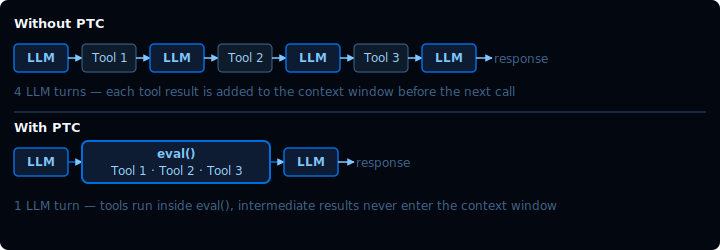
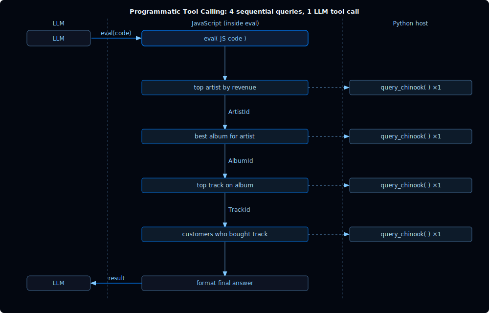

[For translation, open lesson in new tab and use Chrome translate](https://langchain-ai.github.io/lca-deepagents/m2/m2.4-interpreter.html)

<style>@import url('../shared/sd-components.css');</style>
<script src="../shared/sd-components.js"></script>

# Interpreters

<style>
.lt-bar {
  display: flex;
  flex-wrap: wrap;
  gap: 20px;
  margin: 28px 0 0;
  border-bottom: 2px solid #CCE9FF;
}
.lt-group { display: flex; gap: 3px; }
.lt-exec { --c: #7C3AED; }
.lt-quiz { --c: #7C3AED; }
.lt-wrap { --c: #B45309; }
.lt-tab {
  font: 500 14px 'IBM Plex Mono', monospace;
  padding: 9px 14px;
  border: none;
  background: transparent;
  color: #40668D;
  cursor: pointer;
  border-bottom: 3px solid transparent;
  margin-bottom: -2px;
  border-radius: 6px 6px 0 0;
  transition: background .15s, color .15s, border-color .15s;
  white-space: nowrap;
}
.lt-tab:hover { background: #F2FAFF; color: #030710; }
.lt-tab.active {
  color: var(--c);
  border-bottom-color: var(--c);
  background: #fff;
}
.lt-panel { display: none; padding-top: 24px; }
.lt-panel.active { display: block; }
@media (max-width: 600px) {
  .lt-bar { flex-wrap: nowrap; overflow-x: auto; gap: 12px; }
  .lt-tab { padding: 8px 10px; font-size: 13px; }
}
</style>

<div class="lt-bar" role="tablist" aria-label="Lesson sections">
  <div class="lt-group lt-exec">
    <button class="lt-tab active" data-p="exec" role="tab" aria-selected="true">Interpreters</button>
  </div>
  <div class="lt-group lt-wrap">
    <button class="lt-tab" data-p="lab1" role="tab" aria-selected="false">Lab 1</button>
    <button class="lt-tab" data-p="lab2" role="tab" aria-selected="false">Lab 2</button>
  </div>
  <div class="lt-group lt-quiz">
    <button class="lt-tab" data-p="quiz" role="tab" aria-selected="false">Quiz</button>
  </div>
</div>

<div class="lt-panel active" id="p-exec" markdown="1" role="tabpanel">

<details style="border:2.5px solid #000;border-radius:6px;background:#fff;margin:1rem 0;"><summary style="padding:10px 16px;cursor:pointer;font-weight:500;font-family:'IBM Plex Mono',monospace;font-size:14px;">Video Walkthrough</summary><div style="padding:12px 16px 16px;"><div class="video-container" style="max-width:750px;"><div class="video-wrapper"><iframe src="https://share.descript.com/embed/qIeyaZ9HbAO" frameborder="0" allow="autoplay; fullscreen; encrypted-media; picture-in-picture" allowfullscreen></iframe></div></div></div></details>

Code execution is a powerful capability for agents. The previous lesson introduced shell-capable backends: environments where the agent can use `execute` to run commands, scripts, installs, and tests.

**Interpreters are a lighter-weight code execution option.** They embed a JavaScript runtime directly in the agent loop with no cloud infrastructure and no API calls to spin up a shell environment. The tradeoff is a narrower direct capability set: JavaScript standard library only, no external packages, no direct filesystem, and no direct network access.

<div style="text-align: center;">
<svg viewBox="0 0 720 322" width="680" role="img" aria-label="Sequence diagram: Client sends a request to the LLM; the LLM generates a code block and sends it to the Interpreter; the Interpreter executes the code and returns the final result to the LLM; the LLM sends the final response back to the Client." xmlns="http://www.w3.org/2000/svg" font-family="'Inter', -apple-system, BlinkMacSystemFont, 'Segoe UI', sans-serif">
  <rect width="720" height="322" fill="#030710" rx="8"/>
  <text x="90" y="24" text-anchor="middle" font-size="13" fill="#CCE9FF">Client</text>
  <text x="360" y="24" text-anchor="middle" font-size="13" fill="#CCE9FF">LLM</text>
  <text x="630" y="24" text-anchor="middle" font-size="13" fill="#CCE9FF">Interpreter</text>
  <circle cx="90" cy="56" r="22" fill="#161F34" stroke="#40668D" stroke-width="1.5"/>
  <circle cx="90" cy="48" r="8" fill="none" stroke="#7FC8FF" stroke-width="1.5"/>
  <path d="M73,72 Q73,62 90,62 Q107,62 107,72" fill="none" stroke="#7FC8FF" stroke-width="1.5" stroke-linecap="round"/>
  <circle cx="360" cy="56" r="22" fill="#161F34" stroke="#7FC8FF" stroke-width="1.5"/>
  <circle cx="360" cy="56" r="12" fill="none" stroke="#7FC8FF" stroke-width="1" opacity="0.6"/>
  <circle cx="360" cy="56" r="5" fill="#7FC8FF"/>
  <circle cx="630" cy="56" r="22" fill="#161F34" stroke="#40668D" stroke-width="1.5"/>
  <text x="630" y="61" text-anchor="middle" font-size="15" font-weight="700" fill="#7FC8FF" font-family="'IBM Plex Mono', ui-monospace, monospace">{}</text>
  <line x1="90" y1="78" x2="90" y2="314" stroke="#40668D" stroke-width="1" stroke-dasharray="4 3"/>
  <line x1="360" y1="78" x2="360" y2="314" stroke="#40668D" stroke-width="1" stroke-dasharray="4 3"/>
  <line x1="630" y1="78" x2="630" y2="314" stroke="#40668D" stroke-width="1" stroke-dasharray="4 3"/>
  <line x1="90" y1="108" x2="326" y2="108" stroke="#7FC8FF" stroke-width="1.5"/>
  <polygon points="326,101 338,108 326,115" fill="#7FC8FF"/>
  <circle cx="90" cy="108" r="10" fill="#006DDD"/>
  <text x="90" y="112" text-anchor="middle" font-size="12" font-weight="700" fill="#F2FAFF">1</text>
  <text x="213" y="94" text-anchor="middle" font-size="12" fill="#CCE9FF" font-family="'IBM Plex Mono', ui-monospace, monospace">REQUEST</text>
  <line x1="360" y1="144" x2="596" y2="144" stroke="#7FC8FF" stroke-width="1.5"/>
  <polygon points="596,137 608,144 596,151" fill="#7FC8FF"/>
  <circle cx="360" cy="144" r="10" fill="#006DDD"/>
  <text x="360" y="148" text-anchor="middle" font-size="12" font-weight="700" fill="#F2FAFF">2</text>
  <text x="490" y="130" text-anchor="middle" font-size="12" fill="#CCE9FF" font-family="'IBM Plex Mono', ui-monospace, monospace">CODE BLOCK</text>
  <rect x="374" y="154" width="244" height="82" rx="4" fill="#0D1322" stroke="#40668D" stroke-width="1"/>
  <text x="386" y="174" font-size="12" fill="#7FC8FF" font-family="'IBM Plex Mono', ui-monospace, monospace">const results = search(query)</text>
  <text x="386" y="192" font-size="12" fill="#7FC8FF" font-family="'IBM Plex Mono', ui-monospace, monospace">const relevant = check(results)</text>
  <text x="386" y="210" font-size="12" fill="#7FC8FF" font-family="'IBM Plex Mono', ui-monospace, monospace">createTicket(relevant)</text>
  <text x="386" y="228" font-size="12" fill="#40668D" font-family="'IBM Plex Mono', ui-monospace, monospace">...</text>
  <circle cx="630" cy="250" r="10" fill="#006DDD"/>
  <text x="630" y="254" text-anchor="middle" font-size="12" font-weight="700" fill="#F2FAFF">3</text>
  <text x="648" y="254" text-anchor="start" font-size="12" fill="#CCE9FF" font-family="'IBM Plex Mono', ui-monospace, monospace">EXECUTE</text>
  <line x1="630" y1="274" x2="394" y2="274" stroke="#7FC8FF" stroke-width="1.5"/>
  <polygon points="394,267 382,274 394,281" fill="#7FC8FF"/>
  <circle cx="630" cy="274" r="10" fill="#006DDD"/>
  <text x="630" y="278" text-anchor="middle" font-size="12" font-weight="700" fill="#F2FAFF">4</text>
  <text x="495" y="260" text-anchor="middle" font-size="12" fill="#CCE9FF" font-family="'IBM Plex Mono', ui-monospace, monospace">RETURN FINAL RESULT</text>
  <line x1="360" y1="298" x2="124" y2="298" stroke="#7FC8FF" stroke-width="1.5"/>
  <polygon points="124,291 112,298 124,305" fill="#7FC8FF"/>
  <circle cx="360" cy="298" r="10" fill="#006DDD"/>
  <text x="360" y="302" text-anchor="middle" font-size="12" font-weight="700" fill="#F2FAFF">5</text>
  <text x="225" y="284" text-anchor="middle" font-size="12" fill="#CCE9FF" font-family="'IBM Plex Mono', ui-monospace, monospace">FINAL RESPONSE</text>
</svg>

<p><em>The LLM writes code; the Interpreter runs it and returns the real result.</em></p>
</div>

Unlike shell-capable backends, the interpreter is not a backend service. It operates in the agent loop like other tools.

---

## The eval tool

When `CodeInterpreterMiddleware` is added to an agent, it provides a single new tool: **`eval`**. The agent calls it with a string of JavaScript to execute.

```javascript
eval(code=`
const prices = [0.99, 1.29, 0.99, 1.99, 0.99];
const avg = prices.reduce((a, b) => a + b, 0) / prices.length;
\`Average price: $\${avg.toFixed(2)}\`
`)
```

The middleware runs the code in a [QuickJS](https://bellard.org/quickjs/) runtime, a lightweight JavaScript engine designed for embedded execution. The result of the last expression, plus any `console.log` output, comes back as the tool result.

The string `"Average price: $1.25"` comes back as the tool result on the next LLM call.

---

## The QuickJS runtime

QuickJS exposes the JavaScript standard library and nothing else directly.

**Available:**
- Array methods: `map`, `filter`, `reduce`, `sort`, `flat`, `find`
- `Map`, `Set`, `JSON`, `Math`, `Promise`
- `Date` and other standard JavaScript globals
- `console.log` (captured and returned as output)
- String and number methods, destructuring, `async`/`await`

**Not directly available:**
- Filesystem (`fs`)
- Network (`fetch`)
- Node.js APIs
- `npm` packages

With Programmatic Tool Calling, JavaScript can still reach outside the interpreter indirectly through tools you explicitly allow. That allowlist is the safety boundary.

The interpreter state persists across `eval` calls within the same thread. Variables defined in one call are available in the next.

Interpreter execution is bounded by runtime limits such as timeout, memory, output size, and PTC call limits. Those limits keep runaway loops or huge results from taking over the agent run.

---

## Use cases

There are three patterns where interpreters shine.

<details style="border:2.5px solid #000;border-radius:6px;background:#fff;margin:1rem 0;"><summary style="padding:10px 16px;cursor:pointer;font-weight:500;font-family:'IBM Plex Mono',monospace;font-size:14px;">Video Walkthrough</summary><div style="padding:12px 16px 16px;"><div class="video-container" style="max-width:750px;"><div class="video-wrapper"><iframe src="https://share.descript.com/embed/ma8zcRLkFWk" frameborder="0" allow="autoplay; fullscreen; encrypted-media; picture-in-picture" allowfullscreen></iframe></div></div></div></details>

### 1. Data transformation

When the agent has data in context and needs to compute something (sort, group, aggregate, reformat), `eval` is faster and more reliable than asking the LLM to do arithmetic in prose.

```javascript
const invoices = [
  {month: "2024-01", total: 42.50},
  {month: "2024-02", total: 38.75},
  {month: "2024-03", total: 61.20},
];
const best = invoices.reduce((a, b) => a.total > b.total ? a : b);
`Best month: ${best.month} ($${best.total})`
```

### 2. Programmatic Tool Calling (PTC)

This is the most powerful pattern. When PTC is enabled, the JavaScript code can call the agent's tools directly, without those intermediate results ever entering the LLM's context window.

<div style="text-align: center;">

</div>

Without PTC, each tool result is returned to the LLM as a new message, consuming context space. The LLM must examine it and decide on the next tool call, incurring additional latency and cost with every turn.

In contrast, with PTC, when an agent is able to write code to chain tool calls successively, the number of iterations and the associated cost and latency can be reduced.

```javascript
// Tool 1 — fetch top genres by revenue
const genres = JSON.parse(await tools.queryChinook({ sql: `
    SELECT Genre.GenreId, Genre.Name, SUM(InvoiceLine.UnitPrice * InvoiceLine.Quantity) AS rev
    FROM InvoiceLine
    JOIN Track USING(TrackId)
    JOIN Genre USING(GenreId)
    GROUP BY Genre.GenreId
    ORDER BY rev DESC LIMIT 3
`}));

// Tool 2 — result from Tool 1 drives this query
const topGenreId = Number(genres[0].GenreId);
const topTrack = JSON.parse(await tools.queryChinook({ sql: `
    SELECT Track.Name, SUM(InvoiceLine.UnitPrice * InvoiceLine.Quantity) AS rev
    FROM InvoiceLine
    JOIN Track USING(TrackId)
    WHERE Track.GenreId = ${topGenreId}
    GROUP BY Track.TrackId
    ORDER BY rev DESC LIMIT 1
`}));

// Tool 3 — fetch overall revenue total
const totals = JSON.parse(await tools.queryChinook({ sql: `
    SELECT SUM(InvoiceLine.UnitPrice * InvoiceLine.Quantity) AS total FROM InvoiceLine
`}));

// Combine — only this string is returned to the LLM
`Top genre: ${genres[0].Name} ($${genres[0].rev.toFixed(2)})
 Top track: ${topTrack[0].Name}
 Catalog total: $${totals[0].total.toFixed(2)}`;
```

The model writes the JavaScript once. The interpreter executes it, calling the Python `query_chinook` tool on the host, receiving the JSON result, processing it, and returning only the final formatted string to the LLM.

Tools are exposed as `tools.<camelCaseName>(input)` async functions. Results come back as strings; use `JSON.parse()` when the tool returns JSON.

> **Note:** Only tools explicitly listed in the `ptc` argument to `CodeInterpreterMiddleware` are callable from JavaScript. Keep this allowlist narrow. PTC tool calls run inside the interpreter bridge, so do not expose broad or sensitive tools unless you are comfortable with code calling them programmatically.

*Lab 2 walks through a fully sequential version of this pattern: each query depends entirely on the result of the previous one, rather than fanning out to several genres at once.

---

## Interpreter vs shell-capable backend

| | Interpreter | Shell-capable backend / sandbox |
|---|---|---|
| Language | JavaScript (QuickJS) | Any shell command or installed runtime |
| External libraries | JS standard library directly; more only through allowlisted tools | Packages available in the environment |
| Filesystem | No direct filesystem API; can only access files through allowlisted tools | Filesystem tools plus shell access when supported |
| Network | No direct network API; can only access network through allowlisted tools | Depends on backend and sandbox/network configuration |
| Infrastructure | Embedded in the agent process | Local shell or external sandbox resource |
| State | Persists within thread | Persists within the shell/sandbox workspace until reset or deleted |
| Best for | Computation, loops, PTC orchestration | Scripts, packages, file I/O, builds, tests, arbitrary shell work |

Use an interpreter when the task is logic and orchestration. Use a shell-capable backend or sandbox when the task requires packages, filesystem operations from code, network access, or arbitrary command execution.

---

## Configuring the interpreter

Add `CodeInterpreterMiddleware` to any agent via `middleware=`. Enable PTC by passing a list of tool names to `ptc=`.

```python
# python/m2/m2.4_interpreter_agent.py
from langchain_quickjs import CodeInterpreterMiddleware
from deepagents import create_deep_agent

agent = create_deep_agent(
    model=model,
    tools=[query_chinook],
    middleware=[CodeInterpreterMiddleware(ptc=["query_chinook"])],
)
```

The middleware injects the `eval` tool and adds instructions to the system prompt describing how to use it and which tools are available via PTC.

---

## Recap

- `CodeInterpreterMiddleware` adds an `eval` tool that runs JavaScript in an embedded QuickJS runtime
- QuickJS provides the JS standard library directly: no packages, no direct filesystem, no direct network
- Programmatic Tool Calling (PTC) lets JavaScript code call explicitly allowlisted Python tools on the host; intermediate results stay in the interpreter and never enter the LLM context window
- Use an interpreter for computation and PTC orchestration; use a shell-capable backend or sandbox when you need packages, file I/O from code, or arbitrary shell work

## Next

Complete the **Quiz** and **Labs** above, then continue to the next lesson on context engineering: managing what the agent sees as conversations grow long.

---

## References

**Documentation:**
- [Interpreters in Deep Agents](https://docs.langchain.com/oss/python/deepagents/interpreters)
- [QuickJS](https://bellard.org/quickjs/)

</div>

<div class="lt-panel" id="p-lab1" markdown="1" role="tabpanel">

## Lab 1: Fibonacci with eval

<Tip>

<details style="border:2.5px solid #000;border-radius:6px;background:#fff;margin:1rem 0;"><summary style="padding:10px 16px;cursor:pointer;font-weight:500;font-family:'IBM Plex Mono',monospace;font-size:14px;">Lab Video Walkthrough</summary><div style="padding:12px 16px 16px;"><div class="video-container" style="max-width:750px;"><div class="video-wrapper"><iframe src="https://share.descript.com/embed/wSwgLsOL9uy" frameborder="0" allow="autoplay; fullscreen; encrypted-media; picture-in-picture" allowfullscreen></iframe></div></div></div></details>

**[View this run here in LangSmith.](https://smith.langchain.com/public/eac34459-0785-44fa-b398-ae0c07e4f2be/r/019f20d4-3412-70b1-883b-55f9a7868b8b)** Notice the `eval` tool call running the Fibonacci computation directly, with no sandbox or `execute` step involved.

<details style="border:2.5px solid #000;border-radius:6px;background:#E5F4FF;margin:1rem 0;"><summary style="padding:10px 16px;cursor:pointer;font-weight:500;font-family:'IBM Plex Mono',monospace;font-size:14px;">Langsmith Walkthrough</summary><div style="padding:12px 16px 16px;"><div class="video-container" style="max-width:750px;"><div class="video-wrapper"><iframe src="https://share.descript.com/embed/f0tbdzAGkfj" frameborder="0" allow="autoplay; fullscreen; encrypted-media; picture-in-picture" allowfullscreen></iframe></div></div></div></details>

</Tip>

Compute the first 15 Fibonacci numbers, the same task as Lab 1 in the previous lesson, but using the interpreter instead of a sandbox. No cloud environment, no `execute` tool, no infrastructure. Just `eval`.

---

```python {10}
# python/m2/m2.4_eval_agent.py
from deepagents import create_deep_agent
from langchain_quickjs import CodeInterpreterMiddleware
from models import model

agent = create_deep_agent(
    model=model,
    middleware=[CodeInterpreterMiddleware()],
)

result = agent.invoke(
    {
        "messages": [
            {
                "role": "user",
                "content": "Use the eval tool to compute and return the first 15 Fibonacci numbers.",
            }
        ]
    }
)

print(result["messages"][-1].content)
```

```bash
cd python
uv run ./m2/m2.4_eval_agent.py
```

Compare this to the sandbox version in lesson 2.3: the agent still calls a tool and gets back output, but there's no sandbox to spin up, no `write_file` → `execute` sequence, and no Python runtime involved. One middleware line is all it takes.

**Example output:**

<pre style="max-height:160px;overflow-y:auto;background:#0d1117;color:#e6edf3;padding:16px;border-radius:6px;font-size:12px;font-family:'IBM Plex Mono',monospace;line-height:1.6;white-space:pre-wrap;">The first 15 Fibonacci numbers are: **[0, 1, 1, 2, 3, 5, 8, 13, 21, 34, 55, 89, 144, 233, 377]**</pre>

</div>

<div class="lt-panel" id="p-lab2" markdown="1" role="tabpanel">

## Lab 2: Programmatic Tool Calling with Chinook

<Tip>

<details style="border:2.5px solid #000;border-radius:6px;background:#fff;margin:1rem 0;"><summary style="padding:10px 16px;cursor:pointer;font-weight:500;font-family:'IBM Plex Mono',monospace;font-size:14px;">Lab Video Walkthrough</summary><div style="padding:12px 16px 16px;"><div class="video-container" style="max-width:750px;"><div class="video-wrapper"><iframe src="https://share.descript.com/embed/xtGr4FJFVbo" frameborder="0" allow="autoplay; fullscreen; encrypted-media; picture-in-picture" allowfullscreen></iframe></div></div></div></details>

**With interpreter — [view this run in LangSmith.](https://smith.langchain.com/public/f6af8094-f41a-41b8-bafd-b480751930e7/r/019f4d00-51bc-7cf0-be76-080a15113aae)** Notice the four sequential `query_chinook` calls inside a single `eval` tool call — two LLM round trips total.

**Without interpreter — [view this run in LangSmith.](https://smith.langchain.com/public/da16798e-d562-4dbf-b3c1-712dc9e05a8b/r/019f4d00-6bc8-73e3-8483-c79a55e5c381)** Notice the five LLM round trips, one per query plus the final answer.

<details style="border:2.5px solid #000;border-radius:6px;background:#E5F4FF;margin:1rem 0;"><summary style="padding:10px 16px;cursor:pointer;font-weight:500;font-family:'IBM Plex Mono',monospace;font-size:14px;">Langsmith Walkthrough</summary><div style="padding:12px 16px 16px;"><div class="video-container" style="max-width:750px;"><div class="video-wrapper"><iframe src="https://share.descript.com/embed/xuBB1zLLUm7" frameborder="0" allow="autoplay; fullscreen; encrypted-media; picture-in-picture" allowfullscreen></iframe></div></div></div></details>

</Tip>

The script runs two agents on the same question. The first uses `CodeInterpreterMiddleware` with PTC: four SQL queries run inside a single `eval()` call, each one using the ID produced by the previous. Two LLM round trips total. The second uses plain tool calls: the LLM sees each query result as a new message and must decide on the next query itself.



<p><em>Each query result feeds directly into the next; only the final formatted answer is returned to the LLM.</em></p>

---

```python {51,53-58,72-75}
# python/m2/m2.4_interpreter_agent.py
import json
import sqlite3
import uuid
from pathlib import Path

from deepagents import create_deep_agent
from langchain.tools import tool
from langchain_quickjs import CodeInterpreterMiddleware

from models import model

DB_PATH = Path(__file__).resolve().parent / "chinook.db"

TASK = (
    "Who is our top-selling artist, what is their best-selling album, "
    "what is the most-purchased track on that album, "
    "and how many distinct customers have bought that track? "
    "Each answer depends on the result of the previous query."
)

SYSTEM = (
    "You are a sales analyst for Chinook Digital Music Store. "
    "Use the query_chinook tool to query the database. "
    "Key tables: Artist(ArtistId, Name), Album(AlbumId, Title, ArtistId), "
    "Track(TrackId, Name, AlbumId), "
    "InvoiceLine(InvoiceLineId, InvoiceId, TrackId, UnitPrice, Quantity). "
    "Revenue is InvoiceLine.UnitPrice * InvoiceLine.Quantity."
)


@tool
def query_chinook(sql: str) -> str:
    """Execute a read-only SQL query against the Chinook database. Returns a JSON-encoded string."""
    conn = sqlite3.connect(DB_PATH)
    conn.row_factory = sqlite3.Row
    try:
        cursor = conn.execute(sql)
        rows = [dict(row) for row in cursor.fetchall()]
        return json.dumps(rows)
    finally:
        conn.close()


# --- Agent with interpreter ---
# Additional information is added to the system prompt to guide the agent to use
# the interpreter as well as some hints on how to use it.

agent_with = create_deep_agent(
    model=model,
    tools=[query_chinook],
    middleware=[CodeInterpreterMiddleware(ptc=["query_chinook"])],
    system_prompt=(
        SYSTEM
        + " The eval tool supports Programmatic Tool Calling (PTC): JavaScript"
        " running inside eval() can call query_chinook via tools.queryChinook()."
        " For dependent queries where each answer requires a result from the"
        " previous, prefer a single eval() call that chains all queries in"
        " JavaScript — intermediate values stay in variables and never return to the model."
    ),
)

result_with = agent_with.invoke(
    {"messages": [{"role": "user", "content": TASK}]},
    config={"configurable": {"thread_id": str(uuid.uuid4())}},
)

print("=== With interpreter ===")
print(result_with["messages"][-1].content)

# --- Agent without interpreter ---

agent_without = create_deep_agent(
    model=model,
    tools=[query_chinook],
    system_prompt=SYSTEM,
)

result_without = agent_without.invoke(
    {"messages": [{"role": "user", "content": TASK}]},
    config={"configurable": {"thread_id": str(uuid.uuid4())}},
)

print("\n=== Without interpreter ===")
print(result_without["messages"][-1].content)
```

```bash
cd python
uv run ./m2/m2.4_interpreter_agent.py
```

**Example output:**

Both agents reach the same answers; formatting may vary slightly.

<pre style="max-height:260px;overflow-y:auto;background:#0d1117;color:#e6edf3;padding:16px;border-radius:6px;font-size:12px;font-family:'IBM Plex Mono',monospace;line-height:1.6;white-space:pre-wrap;">=== With interpreter ===
Here are the answers to your dependent queries:

1. **Top-selling artist:** Iron Maiden ($138.60 total revenue)
2. **Best-selling album:** The X Factor ($10.89 revenue)
3. **Most-purchased track:** The Aftermath (2 units purchased, $1.98 revenue)
4. **Distinct customers:** 2 customers have purchased "The Aftermath"

=== Without interpreter ===
**Results:**

1. **Top-selling artist:** Iron Maiden (140 total units sold)
2. **Their best-selling album:** The X Factor (11 units sold)
3. **Most-purchased track on that album:** The Aftermath (2 units sold)
4. **Distinct customers who bought that track:** 2</pre>

**What to watch for in LangSmith:** Open both traces. The with-interpreter trace shows one `eval` tool call; inside it, the PTC bridge fires `query_chinook` four times in sequence — two LLM round trips total. The without-interpreter trace shows five LLM round trips: the model calls `query_chinook` once per turn, reading each result before deciding the next query. Both agents reach the same answer; the interpreter eliminates the intermediate context switches.

</div>

<div class="lt-panel" id="p-quiz" role="tabpanel">

<h2>Check your understanding</h2>

<MCQ
    question="What is the key advantage of Programmatic Tool Calling over normal tool use?"
    choices='["The agent can call more tools per turn", "Intermediate tool results never enter the LLM context window", "Tools run faster inside the interpreter", "The LLM can see all tool results at once"]'
    correctIndex={1}
    explanation="With PTC, JavaScript drives the tool calls and processes the results entirely inside the interpreter. Only the final computed value is returned to the LLM. The intermediate results never become LLM messages."
/>

<MCQ
    question="What language does the agent write when calling the eval tool?"
    choices='["Python", "TypeScript", "Bash", "JavaScript"]'
    correctIndex={3}
    explanation="The eval tool runs code in a QuickJS JavaScript runtime. The model writes JavaScript, not Python, as the code argument to eval()."
/>

<MCQ
    question="Which of the following is available inside the QuickJS runtime?"
    choices='["fetch for network requests", "fs for filesystem access", "Array.reduce, Map, JSON, and Promise", "npm packages via import"]'
    correctIndex={2}
    explanation="QuickJS provides the JavaScript standard library: array methods, Map, Set, JSON, Math, Promise, Date, and console.log. There is no direct filesystem, network, Node.js, or package manager access."
/>

<MCQ
    question="The interpreter state persists within a thread. What does this mean?"
    choices='["Variables from one eval() call are available in the next eval() call", "Variables are shared across different thread IDs", "JavaScript variables are saved to disk automatically", "The agent can share interpreter state with other agents"]'
    correctIndex={0}
    explanation="The QuickJS context lives for the duration of a thread. Variables defined in one eval() call remain in scope for subsequent eval() calls in the same thread, like a persistent REPL session. Between separate agent.invoke() calls, state is also preserved as long as the same thread_id is used. Switch to a different thread_id and the interpreter starts fresh."
/>

</div>

<script>
(function () {
  var tabs = document.querySelectorAll('.lt-tab');
  function show(p) {
    tabs.forEach(function (t) {
      var on = t.getAttribute('data-p') === p;
      t.classList.toggle('active', on);
      t.setAttribute('aria-selected', on ? 'true' : 'false');
    });
    document.querySelectorAll('.lt-panel').forEach(function (panel) {
      panel.classList.toggle('active', panel.id === 'p-' + p);
    });
  }
  tabs.forEach(function (t) {
    t.addEventListener('click', function () { show(t.getAttribute('data-p')); });
  });
})();
</script>
