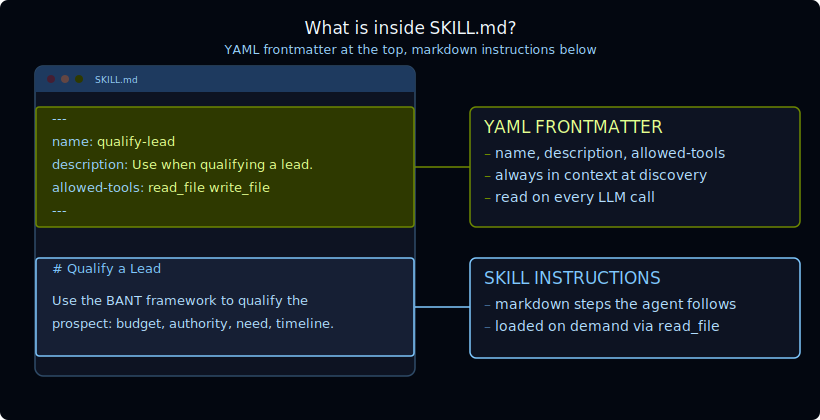

[For translation, open lesson in new tab and use Chrome translate](https://langchain-ai.github.io/lca-deepagents/m3/m3.2-skills.html)

<style>@import url('../shared/sd-components.css');</style>
<script src="../shared/sd-components.js"></script>

# Skills

<style>
.lt-bar {
  display: flex;
  flex-wrap: wrap;
  gap: 20px;
  margin: 28px 0 0;
  border-bottom: 2px solid #CCE9FF;
}
.lt-group { display: flex; gap: 3px; }
.lt-quiz  { --c: #7C3AED; }
.lt-skills { --c: #059669; }
.lt-wrap   { --c: #B45309; }
.lt-tab {
  font: 500 14px 'IBM Plex Mono', monospace;
  padding: 9px 14px;
  border: none;
  background: transparent;
  color: #40668D;
  cursor: pointer;
  border-bottom: 3px solid transparent;
  margin-bottom: -2px;
  border-radius: 6px 6px 0 0;
  transition: background .15s, color .15s, border-color .15s;
  white-space: nowrap;
}
.lt-tab:hover { background: #F2FAFF; color: #030710; }
.lt-tab.active {
  color: var(--c);
  border-bottom-color: var(--c);
  background: #fff;
}
.lt-panel { display: none; padding-top: 24px; }
.lt-panel.active { display: block; }
@media (max-width: 600px) {
  .lt-bar { flex-wrap: nowrap; overflow-x: auto; gap: 12px; }
  .lt-tab { padding: 8px 10px; font-size: 13px; }
}
</style>

<div class="lt-bar" role="tablist" aria-label="Lesson sections">
  <div class="lt-group lt-skills">
    <button class="lt-tab active" data-p="skills" role="tab" aria-selected="true">Skills</button>
  </div>
  <div class="lt-group lt-wrap">
    <button class="lt-tab" data-p="lab" role="tab" aria-selected="false">Lab</button>
  </div>
  <div class="lt-group lt-quiz">
    <button class="lt-tab" data-p="quiz" role="tab" aria-selected="false">Quiz</button>
  </div>
</div>

<div class="lt-panel active" id="p-skills" markdown="1" role="tabpanel">

## Skills

A skill is a directory containing a `SKILL.md` file. Skills follow an [open standard](https://agentskills.io/specification), which means they are portable across agents and shareable across teams.

<details style="border:2.5px solid #000;border-radius:6px;background:#fff;margin:1rem 0;"><summary style="padding:10px 16px;cursor:pointer;font-weight:500;font-family:'IBM Plex Mono',monospace;font-size:14px;">Video Walkthrough</summary><div style="padding:12px 16px 16px;"><div class="video-container" style="max-width:750px;"><div class="video-wrapper"><iframe src="https://share.descript.com/embed/0DoYTlG67pf" frameborder="0" allow="autoplay; fullscreen; encrypted-media; picture-in-picture" allowfullscreen></iframe></div></div></div></details>

<iframe src="images/m3.2-skill-structure.html" style="width:100%;height:580px;border:none;border-radius:12px;display:block;margin:1.25rem 0 1.5rem;" title="Skill directory structure; use arrow keys or Prev/Next to navigate"></iframe>

### The SKILL.md file

Each skill lives in its own named directory, and the directory name must match the `name` field in the frontmatter:

The `SKILL.md` file has two parts: a YAML frontmatter block at the top, and the skill instructions below it.



The agent reads only the frontmatter at startup; the full body is loaded when a skill is activated. Write the `description` to clearly answer when the skill should be used. Keep it brief and specific.

The recognized frontmatter fields are:

| Field | Required | Notes |
|---|---|---|
| `name` | yes | Lowercase, alphanumeric, hyphens only. Must match the directory name. |
| `description` | yes | Describes when to use this skill. Kept brief; always in context. |
| `allowed-tools` | no | Space-separated list of tool names the skill may use. |
| `compatibility` | no | Environment or version requirements. |
| `metadata` | no | Arbitrary key-value pairs. |

## Progressive disclosure

<details style="border:2.5px solid #000;border-radius:6px;background:#fff;margin:1rem 0;"><summary style="padding:10px 16px;cursor:pointer;font-weight:500;font-family:'IBM Plex Mono',monospace;font-size:14px;">Video Walkthrough</summary><div style="padding:12px 16px 16px;"><div class="video-container" style="max-width:750px;"><div class="video-wrapper"><iframe src="https://share.descript.com/embed/pDra5U0wKtN" frameborder="0" allow="autoplay; fullscreen; encrypted-media; picture-in-picture" allowfullscreen></iframe></div></div></div></details>

Skills use a three-stage pattern to keep the agent's context lean:

**1. Discovery**

The SDK reads the `name` and `description` from each skill's frontmatter and automatically injects them into the system prompt on every call. You do not write this section; the SDK generates it. Simplified, it looks like this:

<pre class="no-copy"><code>## Skills System

Available skills:
- **qualify-lead**: Use when the user wants to qualify a sales lead or prospect.
  -> Read skills/qualify-lead/SKILL.md for full instructions.
- **draft-pitch**: Use when the user wants to write a sales pitch or outreach message.
  -> Read skills/draft-pitch/SKILL.md for full instructions.
</code></pre>

Both the `name` and `description` are always in context, so keep them short and precise. The `description` in particular should describe only **when** to use the skill, not what it does internally.

**2. Activation**

When a task matches a skill's description, the agent calls `read_file` on the path shown in the system prompt, loading the full `SKILL.md` into context for that turn. The full content is not loaded automatically; the agent reads it on demand.

**3. Execution**

The agent follows the instructions in the skill body, calling any tools it needs and using any bundled files referenced in the instructions.

You can see all three stages in a LangSmith trace: the Skills System section appears in every system message; the `read_file` call marks the moment of activation; and the subsequent tool calls show execution.

<Tip>

**Skills go further than static text.** An agent can write and edit its own skill files over time, refining them from the preferences and patterns it learns on the job. Skills can also include executable scripts in a `scripts/` subdirectory, which the agent can run in a sandbox, enabling more advanced workflows like code generation, data processing, or multi-step automation.
</Tip>

---

## How to use skills

Using a skill has three parts.

### 1. Create a skill directory

Each skill is a directory with a `SKILL.md` file:

```text
skills/
  qualify-lead/
    SKILL.md
  draft-pitch/
    SKILL.md
```

The directory name should match the `name` field in `SKILL.md`.

### 2. Write the metadata and instructions

```markdown
---
name: qualify-lead
description: Use when the user wants to qualify a sales lead or prospect.
---

# Qualify a Lead

Follow these steps...
```

The `description` is the trigger. The body is the detailed procedure the agent reads after activation.

### 3. Put the skills in the agent's backend and register them

Skills are files, so they must be available through the agent's backend. The `skills` argument points to a directory path in that backend.

```python
from deepagents.backends import FilesystemBackend

backend = FilesystemBackend(root_dir="/path/to/agent-files", virtual_mode=True)

agent = create_deep_agent(
    model=model,
    backend=backend,
    skills=["/skills"],
)
```

In this example, the backend must contain `/skills/qualify-lead/SKILL.md` and `/skills/draft-pitch/SKILL.md`. The agent discovers each skill's `name` and `description`, then reads the full `SKILL.md` through its filesystem tools only when needed.

At runtime, the agent:

1. Sees all skill names and descriptions in the system prompt
2. Matches the user request to a skill description
3. Calls `read_file` on that skill's `SKILL.md`
4. Follows the full instructions in the skill body

In LangSmith, you can debug this by checking the system prompt for the discovery list, the `read_file` call for activation, and the later tool calls or final output for execution.

---

## References

**Documentation:**
- [Skills (Deep Agents)](https://docs.langchain.com/oss/python/deepagents/skills)
- [Agent Skills specification](https://agentskills.io/specification)

</div>

<div class="lt-panel" id="p-quiz" role="tabpanel">

<h2>Check your understanding</h2>

<MCQ
    question="What constraint links the skill directory name to its SKILL.md frontmatter?"
    choices='["The directory name must match the name field in the frontmatter", "The directory name must match the description field", "The directory name must be all uppercase", "There is no constraint; the two are independent"]'
    correctIndex={0}
    explanation="Each skill lives in its own named directory, and that directory name must match the name field in the SKILL.md frontmatter. Breaking this constraint means the SDK cannot resolve the skill correctly."
/>

<MCQ
    question="At which stage does the agent call read_file on a skill's SKILL.md path?"
    choices='["Discovery: when the SDK assembles the system prompt at startup", "Execution: once per tool call during the run", "All three stages; the file is read once and cached at startup", "Activation: when a task matches the skill&#39;s description"]'
    correctIndex={3}
    explanation="Activation is the stage where the agent calls read_file. At discovery, only the name and description are injected; the full body stays unread until a matching task triggers the read."
/>

<MCQ
    question="What should the description field in a skill's frontmatter communicate?"
    choices='["A summary of what the skill does internally, step by step", "The skill&#39;s author and version number", "In what situation the skill should be used", "The list of tools the skill is permitted to call"]'
    correctIndex={2}
    explanation="The description is the main selection text the agent sees before it decides whether to activate a skill. Write it as a single, specific sentence describing when to use the skill, not what it does internally."
/>

<MCQ
    question="Why does the SDK inject only the name and description into the system prompt rather than the full SKILL.md body?"
    choices='["The full body is too long for any model&#39;s context window", "To keep the agent&#39;s context lean by loading skill details only when a task requires them", "The full body is compiled into a binary at deploy time and is not readable as text", "Injecting the full body would expose internal instructions to users"]'
    correctIndex={1}
    explanation="Progressive disclosure keeps the context lean. Only the compact name and description are always present. The full body (steps, output format, bundled files) loads only when the agent activates the skill for a matching task."
/>

<MCQ
    question="Which two frontmatter fields in SKILL.md are required?"
    choices='["name and allowed-tools", "name and compatibility", "description and metadata", "name and description"]'
    correctIndex={3}
    explanation="name and description are the only required fields. allowed-tools, compatibility, and metadata are all optional. name must be lowercase alphanumeric with hyphens and must match the directory name."
/>

</div>

<div class="lt-panel" id="p-lab" markdown="1" role="tabpanel">

## Sales Assistant with Skills

<Tip>

<details style="border:2.5px solid #000;border-radius:6px;background:#fff;margin:1rem 0;"><summary style="padding:10px 16px;cursor:pointer;font-weight:500;font-family:'IBM Plex Mono',monospace;font-size:14px;">Lab Video Walkthrough</summary><div style="padding:12px 16px 16px;"><div class="video-container" style="max-width:750px;"><div class="video-wrapper"><iframe src="https://share.descript.com/embed/XxEWKNe2z1p" frameborder="0" allow="autoplay; fullscreen; encrypted-media; picture-in-picture" allowfullscreen></iframe></div></div></div></details>

**[View this run here in LangSmith.](https://smith.langchain.com/public/c9b778d4-48f2-461d-8cc8-0d502e6f463c/r/019f1ff2-0085-7402-b80c-a1451e36a18f)** Notice the skill descriptions are visible upfront, but the matching `SKILL.md` is only read once the agent decides it needs it.

<details style="border:2.5px solid #000;border-radius:6px;background:#E5F4FF;margin:1rem 0;"><summary style="padding:10px 16px;cursor:pointer;font-weight:500;font-family:'IBM Plex Mono',monospace;font-size:14px;">LangSmith Walkthrough</summary><div style="padding:12px 16px 16px;"><div class="video-container" style="max-width:750px;"><div class="video-wrapper"><iframe src="https://share.descript.com/embed/KqVlE3klzVJ" frameborder="0" allow="autoplay; fullscreen; encrypted-media; picture-in-picture" allowfullscreen></iframe></div></div></div></details>

</Tip>

This lab uses a sales assistant with two skills: one for qualifying leads and one for drafting pitches. Using two skills makes the discovery and activation stages visible: both descriptions are always in the system prompt, but only the relevant skill's `SKILL.md` is read when needed.

All files are already in the repo under `python/m3/`. Open `m3.2_scratch_agent_skills.py` and run it directly, or use a coding agent to explore the setup.

---

### 1. `qualify-lead/SKILL.md`

Located at `python/m3/skills/qualify-lead/SKILL.md`:

```markdown
---
name: qualify-lead
description: Use when the user wants to qualify a sales lead or prospect.
---

# Qualify a Lead

Use the BANT framework to qualify the prospect systematically.

**Step 1: Budget**: Ask what budget range they are working with and how purchasing decisions are made in their organisation.

**Step 2: Authority**: Confirm whether you are speaking with the decision maker. If not, ask who is and whether they can be involved.

**Step 3: Need**: Understand the specific pain point. What problem are they trying to solve? What happens if it stays unsolved?

**Step 4: Timeline**: Ask when they are looking to make a decision and when they would need the solution running.

## Output

After gathering responses, classify the lead and summarise your findings:

- **Qualified**: clear budget, authority confirmed, defined need, decision within 90 days
- **Nurture**: one or more gaps; recommend a follow-up in 30 days
- **Disqualify**: no budget, no authority, or no real need identified
```

---

### 2. `draft-pitch/SKILL.md`

Located at `python/m3/skills/draft-pitch/SKILL.md`:

```markdown
---
name: draft-pitch
description: Use when the user wants to write a sales pitch or outreach message for a prospect.
---

# Draft a Sales Pitch

Follow these steps to write a concise, effective pitch.

**Step 1: Research**: Ask for the prospect's company name, their role, and any context about their situation or pain points.

**Step 2: Hook**: Open with one sentence that names the problem they are likely experiencing.

**Step 3: Value proposition**: One to two sentences explaining what the product does and who it is for.

**Step 4: Social proof**: One brief example: "We helped [similar company] achieve [specific result]."

**Step 5: Call to action**: End with a specific, low-friction ask; a 15-minute call or a short reply.

Keep the final pitch under 150 words.
```

---

### 3. `m3.2_scratch_agent_skills.py`

Here's how `python/m3/m3.2_scratch_agent_skills.py` wires the skills into the agent:

```python
# python/m3/m3.2_scratch_agent_skills.py
from pathlib import Path

from deepagents import create_deep_agent
from deepagents.backends.filesystem import FilesystemBackend

from models import model

m3_dir = Path(__file__).parent
backend = FilesystemBackend(root_dir=str(m3_dir), virtual_mode=True)

agent = create_deep_agent(
    model=model,
    name="Sales_Assistant",
    backend=backend,
    skills=["/skills"],
    system_prompt="You are a sales assistant.",
)

result = agent.invoke({"messages": [{"role": "user", "content": "Qualify this lead: Acme Corp, 200-person logistics company. I spoke with Sarah Chen, VP of Sales: she's the decision maker. They have $45k budgeted for CRM this year. Main pain: deals are slipping through the cracks due to poor pipeline visibility. They want a solution live by end of Q3."}]})
print(result["messages"][-1].content)
```

Try swapping in either question to see both skills activate:

- `"Qualify this lead: Acme Corp, 200-person logistics company. I spoke with Sarah Chen, VP of Sales: she's the decision maker. They have $45k budgeted for CRM this year. Main pain: deals are slipping through the cracks due to poor pipeline visibility. They want a solution live by end of Q3."`
- `"Write a cold outreach message for a prospect at a mid-size logistics company."`

---

### Run it

Before running it, make sure your model API key from setup is available in the Python environment.

From the repo root:

```bash
cd python
uv run ./m3/m3.2_scratch_agent_skills.py
```

---

### What to look for in LangSmith

Open the run and check the system message on the first LLM call. You should see a **Skills System** section listing both skill names and descriptions, but no body content from either `SKILL.md`. This is discovery.

To see activation, toggle **Hidden runs** in LangSmith. This reveals the full execution tree, including middleware calls. Find the `read_file` entry nested inside `FilesystemMiddleware` -- click into it and open the **Output** tab. You will see the full body of whichever skill matched: the BANT steps for a qualify-lead request, or the pitch steps for a draft-pitch request. That is activation: the agent loaded exactly one skill body, on demand, because the task matched its description.

Try both questions in two separate runs and compare which skill body appears in the `read_file` output.

<div class="callout">
<strong>Why the name and description are what matter at discovery</strong><br>
The name and description are the discovery text the agent sees before deciding whether to activate a skill. The full body, the steps, the output format: none of it is visible until <code>read_file</code> is called. Write the description to clearly answer: "In what situation should this skill be used?" Keep it brief and specific.
</div>

</div>

<script>
(function () {
  var tabs = document.querySelectorAll('.lt-tab');
  function show(p) {
    tabs.forEach(function (t) {
      var on = t.getAttribute('data-p') === p;
      t.classList.toggle('active', on);
      t.setAttribute('aria-selected', on ? 'true' : 'false');
    });
    document.querySelectorAll('.lt-panel').forEach(function (panel) {
      panel.classList.toggle('active', panel.id === 'p-' + p);
    });
  }
  tabs.forEach(function (t) {
    t.addEventListener('click', function () { show(t.getAttribute('data-p')); });
  });
})();
</script>
