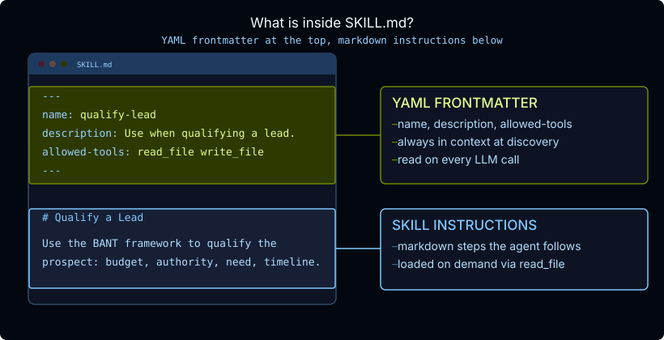

[For translation, open lesson in new tab and use Chrome translate](https://langchain-ai.github.io/lca-lessons/deepagents/m3/m3.2-skills.html)

<style>@import url('../shared/sd-components.css');</style>
<script src="../shared/sd-components.js"></script>

<div class="page-lang-switch" data-page-lang-switch>
  <button class="page-lang-btn" data-page-lang="python" aria-selected="false">Python</button>
  <button class="page-lang-btn" data-page-lang="typescript" aria-selected="false">TypeScript</button>
</div>

# Skills

<style>
.lt-bar {
  display: flex;
  flex-wrap: wrap;
  gap: 20px;
  margin: 28px 0 0;
  border-bottom: 2px solid #CCE9FF;
}
.lt-group { display: flex; gap: 3px; }
.lt-quiz  { --c: #7C3AED; }
.lt-skills { --c: #059669; }
.lt-wrap   { --c: #B45309; }
.lt-homework { --c: #0E9F6E; }
.lt-tab {
  font: 500 14px 'IBM Plex Mono', monospace;
  padding: 9px 14px;
  border: none;
  background: transparent;
  color: #40668D;
  cursor: pointer;
  border-bottom: 3px solid transparent;
  margin-bottom: -2px;
  border-radius: 6px 6px 0 0;
  transition: background .15s, color .15s, border-color .15s;
  white-space: nowrap;
}
.lt-tab:hover { background: #F2FAFF; color: #030710; }
.lt-tab.active {
  color: var(--c);
  border-bottom-color: var(--c);
  background: #fff;
}
.lt-panel { display: none; padding-top: 24px; }
.lt-panel.active { display: block; }
@media (max-width: 600px) {
  .lt-bar { flex-wrap: nowrap; overflow-x: auto; gap: 12px; }
  .lt-tab { padding: 8px 10px; font-size: 13px; }
}
</style>

<div class="lt-bar" role="tablist" aria-label="Lesson sections">
  <div class="lt-group lt-skills">
    <button class="lt-tab active" data-p="skills" role="tab" aria-selected="true">Skills</button>
  </div>
  <div class="lt-group lt-wrap">
    <button class="lt-tab" data-p="lab" role="tab" aria-selected="false">Lab</button>
  </div>
  <div class="lt-group lt-quiz">
    <button class="lt-tab" data-p="quiz" role="tab" aria-selected="false">Quiz</button>
  </div>
  <div class="lt-group lt-homework">
    <button class="lt-tab" data-p="homework" role="tab" aria-selected="false">Homework</button>
  </div>
</div>

<div class="lt-panel active" id="p-skills" markdown="1" role="tabpanel">

<div data-lang="python" markdown="1">

A skill is a directory containing a `SKILL.md` file. Skills follow an [open standard](https://agentskills.io/specification), which means they are portable across agents and shareable across teams.

<details style="border:2.5px solid #000;border-radius:6px;background:#fff;margin:1rem 0;"><summary style="padding:10px 16px;cursor:pointer;font-weight:500;font-family:'IBM Plex Mono',monospace;font-size:14px;">Quick Overview: What is a Skill</summary><div style="padding:12px 16px 16px;"><div class="video-container" style="max-width:750px;"><div class="video-wrapper"><iframe src="https://share.descript.com/embed/zbinJN7a2I0" frameborder="0" allow="autoplay; fullscreen; encrypted-media; picture-in-picture" allowfullscreen></iframe></div></div></div></details>

<details style="border:2.5px solid #000;border-radius:6px;background:#fff;margin:1rem 0;"><summary style="padding:10px 16px;cursor:pointer;font-weight:500;font-family:'IBM Plex Mono',monospace;font-size:14px;">Lesson Video Walkthrough</summary><div style="padding:12px 16px 16px;"><div class="video-container" style="max-width:750px;"><div class="video-wrapper"><iframe src="https://share.descript.com/embed/0DoYTlG67pf" frameborder="0" allow="autoplay; fullscreen; encrypted-media; picture-in-picture" allowfullscreen></iframe></div></div></div></details>

<iframe src="images/m3.2-skill-structure.html" style="width:100%;height:580px;border:none;border-radius:12px;display:block;margin:1.25rem 0 1.5rem;" title="Skill directory structure; use arrow keys or Prev/Next to navigate"></iframe>

### The SKILL.md file

Each skill lives in its own named directory, and the directory name should match the `name` field in the frontmatter (this is the Agent Skills spec convention; if they differ, deepagents logs a warning but still loads the skill):

The `SKILL.md` file has two parts: a YAML frontmatter block at the top, and the skill instructions below it.



At startup, `SkillsMiddleware` reads each `SKILL.md` through the backend in code (not through a model tool call) and keeps only the frontmatter's `name` and `description`. The model loads the full body with `read_file` when it activates a skill. Write the `description` to clearly answer when the skill should be used. Keep it brief and specific.

The recognized frontmatter fields are:

| Field | Required | Notes |
|---|---|---|
| `name` | yes | Lowercase, alphanumeric, hyphens only. Should match the directory name. |
| `description` | yes | Describes when to use this skill. Kept brief; always in context. |
| `allowed-tools` | no | Space-separated list of tool names the skill may use. |
| `compatibility` | no | Environment or version requirements. |
| `metadata` | no | Arbitrary key-value pairs. |

## Progressive disclosure

<details style="border:2.5px solid #000;border-radius:6px;background:#fff;margin:1rem 0;"><summary style="padding:10px 16px;cursor:pointer;font-weight:500;font-family:'IBM Plex Mono',monospace;font-size:14px;">Lesson Video Walkthrough</summary><div style="padding:12px 16px 16px;"><div class="video-container" style="max-width:750px;"><div class="video-wrapper"><iframe src="https://share.descript.com/embed/pDra5U0wKtN" frameborder="0" allow="autoplay; fullscreen; encrypted-media; picture-in-picture" allowfullscreen></iframe></div></div></div></details>

Skills use a three-stage pattern to keep the agent's context lean:

**1. Discovery**

Before the model runs, the SDK reads each skill's frontmatter itself, parsing the YAML in code rather than through a `read_file` tool call, and injects the `name` and `description` into the system prompt on every call. You do not write this section; the SDK generates it. Simplified, it looks like this:

<pre class="no-copy"><code>## Skills System

Available skills:
- **qualify-lead**: Use when the user wants to qualify a sales lead or prospect.
  -> Read skills/qualify-lead/SKILL.md for full instructions.
- **draft-pitch**: Use when the user wants to write a sales pitch or outreach message.
  -> Read skills/draft-pitch/SKILL.md for full instructions.
</code></pre>

Both the `name` and `description` are always in context, so keep them short and precise. The `description` in particular should describe only **when** to use the skill, not what it does internally.

**2. Activation**

When a task matches a skill's description, the agent calls `read_file` on the path shown in the system prompt, loading the full `SKILL.md` into context for that turn. The full content is not loaded automatically; the agent reads it on demand.

**3. Execution**

The agent follows the instructions in the skill body, calling any tools it needs and using any bundled files referenced in the instructions.

You can see all three stages in a LangSmith trace: the Skills System section appears in every system message; the `read_file` call marks the moment of activation; and the subsequent tool calls show execution.

<Tip>

**Skills go further than static text.** An agent can write and edit its own skill files over time, refining them from the preferences and patterns it learns on the job. Skills can also include executable scripts in a `scripts/` subdirectory, which the agent can run in a sandbox, enabling more advanced workflows like code generation, data processing, or multi-step automation.
</Tip>

<div class="callout">
<strong>Skills vs. Tools:</strong>
<br><br>
<ul>
<li>A <strong>tool</strong> is a function the model calls to <em>do</em> something: search the web, write a file, hit an API. Calling it takes an action and returns a result.</li>
<li>A <strong>skill</strong> doesn't do anything by itself. It's markdown instructions (plus optional bundled scripts) that the agent reads via <code>read_file</code> when a task matches its <code>description</code>.</li>
</ul>
In practice, a skill's instructions just tell the agent which of its existing tools to use, and how.
</div>

---

## How to use skills

Using a skill has three parts.

### 1. Create a skill directory

Each skill is a directory with a `SKILL.md` file:

```text
skills/
  qualify-lead/
    SKILL.md
  draft-pitch/
    SKILL.md
```

The directory name should match the `name` field in `SKILL.md`.

### 2. Write the metadata and instructions

```markdown
---
name: qualify-lead
description: Use when the user wants to qualify a sales lead or prospect.
---

# Qualify a Lead

Follow these steps...
```

The `description` is the trigger. The body is the detailed procedure the agent reads after activation.

### 3. Put the skills in the agent's backend and register them

Skills are files, so they must be available through the agent's backend. The `skills` argument points to a directory path in that backend.

```python
from deepagents.backends import FilesystemBackend

backend = FilesystemBackend(root_dir="/path/to/agent-files", virtual_mode=True)

agent = create_deep_agent(
    model=model,
    backend=backend,
    skills=["/skills"],
)
```

In this example, the backend must contain `/skills/qualify-lead/SKILL.md` and `/skills/draft-pitch/SKILL.md`. The agent discovers each skill's `name` and `description`, then reads the full `SKILL.md` through its filesystem tools only when needed.

At runtime, the agent:

1. Sees all skill names and descriptions in the system prompt
2. Matches the user request to a skill description
3. Calls `read_file` on that skill's `SKILL.md`
4. Follows the full instructions in the skill body

In LangSmith, you can debug this by checking the system prompt for the discovery list, the `read_file` call for activation, and the later tool calls or final output for execution.

<div class="case-study" markdown="1">


<div markdown="1">

**LangChain Blog**

[How Stripe built their Knowledge AI Platform on Deep Agents](https://www.langchain.com/blog/how-stripe-built-their-knowledge-ai-platform-on-deep-agents)

Stripe's internal agent, Kai, runs 1,000+ skills across 100+ teams, using skill selection to decide which of 500+ internal tools get loaded into context. Past a few hundred skills, description-based discovery alone starts to degrade, so Kai adds a second gating pass, using each skill's `allowedTools` list to filter which tools actually load.

<details style="border:2.5px solid #000;border-radius:6px;background:#fff;margin:1rem 0;"><summary style="padding:10px 16px;cursor:pointer;font-weight:500;font-family:'IBM Plex Mono',monospace;font-size:14px;">Case Study Video Walkthrough</summary><div style="padding:12px 16px 16px;"><div class="video-container" style="max-width:750px;"><div class="video-wrapper"><iframe src="https://share.descript.com/embed/cgm08f5KpF8" frameborder="0" allow="autoplay; fullscreen; encrypted-media; picture-in-picture" allowfullscreen></iframe></div></div></div></details>

</div>
</div>

---

## References

**Documentation:**

- [Skills (Deep Agents)](https://docs.langchain.com/oss/python/deepagents/skills)
- [Agent Skills specification](https://agentskills.io/specification)

</div>

<div data-lang="typescript" markdown="1">

A skill is a directory containing a `SKILL.md` file. Skills follow an [open standard](https://agentskills.io/specification), which means they are portable across agents and shareable across teams.

<details style="border:2.5px solid #000;border-radius:6px;background:#fff;margin:1rem 0;"><summary style="padding:10px 16px;cursor:pointer;font-weight:500;font-family:'IBM Plex Mono',monospace;font-size:14px;">Quick Overview: What is a Skill</summary><div style="padding:12px 16px 16px;"><div class="video-container" style="max-width:750px;"><div class="video-wrapper"><iframe src="https://share.descript.com/embed/zbinJN7a2I0" frameborder="0" allow="autoplay; fullscreen; encrypted-media; picture-in-picture" allowfullscreen></iframe></div></div></div></details>

<details style="border:2.5px solid #000;border-radius:6px;background:#fff;margin:1rem 0;"><summary style="padding:10px 16px;cursor:pointer;font-weight:500;font-family:'IBM Plex Mono',monospace;font-size:14px;">Lesson Video Walkthrough</summary><div style="padding:12px 16px 16px;"><div class="video-container" style="max-width:750px;"><div class="video-wrapper"><iframe src="https://share.descript.com/embed/0DoYTlG67pf" frameborder="0" allow="autoplay; fullscreen; encrypted-media; picture-in-picture" allowfullscreen></iframe></div></div></div></details>

<iframe src="images/m3.2-skill-structure.html" style="width:100%;height:580px;border:none;border-radius:12px;display:block;margin:1.25rem 0 1.5rem;" title="Skill directory structure; use arrow keys or Prev/Next to navigate"></iframe>

### The SKILL.md file

Each skill lives in its own named directory, and the directory name should match the `name` field in the frontmatter (this is the Agent Skills spec convention; if they differ, deepagents logs a warning but still loads the skill):

The `SKILL.md` file has two parts: a YAML frontmatter block at the top, and the skill instructions below it.


At startup, `SkillsMiddleware` reads each `SKILL.md` through the backend in code (not through a model tool call) and keeps only the frontmatter's `name` and `description`. The model loads the full body with `read_file` when it activates a skill. Write the `description` to clearly answer when the skill should be used. Keep it brief and specific.

The recognized frontmatter fields are:

| Field | Required | Notes |
|---|---|---|
| `name` | yes | Lowercase, alphanumeric, hyphens only. Should match the directory name. |
| `description` | yes | Describes when to use this skill. Kept brief; always in context. |
| `allowed-tools` | no | Space-separated list of tool names the skill may use. |
| `compatibility` | no | Environment or version requirements. |
| `metadata` | no | Arbitrary key-value pairs. |

## Progressive disclosure

<details style="border:2.5px solid #000;border-radius:6px;background:#fff;margin:1rem 0;"><summary style="padding:10px 16px;cursor:pointer;font-weight:500;font-family:'IBM Plex Mono',monospace;font-size:14px;">Lesson Video Walkthrough</summary><div style="padding:12px 16px 16px;"><div class="video-container" style="max-width:750px;"><div class="video-wrapper"><iframe src="https://share.descript.com/embed/pDra5U0wKtN" frameborder="0" allow="autoplay; fullscreen; encrypted-media; picture-in-picture" allowfullscreen></iframe></div></div></div></details>

Skills use a three-stage pattern to keep the agent's context lean:

**1. Discovery**

Before the model runs, the SDK reads each skill's frontmatter itself, parsing the YAML in code rather than through a `read_file` tool call, and injects the `name` and `description` into the system prompt on every call. You do not write this section; the SDK generates it. Simplified, it looks like this:

<pre class="no-copy"><code>## Skills System

Available skills:
- **qualify-lead**: Use when the user wants to qualify a sales lead or prospect.
  -> Read skills/qualify-lead/SKILL.md for full instructions.
- **draft-pitch**: Use when the user wants to write a sales pitch or outreach message.
  -> Read skills/draft-pitch/SKILL.md for full instructions.
</code></pre>

Both the `name` and `description` are always in context, so keep them short and precise. The `description` in particular should describe only **when** to use the skill, not what it does internally.

**2. Activation**

When a task matches a skill's description, the agent calls `read_file` on the path shown in the system prompt, loading the full `SKILL.md` into context for that turn. The full content is not loaded automatically; the agent reads it on demand.

**3. Execution**

The agent follows the instructions in the skill body, calling any tools it needs and using any bundled files referenced in the instructions.

You can see all three stages in a LangSmith trace: the Skills System section appears in every system message; the `read_file` call marks the moment of activation; and the subsequent tool calls show execution.

<Tip>

**Skills go further than static text.** An agent can write and edit its own skill files over time, refining them from the preferences and patterns it learns on the job. Skills can also include executable scripts in a `scripts/` subdirectory, which the agent can run in a sandbox, enabling more advanced workflows like code generation, data processing, or multi-step automation.
</Tip>

<div class="callout">
<strong>Skills vs. Tools:</strong>
<br><br>
<ul>
<li>A <strong>tool</strong> is a function the model calls to <em>do</em> something: search the web, write a file, hit an API. Calling it takes an action and returns a result.</li>
<li>A <strong>skill</strong> doesn't do anything by itself. It's markdown instructions (plus optional bundled scripts) that the agent reads via <code>read_file</code> when a task matches its <code>description</code>.</li>
</ul>
In practice, a skill's instructions just tell the agent which of its existing tools to use, and how.
</div>

---

## How to use skills

Using a skill has three parts.

### 1. Create a skill directory

Each skill is a directory with a `SKILL.md` file:

```text
skills/
  qualify-lead/
    SKILL.md
  draft-pitch/
    SKILL.md
```

The directory name should match the `name` field in `SKILL.md`.

### 2. Write the metadata and instructions

```markdown
---
name: qualify-lead
description: Use when the user wants to qualify a sales lead or prospect.
---

# Qualify a Lead

Follow these steps...
```

The `description` is the trigger. The body is the detailed procedure the agent reads after activation.

### 3. Put the skills in the agent's backend and register them

Skills are files, so they must be available through the agent's backend. The `skills` argument points to a directory path in that backend.

```typescript
import { createDeepAgent, FilesystemBackend } from "deepagents";

const backend = new FilesystemBackend({ rootDir: "/path/to/agent-files", virtualMode: true });

const agent = createDeepAgent({
  model,
  backend,
  skills: ["/skills"],
});
```

In this example, the backend must contain `/skills/qualify-lead/SKILL.md` and `/skills/draft-pitch/SKILL.md`. The agent discovers each skill's `name` and `description`, then reads the full `SKILL.md` through its filesystem tools only when needed.

At runtime, the agent:

1. Sees all skill names and descriptions in the system prompt
2. Matches the user request to a skill description
3. Calls `read_file` on that skill's `SKILL.md`
4. Follows the full instructions in the skill body

In LangSmith, you can debug this by checking the system prompt for the discovery list, the `read_file` call for activation, and the later tool calls or final output for execution.

<div class="case-study" markdown="1">


<div markdown="1">

**LangChain Blog**

[How Stripe built their Knowledge AI Platform on Deep Agents](https://www.langchain.com/blog/how-stripe-built-their-knowledge-ai-platform-on-deep-agents)

Stripe's internal agent, Kai, runs 1,000+ skills across 100+ teams, using skill selection to decide which of 500+ internal tools get loaded into context. Past a few hundred skills, description-based discovery alone starts to degrade, so Kai adds a second gating pass, using each skill's `allowedTools` list to filter which tools actually load.

<details style="border:2.5px solid #000;border-radius:6px;background:#fff;margin:1rem 0;"><summary style="padding:10px 16px;cursor:pointer;font-weight:500;font-family:'IBM Plex Mono',monospace;font-size:14px;">Case Study Video Walkthrough</summary><div style="padding:12px 16px 16px;"><div class="video-container" style="max-width:750px;"><div class="video-wrapper"><iframe src="https://share.descript.com/embed/cgm08f5KpF8" frameborder="0" allow="autoplay; fullscreen; encrypted-media; picture-in-picture" allowfullscreen></iframe></div></div></div></details>

</div>
</div>

---

## References

**Documentation:**

- [Skills (Deep Agents)](https://docs.langchain.com/oss/javascript/deepagents/skills)
- [Agent Skills specification](https://agentskills.io/specification)

</div>

</div>

<div class="lt-panel" id="p-quiz" role="tabpanel">

<h2>Check your understanding</h2>

<MCQ
    question="When a thread starts, the system prompt already lists every skill&#39;s name and description. How was that frontmatter read, and when does the model itself first call read_file on a SKILL.md?"
    choices='["The model calls read_file on every SKILL.md at startup, then again when a task matches", "The middleware reads each SKILL.md in code; the model calls read_file when a task matches", "The names come from directory names alone; the model reads each SKILL.md before replying", "The frontmatter is cached at deploy time; the model reads the SKILL.md on every tool call"]'
    correctIndex={1}
    explanation="Discovery is not a model tool call. Before the model runs, SkillsMiddleware downloads each SKILL.md through the backend, parses the YAML frontmatter in code, and injects only the name and description into the system prompt. The model&#39;s first read_file on that SKILL.md happens at activation, when a task matches the description, and it loads the full body into context."
/>
<MCQ
    question="A skill&#39;s description reads: &#34;Scores leads using BANT, writes a three-part summary, and saves it to /reports.&#34; Users who ask &#34;is this prospect worth pursuing?&#34; rarely trigger it. What is the most likely fix?"
    choices='["Rename the skill directory so it better matches the wording that users tend to type", "Add allowed-tools to the frontmatter so the agent knows which tools the skill needs", "Rewrite the description to say when to use it, like judging whether to pursue a lead", "Move the full skill body into the description so the agent can see every step up front"]'
    correctIndex={2}
    explanation="The description is what the agent matches against when deciding whether to activate a skill. This one describes what the skill does internally rather than when to use it, so it is a weak match for how users phrase the request. The lesson recommends a brief description that states when the skill should be used."
/>
<MCQ
    question="Why does SkillsMiddleware put only each skill&#39;s name and description in the system prompt, instead of the full SKILL.md body?"
    choices='["The body loads only when a task needs it, which keeps the always-on context small", "The body is withheld so that end users cannot see the skill&#39;s internal instructions", "The body is parsed into tool schemas, so the model never needs to read it as text", "The body can only be read by subagents, so the main agent sees only the metadata"]'
    correctIndex={0}
    explanation="This is progressive disclosure. The name and description are always in context so the agent can pick a skill; the full body enters context only when the agent activates the skill with read_file."
/>
<MCQ
    question="A SKILL.md has a description in its frontmatter but no name field. What happens when the agent starts?"
    choices='["The skill loads, using its directory name as the skill name", "The agent fails to start until the missing field is added", "The skill is skipped, and deepagents logs a warning", "The skill loads, but only subagents are able to see it"]'
    correctIndex={2}
    explanation="name and description are the required fields; a SKILL.md missing either is skipped with a warning. allowed-tools, compatibility, and metadata are optional. The Agent Skills spec also says name should match the directory name; if it doesn&#39;t, deepagents currently logs a warning but still loads the skill."
/>
</div>

<div class="lt-panel" id="p-lab" markdown="1" role="tabpanel">

<div data-lang="python" markdown="1">

## Sales Assistant with Skills

<Tip>

<details style="border:2.5px solid #000;border-radius:6px;background:#fff;margin:1rem 0;"><summary style="padding:10px 16px;cursor:pointer;font-weight:500;font-family:'IBM Plex Mono',monospace;font-size:14px;">Lab Video Walkthrough</summary><div style="padding:12px 16px 16px;"><div class="video-container" style="max-width:750px;"><div class="video-wrapper"><iframe src="https://share.descript.com/embed/XxEWKNe2z1p" frameborder="0" allow="autoplay; fullscreen; encrypted-media; picture-in-picture" allowfullscreen></iframe></div></div></div></details>

**[View this run here in LangSmith.](https://smith.langchain.com/public/c9b778d4-48f2-461d-8cc8-0d502e6f463c/r/019f1ff2-0085-7402-b80c-a1451e36a18f)** Notice the skill descriptions are visible upfront, but the matching `SKILL.md` is only read once the agent decides it needs it.

<details style="border:2.5px solid #000;border-radius:6px;background:#E5F4FF;margin:1rem 0;"><summary style="padding:10px 16px;cursor:pointer;font-weight:500;font-family:'IBM Plex Mono',monospace;font-size:14px;">LangSmith Video Walkthrough</summary><div style="padding:12px 16px 16px;"><div class="video-container" style="max-width:750px;"><div class="video-wrapper"><iframe src="https://share.descript.com/embed/KqVlE3klzVJ" frameborder="0" allow="autoplay; fullscreen; encrypted-media; picture-in-picture" allowfullscreen></iframe></div></div></div></details>

</Tip>

This lab uses a sales assistant with two skills: one for qualifying leads and one for drafting pitches. Using two skills makes the discovery and activation stages visible: both descriptions are always in the system prompt, but only the relevant skill's `SKILL.md` is read when needed.

All files are already in the repo under `python/m3/`. Open `m3.2_scratch_agent_skills.py` and run it directly, or use a coding agent to explore the setup.

---

### 1. `qualify-lead/SKILL.md`

Located at `python/m3/skills/qualify-lead/SKILL.md`:

```markdown
---
name: qualify-lead
description: Use when the user wants to qualify a sales lead or prospect.
---

# Qualify a Lead

Use the BANT framework to qualify the prospect systematically.

**Step 1: Budget**: Ask what budget range they are working with and how purchasing decisions are made in their organisation.

**Step 2: Authority**: Confirm whether you are speaking with the decision maker. If not, ask who is and whether they can be involved.

**Step 3: Need**: Understand the specific pain point. What problem are they trying to solve? What happens if it stays unsolved?

**Step 4: Timeline**: Ask when they are looking to make a decision and when they would need the solution running.

## Output

After gathering responses, classify the lead and summarise your findings:

- **Qualified**: clear budget, authority confirmed, defined need, decision within 90 days
- **Nurture**: one or more gaps; recommend a follow-up in 30 days
- **Disqualify**: no budget, no authority, or no real need identified
```

---

### 2. `draft-pitch/SKILL.md`

Located at `python/m3/skills/draft-pitch/SKILL.md`:

```markdown
---
name: draft-pitch
description: Use when the user wants to write a sales pitch or outreach message for a prospect.
---

# Draft a Sales Pitch

Follow these steps to write a concise, effective pitch.

**Step 1: Research**: Ask for the prospect's company name, their role, and any context about their situation or pain points.

**Step 2: Hook**: Open with one sentence that names the problem they are likely experiencing.

**Step 3: Value proposition**: One to two sentences explaining what the product does and who it is for.

**Step 4: Social proof**: One brief example: "We helped [similar company] achieve [specific result]."

**Step 5: Call to action**: End with a specific, low-friction ask; a 15-minute call or a short reply.

Keep the final pitch under 150 words.
```

---

### 3. `m3.2_scratch_agent_skills.py`

Here's how `python/m3/m3.2_scratch_agent_skills.py` wires the skills into the agent:

```python
# python/m3/m3.2_scratch_agent_skills.py
from pathlib import Path

from deepagents import create_deep_agent
from deepagents.backends.filesystem import FilesystemBackend

from models import model

m3_dir = Path(__file__).parent
backend = FilesystemBackend(root_dir=str(m3_dir), virtual_mode=True)

agent = create_deep_agent(
    model=model,
    name="Sales_Assistant",
    backend=backend,
    skills=["/skills"],
    system_prompt="You are a sales assistant.",
)

result = agent.invoke({"messages": [{"role": "user", "content": "Qualify this lead: Acme Corp, 200-person logistics company. I spoke with Sarah Chen, VP of Sales: she's the decision maker. They have $45k budgeted for CRM this year. Main pain: deals are slipping through the cracks due to poor pipeline visibility. They want a solution live by end of Q3."}]})
print(result["messages"][-1].text)
```

Try swapping in either question to see both skills activate:

- `"Qualify this lead: Acme Corp, 200-person logistics company. I spoke with Sarah Chen, VP of Sales: she's the decision maker. They have $45k budgeted for CRM this year. Main pain: deals are slipping through the cracks due to poor pipeline visibility. They want a solution live by end of Q3."`
- `"Write a cold outreach message for a prospect at a mid-size logistics company."`

---

### Run it

Before running it, make sure your model API key from setup is available in the Python environment.

From the repo root:

```bash
cd python
uv run ./m3/m3.2_scratch_agent_skills.py
```

---

### What to look for in LangSmith

Open the run and check the system message on the first LLM call. You should see a **Skills System** section listing both skill names and descriptions, but no body content from either `SKILL.md`. This is discovery.

To see activation, turn on **Hidden runs** in LangSmith to show the full execution tree, including middleware. Find the `read_file` entry nested inside `FilesystemMiddleware` and click into it, then open the **Output** tab. You will see the full body of whichever skill matched: the BANT steps for a qualify-lead request, or the pitch steps for a draft-pitch request. That is activation: the agent loaded exactly one skill body, on demand, because the task matched its description.

Try both questions in two separate runs and compare which skill body appears in the `read_file` output.

<div class="callout">
<strong>Why the name and description are what matter at discovery</strong><br>
The name and description are the discovery text the agent sees before deciding whether to activate a skill. The full body, the steps, the output format: none of it is visible until <code>read_file</code> is called. Write the description to clearly answer: "In what situation should this skill be used?" Keep it brief and specific.
</div>

</div>

<div data-lang="typescript" markdown="1">

## Sales Assistant with Skills

<Tip>

<details style="border:2.5px solid #000;border-radius:6px;background:#fff;margin:1rem 0;"><summary style="padding:10px 16px;cursor:pointer;font-weight:500;font-family:'IBM Plex Mono',monospace;font-size:14px;">Lab Video Walkthrough</summary><div style="padding:12px 16px 16px;"><div class="video-container" style="max-width:750px;"><div class="video-wrapper"><iframe src="https://share.descript.com/embed/XxEWKNe2z1p" frameborder="0" allow="autoplay; fullscreen; encrypted-media; picture-in-picture" allowfullscreen></iframe></div></div></div></details>

**[View this run here in LangSmith.](https://smith.langchain.com/public/c9b778d4-48f2-461d-8cc8-0d502e6f463c/r/019f1ff2-0085-7402-b80c-a1451e36a18f)** Notice the skill descriptions are visible upfront, but the matching `SKILL.md` is only read once the agent decides it needs it.

<details style="border:2.5px solid #000;border-radius:6px;background:#E5F4FF;margin:1rem 0;"><summary style="padding:10px 16px;cursor:pointer;font-weight:500;font-family:'IBM Plex Mono',monospace;font-size:14px;">LangSmith Video Walkthrough</summary><div style="padding:12px 16px 16px;"><div class="video-container" style="max-width:750px;"><div class="video-wrapper"><iframe src="https://share.descript.com/embed/KqVlE3klzVJ" frameborder="0" allow="autoplay; fullscreen; encrypted-media; picture-in-picture" allowfullscreen></iframe></div></div></div></details>

</Tip>

This lab uses a sales assistant with two skills: one for qualifying leads and one for drafting pitches. Using two skills makes the discovery and activation stages visible: both descriptions are always in the system prompt, but only the relevant skill's `SKILL.md` is read when needed.

All files are already in the repo under `typescript/m3/`. Open `m3.2_scratch_agent_skills.ts` and run it directly, or use a coding agent to explore the setup.

---

### 1. `qualify-lead/SKILL.md`

Located at `typescript/m3/skills/qualify-lead/SKILL.md`:

```markdown
---
name: qualify-lead
description: Use when the user wants to qualify a sales lead or prospect.
---

# Qualify a Lead

Use the BANT framework to qualify the prospect systematically.

**Step 1: Budget**: Ask what budget range they are working with and how purchasing decisions are made in their organisation.

**Step 2: Authority**: Confirm whether you are speaking with the decision maker. If not, ask who is and whether they can be involved.

**Step 3: Need**: Understand the specific pain point. What problem are they trying to solve? What happens if it stays unsolved?

**Step 4: Timeline**: Ask when they are looking to make a decision and when they would need the solution running.

## Output

After gathering responses, classify the lead and summarise your findings:

- **Qualified**: clear budget, authority confirmed, defined need, decision within 90 days
- **Nurture**: one or more gaps; recommend a follow-up in 30 days
- **Disqualify**: no budget, no authority, or no real need identified
```

---

### 2. `draft-pitch/SKILL.md`

Located at `typescript/m3/skills/draft-pitch/SKILL.md`:

```markdown
---
name: draft-pitch
description: Use when the user wants to write a sales pitch or outreach message for a prospect.
---

# Draft a Sales Pitch

Follow these steps to write a concise, effective pitch.

**Step 1: Research**: Ask for the prospect's company name, their role, and any context about their situation or pain points.

**Step 2: Hook**: Open with one sentence that names the problem they are likely experiencing.

**Step 3: Value proposition**: One to two sentences explaining what the product does and who it is for.

**Step 4: Social proof**: One brief example: "We helped [similar company] achieve [specific result]."

**Step 5: Call to action**: End with a specific, low-friction ask; a 15-minute call or a short reply.

Keep the final pitch under 150 words.
```

---

### 3. `m3.2_scratch_agent_skills.ts`

Here's how `typescript/m3/m3.2_scratch_agent_skills.ts` wires the skills into the agent:

```typescript
// typescript/m3/m3.2_scratch_agent_skills.ts
import { dirname } from "node:path";
import { fileURLToPath } from "node:url";

import { context } from "langchain";
import { createDeepAgent, FilesystemBackend } from "deepagents";

import { model } from "../models.js";

const m3Dir = dirname(fileURLToPath(import.meta.url));
const backend = new FilesystemBackend({ rootDir: m3Dir, virtualMode: true });

const agent = createDeepAgent({
  model,
  name: "Sales_Assistant",
  backend,
  skills: ["/skills"],
  systemPrompt: "You are a sales assistant.",
});

const result = await agent.invoke({
  messages: [
    {
      role: "user",
      content: context`
        Qualify this lead: Acme Corp, 200-person logistics company. I spoke with
        Sarah Chen, VP of Sales: she's the decision maker. They have $45k budgeted
        for CRM this year. Main pain: deals are slipping through the cracks due to
        poor pipeline visibility. They want a solution live by end of Q3.`,
    },
  ],
});

console.log(result.messages.at(-1)?.text);
```

Try swapping in either question to see both skills activate:

- `"Qualify this lead: Acme Corp, 200-person logistics company. I spoke with Sarah Chen, VP of Sales: she's the decision maker. They have $45k budgeted for CRM this year. Main pain: deals are slipping through the cracks due to poor pipeline visibility. They want a solution live by end of Q3."`
- `"Write a cold outreach message for a prospect at a mid-size logistics company."`

---

### Run it

Before running it, make sure your model API key from setup is available in the TypeScript environment.

From the repo root:

```bash
cd typescript
pnpm tsx ./m3/m3.2_scratch_agent_skills.ts
```

---

### What to look for in LangSmith

Open the run and check the system message on the first LLM call. You should see a **Skills System** section listing both skill names and descriptions, but no body content from either `SKILL.md`. This is discovery.

To see activation, turn on **Hidden runs** in LangSmith to show the full execution tree, including middleware. Find the `read_file` entry nested inside `FilesystemMiddleware` and click into it, then open the **Output** tab. You will see the full body of whichever skill matched: the BANT steps for a qualify-lead request, or the pitch steps for a draft-pitch request. That is activation: the agent loaded exactly one skill body, on demand, because the task matched its description.

Try both questions in two separate runs and compare which skill body appears in the `read_file` output.

<div class="callout">
<strong>Why the name and description are what matter at discovery</strong><br>
The name and description are the discovery text the agent sees before deciding whether to activate a skill. The full body, the steps, the output format: none of it is visible until <code>read_file</code> is called. Write the description to clearly answer: "In what situation should this skill be used?" Keep it brief and specific.
</div>

</div>

</div>

<div class="lt-panel" id="p-homework" markdown="1" role="tabpanel">

<div data-lang="python" markdown="1">

## Bundle a Reference File Into Your Skill

The lab's two skills, qualify-lead and draft-pitch, are each a single flat `SKILL.md` file with everything inline. This homework asks you to go one step further: write a skill for a topic or workflow of your choosing (not sales) that bundles a second file, `reference.md` (holding details the agent needs but that aren't written into `SKILL.md` itself), then confirm from the trace that the agent actually called `read_file` on that second file before answering.

Open `python/m3/m3.2_homework.py`.

1. **TODO 1**: write your own `SKILL.md` content, frontmatter and all, for a workflow of your choosing (planning a workout, reviewing a resume, triaging a bug report, etc.). It must instruct the agent to read `reference.md` for specific details and must not restate those details inline. The `name` field in your frontmatter must exactly match `SKILL_NAME` in the file.
2. **TODO 2**: write `reference.md`'s content, the specific facts, numbers, or template your `SKILL.md` points to and depends on.
3. **TODO 3**: write a system prompt for the agent and a user question that should activate your skill, matching your skill's `description`.

The script checks the returned messages for a `read_file` call on your `reference.md` path and prints whether it found one.

### Run it

```bash
cd python
uv run ./m3/m3.2_homework.py
```

Stuck, or want to see the finished shape before you start? `m3.2_homework_filled.py` is a reference copy with every TODO filled in (using a workout-planning skill and a hype personal-trainer persona); run it the same way to see what "done" looks like end to end.

Try to avoid peeking unless you're really stuck, you'll get more out of this by working through the TODOs yourself first.

---

<details markdown="1" style="border:2.5px solid #7FC8FF;border-radius:6px;background:#000;margin:1rem 0;"><summary style="padding:15px 16px;display:flex;align-items:center;cursor:pointer;font-weight:500;font-family:'IBM Plex Mono',monospace;font-size:14px;color:#7FC8FF;">Optional Extension: Want To Code From Scratch?</summary><div style="padding:12px 16px 16px;background:#fff;color:#000;border-radius:0 0 4px 4px;" markdown="1">

**What you'll build:** a skill for a new topic of your choosing (e.g. a trip-planning checklist, a code-review rubric, a meal-prep guide...), with none of the wiring given.

**Requirements:**

- Set up your own `backend` (a `FilesystemBackend` pointed at a real directory, not a temp one) and pick the skills directory layout yourself.
- Wire skills with the `skills=[...]` shorthand on `create_deep_agent`, or with `SkillsMiddleware(backend=..., sources=[...])` via `middleware=[...]` for per-source display labels. Write this in a new file under `python/m3/`.
- Bundle more than one supporting file if it fits your idea:
    - Add a `scripts/` subdirectory with a helper script, an extra reference doc, or a config file.
    - Point to these from `SKILL.md` by absolute path (the same way it points to `reference.md`).
    - If you bundle a script, give the agent an execution tool (a shell/execute tool, or a sandbox) so it can actually run it. No execution tool -> tell `SKILL.md` to just read and reason about the script instead.

```text
# Example skill directory layout
skills/
  your-skill/
    SKILL.md
    reference.md
    scripts/
      helper.py
```

- Write the agent call and a triggering question from scratch, then confirm activation from the trace yourself.

</div></details>

</div>
<div data-lang="typescript" markdown="1">

## Bundle a Reference File Into Your Skill

The lab's two skills, qualify-lead and draft-pitch, are each a single flat `SKILL.md` file with everything inline. This homework asks you to go one step further: write a skill for a topic or workflow of your choosing (not sales) that bundles a second file, `reference.md` (holding details the agent needs but that aren't written into `SKILL.md` itself), then confirm from the trace that the agent actually called `read_file` on that second file before answering.

Open `typescript/m3/m3.2_homework.ts`.

1. **TODO 1**: write your own `SKILL.md` content, frontmatter and all, for a workflow of your choosing (planning a workout, reviewing a resume, triaging a bug report, etc.). It must instruct the agent to read `reference.md` for specific details and must not restate those details inline. The `name` field in your frontmatter must exactly match `SKILL_NAME` in the file.
2. **TODO 2**: write `reference.md`'s content, the specific facts, numbers, or template your `SKILL.md` points to and depends on.
3. **TODO 3**: write a system prompt for the agent and a user question that should activate your skill, matching your skill's `description`.

The script checks the returned messages for a `read_file` call on your `reference.md` path and prints whether it found one.

### Run it

```bash
cd typescript
pnpm tsx ./m3/m3.2_homework.ts
```

Stuck, or want to see the finished shape before you start? `m3.2_homework_filled.ts` is a reference copy with every TODO filled in (using a workout-planning skill and a hype personal-trainer persona); run it the same way to see what "done" looks like end to end.

Try to avoid peeking unless you're really stuck, you'll get more out of this by working through the TODOs yourself first.

---

<details markdown="1" style="border:2.5px solid #7FC8FF;border-radius:6px;background:#000;margin:1rem 0;"><summary style="padding:15px 16px;display:flex;align-items:center;cursor:pointer;font-weight:500;font-family:'IBM Plex Mono',monospace;font-size:14px;color:#7FC8FF;">Optional Extension: Want To Code From Scratch?</summary><div style="padding:12px 16px 16px;background:#fff;color:#000;border-radius:0 0 4px 4px;" markdown="1">

**What you'll build:** a skill for a new topic of your choosing (e.g. a trip-planning checklist, a code-review rubric, a meal-prep guide...), with none of the wiring given.

**Requirements:**

- Set up your own `backend` (a `FilesystemBackend` pointed at a real directory, not a temp one) and pick the skills directory layout yourself.
- Wire skills with the `skills: [...]` shorthand on `createDeepAgent`, or with `SkillsMiddleware({ backend, sources })` via `middleware: [...]` for per-source display labels. Write this in a new file under `typescript/m3/`.
- Bundle more than one supporting file if it fits your idea:
    - Add a `scripts/` subdirectory with a helper script, an extra reference doc, or a config file.
    - Point to these from `SKILL.md` by absolute path (the same way it points to `reference.md`).
    - If you bundle a script, give the agent an execution tool (a shell/execute tool, or a sandbox) so it can actually run it. No execution tool -> tell `SKILL.md` to just read and reason about the script instead.

```text
# Example skill directory layout
skills/
  your-skill/
    SKILL.md
    reference.md
    scripts/
      helper.py
```

- Write the agent call and a triggering question from scratch, then confirm activation from the trace yourself.

</div></details>

</div>

</div>

<script>
(function () {
  var tabs = document.querySelectorAll('.lt-tab');
  function show(p) {
    tabs.forEach(function (t) {
      var on = t.getAttribute('data-p') === p;
      t.classList.toggle('active', on);
      t.setAttribute('aria-selected', on ? 'true' : 'false');
    });
    document.querySelectorAll('.lt-panel').forEach(function (panel) {
      panel.classList.toggle('active', panel.id === 'p-' + p);
    });
  }
  tabs.forEach(function (t) {
    t.addEventListener('click', function () { show(t.getAttribute('data-p')); });
  });
})();
</script>
