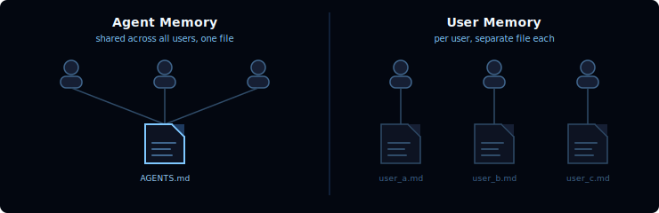
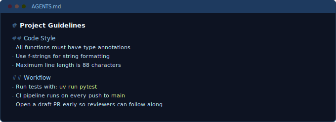

[🔗 For translation, open lesson in new tab and use Chrome translate](https://langchain-ai.github.io/lca-deepagents/m3/m3.3-memory.html)

<style>@import url('../shared/sd-components.css');</style>
<script src="../shared/sd-components.js"></script>

# Memory

<style>
.lt-bar {
  display: flex;
  flex-wrap: wrap;
  gap: 20px;
  margin: 28px 0 0;
  border-bottom: 2px solid #CCE9FF;
}
.lt-group { display: flex; gap: 3px; }
.lt-mem  { --c: #0891B2; }
.lt-wrap { --c: #B45309; }
.lt-tab {
  font: 500 14px 'IBM Plex Mono', monospace;
  padding: 9px 14px;
  border: none;
  background: transparent;
  color: #40668D;
  cursor: pointer;
  border-bottom: 3px solid transparent;
  margin-bottom: -2px;
  border-radius: 6px 6px 0 0;
  transition: background .15s, color .15s, border-color .15s;
  white-space: nowrap;
}
.lt-tab:hover { background: #F2FAFF; color: #030710; }
.lt-tab.active {
  color: var(--c);
  border-bottom-color: var(--c);
  background: #fff;
}
.lt-panel { display: none; padding-top: 24px; }
.lt-panel.active { display: block; }
@media (max-width: 600px) {
  .lt-bar { flex-wrap: nowrap; overflow-x: auto; gap: 12px; }
  .lt-tab { padding: 8px 10px; font-size: 13px; }
}
</style>

<div class="lt-bar" role="tablist" aria-label="Lesson sections">
  <div class="lt-group lt-mem">
    <button class="lt-tab active" data-p="mem" role="tab" aria-selected="true">Memory</button>
  </div>
  <div class="lt-group lt-quiz">
    <button class="lt-tab" data-p="quiz" role="tab" aria-selected="false">Quiz</button>
  </div>
  <div class="lt-group lt-wrap">
    <button class="lt-tab" data-p="lab" role="tab" aria-selected="false">Lab</button>
  </div>
</div>

<div class="lt-panel active" id="p-mem" markdown="1" role="tabpanel">

## Memory: Always-Present Context

Memory files are markdown files loaded at agent startup and injected into the system prompt on every LLM call. Unlike skills (which are loaded on demand when a task matches), memory is always present, every call.



**Agent memory** is shared across all users. Deep Agents makes memory first-class: the agent reads and writes memory as files, and you control where those files are stored using backends.

**User memory** gives each user their own file. The agent remembers preferences, context, and history per user while core agent instructions stay fixed. Users can also have per-user skills if stored in a user-scoped backend.

In Deep Agents, the `memory` argument points to your memory files and `MemoryMiddleware` handles injection and updates. Which scope you use is a function of the backend and file paths you choose.

---

### The memory argument

The `memory` argument is how you attach memory files to your agent. Without it, `MemoryMiddleware` is not active and nothing persists. Pass a list of file paths:

```python {3}
agent = create_deep_agent(
    model=model,
    memory=["memories/AGENTS.md"],
    backend=backend,
)
```

Paths are relative to the backend's root. Multiple files are supported; their contents are concatenated in order.

---

### AGENTS.md (what goes in the file)

Memory files are standard markdown with no required structure. Common contents:

- **Detailed instructions:** coding style rules, workflow conventions, project-specific knowledge the base model would not have
- **Stored facts:** user preferences, recurring context, anything the agent should recall across sessions



Any markdown file works. By convention the main file is named `AGENTS.md`, following the [agents.md specification](https://agents.md/).

---

### How injection works

Passing `memory=[...]` creates a `MemoryMiddleware` behind the scenes. On every LLM call, the middleware reads each source file and wraps the combined content in an `[agent_memory]` block appended to the system prompt.

You can see this in LangSmith:

<Video src="https://share.descript.com/view/kDlDKQy47h6" />

Open any run, expand the system message on the first LLM call, and scroll to the bottom of the system prompt. The `[agent_memory]` block contains the raw content of your memory files. It is there on every call, regardless of what the user asked.

---

### Updating memories

The middleware also injects guidelines telling the agent when to call `edit_file` to persist new information. When a user says "remember this" or provides context that should carry forward, the agent writes to one of its memory files. The updated content then appears in the system prompt on all subsequent calls.

In LangSmith, a memory write shows up as an `edit_file` tool call within the run. The file path will match one of the sources you passed to `memory=[...]`.

---

### Conventions

<div class="callout">
<strong>Naming and structure</strong><br>
By convention, memory files live in a <code>memories/</code> directory and the main file is named <code>AGENTS.md</code>. This follows the <a href="https://agents.md/">agents.md specification</a>.
</div>

<details style="border:1px solid #CCE9FF;border-radius:6px;background:#F2FAFF;margin:20px 0;">
<summary style="padding:10px 16px;cursor:pointer;font-weight:600;color:#2F4B68;list-style:none;border-radius:6px;">deepagents deploy</summary>
<div style="padding:4px 16px 16px;font-size:15px;line-height:1.6;color:#1c1c1c;">
<p>When deploying with deepagents deploy, the agent has no <code>system_prompt</code> argument. The built-in SDK prompt is compiled in at deploy time. Project-specific instructions go in <code>Agent.md</code> instead.</p>
<p>Constraints for deepagents deploy:</p>
<ul>
<li>Only one memory file is supported</li>
<li>It must be named <code>Agent.md</code> (not <code>AGENTS.md</code>)</li>
<li>All agent-specific instructions and context belong in this file</li>
</ul>
</div>
</details>

</div>

<div class="lt-panel" id="p-quiz" markdown="1" role="tabpanel">

## Check your understanding

<MCQ
    question="How does memory differ from skills in terms of when its content is available to the agent?"
    choices='["Memory is loaded on demand when a task matches; skills are always present", "Both memory and skills are always present in the system prompt", "Both memory and skills are loaded on demand when needed", "Memory is always injected into the system prompt on every call; skills are loaded on demand"]'
    correctIndex={3}
    explanation="Memory is always present: MemoryMiddleware injects the contents of your memory files into the system prompt on every LLM call. Skills use progressive disclosure; only the name and description are always in context, and the full body is read on demand when a task activates the skill."
/>

<MCQ
    question="What is the difference between agent memory and user memory in Deep Agents?"
    choices='["Agent memory requires a checkpointer; user memory does not", "Agent memory is read-only; user memory can be written by the agent", "Agent memory is shared across all users; user memory gives each user their own separate file", "Agent memory persists across sessions; user memory is cleared after each session"]'
    correctIndex={2}
    explanation="The distinction is scope. Agent memory lives in a single shared file; all users see the same content. User memory uses per-user files so preferences and context stay isolated. Which scope applies depends on the backend and file paths you configure."
/>

<MCQ
    question="When memory=[\"memories/AGENTS.md\"] is passed to create_deep_agent, what is created behind the scenes?"
    choices='["A MemoryMiddleware that reads the file and injects its content into the system prompt on every call", "A FilesystemBackend rooted at memories/", "A checkpointer that snapshots the file\'s content between runs", "A SQLite database for storing and indexing the memory contents"]'
    correctIndex={0}
    explanation="Passing memory=[...] creates a MemoryMiddleware. On every LLM call the middleware reads each source file and wraps the combined content in an [agent_memory] block appended to the system prompt. Without this argument, MemoryMiddleware is not active and nothing persists."
/>

<MCQ
    question="Where in a LangSmith trace can you confirm that memory is being injected correctly?"
    choices='["As a separate Memory tab in the run details panel", "In the [agent_memory] block at the bottom of the system message on every LLM call", "As the first ToolMessage in every run", "Only in runs where the agent explicitly reads the memory file"]'
    correctIndex={1}
    explanation="Open any run, expand the system message on the first LLM call, and scroll to the bottom. The [agent_memory] block contains the raw content of your memory files. It appears on every call regardless of what the user asked."
/>

<MCQ
    question="How does an agent persist new information to a memory file in Deep Agents?"
    choices='["By returning a special memory_update key in its final response", "By calling a dedicated save_memory() function from the SDK", "Memory files are read-only; new information requires creating an additional file", "By calling edit_file on one of the paths passed to memory=[...]"]'
    correctIndex={3}
    explanation="When the agent should remember something (because a user said 'remember this' or provided context that should carry forward), it calls edit_file on one of the paths in memory=[...]. That write is visible in LangSmith as an edit_file tool call, and the updated content appears in [agent_memory] on all subsequent calls."
/>

</div>

<div class="lt-panel" id="p-lab" markdown="1" role="tabpanel">

## Lab: Coding Assistant with Memory

You'll build a coding assistant backed by a project guidelines file. The first invoke answers a question using the file's content; the second triggers a memory write. In LangSmith you can confirm both: the `[agent_memory]` block on every call, and the `edit_file` on the write.

---

### Setup

Create the memories directory:

```bash
mkdir -p ~/Documents/Github/lca-deepagents/python/m3/memories
```

---

### 1. Create `memories/AGENTS.md`

Create `python/m3/memories/AGENTS.md` with the following content:

```markdown
# Project Guidelines

## Code Style
- All functions must have type annotations
- Use f-strings for string formatting
- Maximum line length is 88 characters
- Use `pathlib.Path` for file operations, not `os.path`

## Workflow
- Run tests with: `uv run pytest`
- The CI pipeline runs on every push to `main`
- Open a draft PR early so reviewers can follow along
```

This is content the base model cannot know: it is specific to your project. The agent will answer questions about it using only what it reads from the file.

---

### 2. Create `m3.3_memory_agent.py`

Create `python/m3/m3.3_memory_agent.py`:

```python
# python/m3/m3.3_memory_agent.py
import sys
from pathlib import Path
sys.path.insert(0, str(Path(__file__).resolve().parent.parent))
from models import model
from deepagents import create_deep_agent
from deepagents.backends.filesystem import FilesystemBackend

m3_dir = Path(__file__).parent
backend = FilesystemBackend(root_dir=str(m3_dir))

agent = create_deep_agent(
    model=model,
    backend=backend,
    memory=["memories/AGENTS.md"],
    system_prompt="You are a helpful coding assistant for this project.",
)

# First invoke: agent answers using memory content
result = agent.invoke({
    "messages": [{"role": "user", "content": "What tool should I use for file paths in this project?"}]
})
print("--- Question 1 ---")
print(result["messages"][-1].content)

# Second invoke: agent writes to memory
result2 = agent.invoke({
    "messages": [{"role": "user", "content": "Remember: the team switched to ruff for linting. Update your memory."}]
})
print("\n--- Question 2 ---")
print(result2["messages"][-1].content)
```

`FilesystemBackend` with `root_dir` pointing to `python/m3/` gives the agent read and write access to files in that directory. The memory path `memories/AGENTS.md` resolves relative to that root.

---

### Run it

```bash
cd ~/Documents/Github/lca-deepagents/python && uv run ./m3/m3.3_memory_agent.py
```

After both invokes complete, open `python/m3/memories/AGENTS.md` and verify the ruff note was written in.

---

### What to look for in LangSmith

**Memory is always present:**

Open the first run and expand the system message on the first LLM call. Scroll to the bottom. You will see an `[agent_memory]` block containing the raw content of `AGENTS.md`. This block is injected by `MemoryMiddleware` and appears on every call in every run.

**The memory write:**

In the second run, find the `edit_file` tool call. It will target `memories/AGENTS.md` and contain the updated content including the ruff note. That call is the moment the agent persists the new information.

Open a third run using the same agent after the write and confirm the updated content appears in the `[agent_memory]` block.

<div class="callout">
<strong>Memory vs Skills in traces</strong><br>
Memory content is visible in the system message of <em>every</em> LLM call in every run. Skills content only appears as a <code>read_file</code> tool call in the specific run where the skill was activated. If you see a large block in the system prompt that is always there, that is memory. If you see a <code>read_file</code> mid-run, that is a skill activation.
</div>

</div>

---

## References

**Documentation:**
- [Memory (Deep Agents)](https://docs.langchain.com/oss/python/deepagents/memory)
- [agents.md specification](https://agents.md/)

<script>
(function () {
  var tabs = document.querySelectorAll('.lt-tab');
  function show(p) {
    tabs.forEach(function (t) {
      var on = t.getAttribute('data-p') === p;
      t.classList.toggle('active', on);
      t.setAttribute('aria-selected', on ? 'true' : 'false');
    });
    document.querySelectorAll('.lt-panel').forEach(function (panel) {
      panel.classList.toggle('active', panel.id === 'p-' + p);
    });
  }
  tabs.forEach(function (t) {
    t.addEventListener('click', function () { show(t.getAttribute('data-p')); });
  });
})();
</script>
