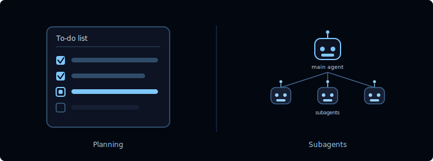
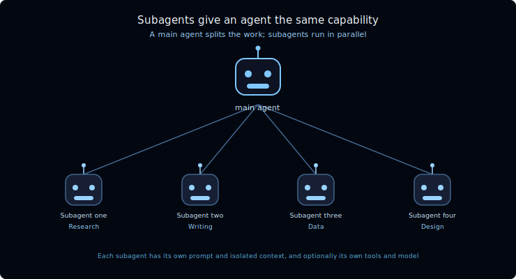
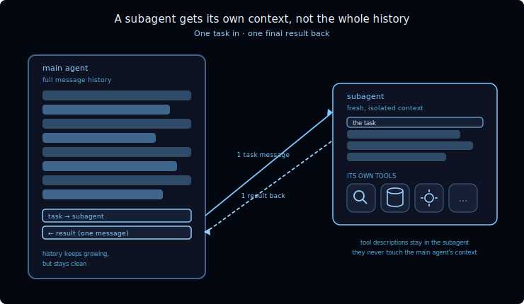
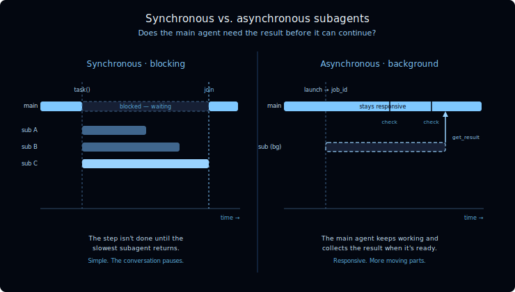

[🔗 For translation, open lesson in new tab and use Chrome translate](https://langchain-ai.github.io/lca-deepagents/m4/m4.1-delegation.html)

# Delegation

🎥 Video Walk-through [click to expand]

 

<Video src="TODO" />

The Deep Agents harness has two capabilities that let it complete long-running tasks: **planning** and **subagents**.

  

- **Planning** — LLMs have long been able to lay out complex, multi-step plans; the hard part is sticking to them. Deep Agents adds a to-do list that tracks tasks over time.
- **Subagents** — like people, agents can break a big task into smaller, more manageable chunks and hand each one to a subagent.

This lesson covers the idea behind both, and the next lesson is a hands-on lab where you build a subagent team. Before we look at how people tackle a big project, let's start with planning and the to-do list.

---

## Planning: the to-do list

A capable model can draft a solid plan for a multi-step job. The hard part is follow-through: as the conversation grows and the agent juggles tool calls and intermediate results, it tends to drift — losing track of what's already done and what's still left.

Deep Agents addresses this with a built-in **`write_todos`** tool. The agent writes its plan out as a structured to-do list and updates each item's status as it works:

- **`pending`** — not started yet
- **`in_progress`** — being worked on now
- **`completed`** — done

The list is saved in the agent's state, so it persists from one turn to the next. On a long task the agent always has an explicit, up-to-date plan to check against instead of trying to hold the whole thing in its head — the agent's version of writing the steps on a whiteboard and ticking them off as it goes.

---

## How people tackle a big project

When a project is too big for one person, we bring in a team.

<svg viewBox="0 0 740 394" width="640" role="img" aria-label="A supervisor figure at the top connected by lines to four worker figures below, each labeled with a different skill: Research, Writing, Data, Design. Hover a figure to see its role." xmlns="http://www.w3.org/2000/svg" font-family="'Inter', -apple-system, BlinkMacSystemFont, 'Segoe UI', sans-serif">
  <rect width="740" height="394" fill="#030710" rx="8"/>
  <text x="370" y="34" text-anchor="middle" font-size="15" font-weight="300" fill="#F2FAFF">How people tackle a big project</text>
  <text x="370" y="53" text-anchor="middle" font-size="11" fill="#99D3FF" font-family="'IBM Plex Mono', ui-monospace, SFMono-Regular, Menlo, Consolas, monospace">A supervisor splits the work; specialists run in parallel</text>
  <line x1="370" y1="170" x2="120" y2="246" stroke="#40668D" stroke-width="1.5"/>
  <line x1="370" y1="170" x2="287" y2="246" stroke="#40668D" stroke-width="1.5"/>
  <line x1="370" y1="170" x2="453" y2="246" stroke="#40668D" stroke-width="1.5"/>
  <line x1="370" y1="170" x2="620" y2="246" stroke="#40668D" stroke-width="1.5"/>
  <g style="cursor:pointer">
    <title>Splits the project into tasks and combines the results</title>
    <circle cx="370" cy="98" r="24" fill="#7FC8FF"/>
    <path d="M 332,170 C 332,134 348,126 370,126 C 392,126 408,134 408,170 Z" fill="#7FC8FF"/>
    <text x="370" y="192" text-anchor="middle" font-size="11" fill="#CCE9FF" font-family="'IBM Plex Mono', ui-monospace, SFMono-Regular, Menlo, Consolas, monospace">Supervisor</text>
  </g>
  <g style="cursor:pointer">
    <title>Finds the sources, facts, and background</title>
    <circle cx="120" cy="268" r="20" fill="#40668D"/>
    <path d="M 88,332 C 88,300 102,293 120,293 C 138,293 152,300 152,332 Z" fill="#40668D"/>
    <text x="120" y="356" text-anchor="middle" font-size="10" fill="#B2DEFF" font-family="'IBM Plex Mono', ui-monospace, SFMono-Regular, Menlo, Consolas, monospace">Research</text>
  </g>
  <g style="cursor:pointer">
    <title>Drafts and edits the copy</title>
    <circle cx="287" cy="268" r="20" fill="#40668D"/>
    <path d="M 255,332 C 255,300 269,293 287,293 C 305,293 319,300 319,332 Z" fill="#40668D"/>
    <text x="287" y="356" text-anchor="middle" font-size="10" fill="#B2DEFF" font-family="'IBM Plex Mono', ui-monospace, SFMono-Regular, Menlo, Consolas, monospace">Writing</text>
  </g>
  <g style="cursor:pointer">
    <title>Pulls the numbers and runs the analysis</title>
    <circle cx="453" cy="268" r="20" fill="#40668D"/>
    <path d="M 421,332 C 421,300 435,293 453,293 C 471,293 485,300 485,332 Z" fill="#40668D"/>
    <text x="453" y="356" text-anchor="middle" font-size="10" fill="#B2DEFF" font-family="'IBM Plex Mono', ui-monospace, SFMono-Regular, Menlo, Consolas, monospace">Data</text>
  </g>
  <g style="cursor:pointer">
    <title>Handles the layout and visuals</title>
    <circle cx="620" cy="268" r="20" fill="#40668D"/>
    <path d="M 588,332 C 588,300 602,293 620,293 C 638,293 652,300 652,332 Z" fill="#40668D"/>
    <text x="620" y="356" text-anchor="middle" font-size="10" fill="#B2DEFF" font-family="'IBM Plex Mono', ui-monospace, SFMono-Regular, Menlo, Consolas, monospace">Design</text>
  </g>
  <text x="370" y="380" text-anchor="middle" font-size="9" fill="#5BADDF" font-family="'IBM Plex Mono', ui-monospace, SFMono-Regular, Menlo, Consolas, monospace">Hover over a teammate to see their role</text>
</svg>

A few things make this work:

- **A supervisor splits the work and pulls it back together.** They break the project into subtasks, hand each one out, and combine what comes back.
- **Each person brings their own expertise.** A researcher, a writer, and a designer each see the problem differently and carry their own tools.
- **People work in parallel.** Three people working at once finish in roughly a third of the time.
- **Each person focuses on their piece, not the whole project.** The writer doesn't need to hold the entire plan in their head — just their assignment.

---

## Subagents give an agent the same capability

A **subagent** is an agent the main agent can call to do a focused task and report back. The same four properties carry straight over.

  

- **The main agent splits work and aggregates results.** Say the job is *"write a newsletter summarizing this week's news on a topic."* The main agent can hand each sub-topic to a different subagent. Each one searches, summarizes what it finds, and passes back only the summary — which the main agent stitches into the final newsletter.
- **Each subagent is a full agent in its own right.** It can have its own system prompt, its own skills, its own tools, and it can even run on a different model than the main agent.
- **Subagents run in parallel.** In Deep Agents, a subagent is invoked like a tool, so the main agent can fire off as many as it needs at the same time.
- **Each subagent focuses on its own task — and its own context.** This is the part that makes subagents a context-engineering tool, and it's worth slowing down on.

> **Subagent-as-tool.** Deep Agents exposes subagents through a built-in `task` tool. To the main agent, delegating looks just like calling any other tool: it calls `task` with an assignment and gets a result back — picking which subagent to use from each one's description, the same way it decides to call any other tool.

---

## Context isolation

  

This is what makes subagents a context-engineering tool. A subagent does its work without cluttering the main agent's context:

- A subagent receives **one message** from the main agent describing its task. Importantly, it does **not** inherit the main agent's message history.
- It runs autonomously until the task is done, then returns **one message** back — its final result. Subagents are stateless: they can't carry on a back-and-forth with the main agent.
- A subagent defines **its own tool set**. Consider a database expert with dozens of specialized tools. Putting those behind a subagent keeps every one of those tool descriptions *out* of the main agent's context. All the main agent has to know is "this needs database expertise" — it hands off the task and gets back an answer.

The payoff: a large, messy subtask gets compressed into a single clean result — as long as the subagent is told to return a concise summary. The main agent's context stays focused on coordination, even as the work piles up behind the scenes.

---

## Synchronous vs. asynchronous

Subagents can run in two modes. The choice comes down to one question: **does the main agent need the result before it can keep going?**

  

- **Synchronous** subagents complete their task within the step. The main agent blocks — the step isn't finished until the longest-running subagent returns. It's the simplest model, but the conversation pauses while the work happens.
- **Asynchronous** subagents run in the background. The main agent launches the job, stays responsive, and checks on it later, collecting the result once it's ready. It's more responsive but has more moving parts.

We'll work with synchronous subagents in the next lesson and come back to asynchronous ones later.

---

## When to reach for a subagent

<Tip>

**Use a subagent when:**
- A multi-step task would otherwise clutter the main agent's context
- The work needs a specialized domain — custom instructions or its own tools
- A subtask is better served by a different model
- You want the main agent to stay focused on high-level coordination

**Skip the subagent when:**
- The task is simple and single-step — the overhead isn't worth it
- You need to keep the intermediate context, not just the final result

</Tip>

---

## Recap

In this lesson you learned what delegation is and why it matters:

- **Delegation lets the main agent split a big job into pieces, run them in parallel, and stay focused on coordination** — the same way a supervisor works with a team.
- It has **two parts**: the **`write_todos`** planning tool for tracking multi-step work, and **subagents** for executing isolated subtasks.
- A subagent is **a full agent in its own right** — always its own prompt and isolated context, and optionally its own tools and model — invoked through the built-in **`task`** tool.
- Subagents are a **context-engineering** tool: at the hand-off boundary, a subagent gets **one task in** and returns **one final result back** (internally it may take many steps), keeping its work and its tool descriptions out of the main agent's context.
- Subagents run **synchronously** (the main agent blocks until they finish) or **asynchronously** (they run in the background while the main agent stays responsive).

## Check your understanding

<MCQ
    question="What is the job of the Deep Agents planning tool (write_todos)?"
    choices='["It keeps a structured to-do list and tracks each task’s status (pending → in progress → completed) as the agent works", "It runs the tasks in parallel across several models", "It deletes old messages once the context window is full", "It writes the final answer to a file"]'
    correctIndex={0}
    explanation="The planning tool maintains a structured to-do list, persisted in the agent’s state, so the agent has an explicit plan to track against on a long, multi-step job."
/>

<MCQ
    question="How does a main agent hand work to a subagent in Deep Agents?"
    choices='["By editing the subagent’s source code at runtime", "By forwarding its entire message history to the subagent", "Subagents cannot be invoked; they run automatically every turn", "Through a built-in task tool — it calls the subagent like any other tool, and can fire off several at once"]'
    correctIndex={3}
    explanation="Subagents use the subagent-as-tool model: the main agent calls the built-in task tool with an assignment. Because it is just a tool call, the main agent can invoke several subagents in parallel."
/>

<MCQ
    question="When the main agent delegates to a subagent, what does the subagent receive and return at the hand-off boundary?"
    choices='["The main agent’s full message history; it returns the updated history", "It shares the main agent’s context directly, so nothing is passed", "One task in; it returns one final result back", "A task in; it returns its entire internal context"]'
    correctIndex={2}
    explanation="A subagent runs in an isolated context. It receives one task — not the main agent’s history — and returns one final result. Internally it may take many steps, but only the result crosses the boundary, keeping the subagent’s work and tools out of the main agent’s context."
/>

<MCQ
    question="What is the difference between a synchronous and an asynchronous subagent?"
    choices='["Synchronous ones run in the background; asynchronous ones block the main agent", "A synchronous subagent blocks the main agent until it finishes; an asynchronous one runs in the background while the main agent stays responsive", "Synchronous subagents can use tools; asynchronous ones cannot", "There is no difference; the terms are interchangeable"]'
    correctIndex={1}
    explanation="A synchronous subagent blocks the main agent until it returns. An asynchronous subagent runs as a background job so the main agent stays responsive and collects the result later."
/>

## Next

In the next lesson you'll build a subagent team in a hands-on lab: a main agent that fans out parallel searches to subagents and synthesizes their results into a weekly newsletter.

---

## References

**Documentation:**
- [Delegation (Deep Agents harness)](https://docs.langchain.com/oss/python/deepagents/harness#delegation)
- [Subagents (Deep Agents)](https://docs.langchain.com/oss/python/deepagents/subagents)
- [Async subagents (Deep Agents)](https://docs.langchain.com/oss/python/deepagents/async-subagents)
- [Context engineering (Deep Agents)](https://docs.langchain.com/oss/python/deepagents/context-engineering)
