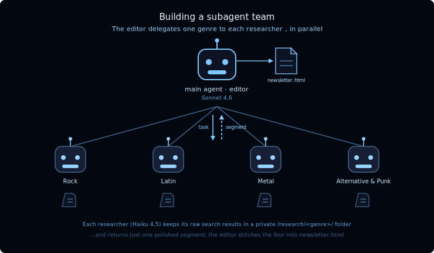
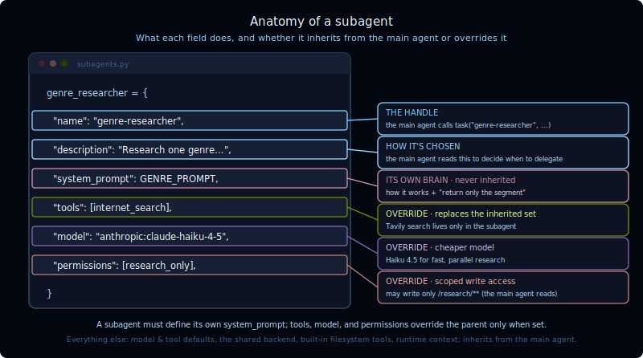

[For translation, open lesson in new tab and use Chrome translate](https://langchain-ai.github.io/lca-deepagents/m4/m4.2-building-a-subagent-team.html)

<style>@import url('../shared/sd-components.css');</style>
<script src="../shared/sd-components.js"></script>

<div class="page-lang-switch" data-page-lang-switch>
  <button class="page-lang-btn" data-page-lang="python" aria-selected="false">Python</button>
  <button class="page-lang-btn" data-page-lang="typescript" aria-selected="false">TypeScript</button>
</div>

# Building a Subagent Team

<style>
.lt-bar {
  display: flex;
  flex-wrap: wrap;
  gap: 20px;
  margin: 28px 0 0;
  border-bottom: 2px solid #CCE9FF;
}
.lt-group { display: flex; gap: 3px; }
.lt-quiz  { --c: #7C3AED; }
.lt-wrap  { --c: #B45309; }
.lt-sub   { --c: #EA580C; }
.lt-homework { --c: #0E9F6E; }
.lt-tab {
  font: 500 14px 'IBM Plex Mono', monospace;
  padding: 9px 14px;
  border: none;
  background: transparent;
  color: #40668D;
  cursor: pointer;
  border-bottom: 3px solid transparent;
  margin-bottom: -2px;
  border-radius: 6px 6px 0 0;
  transition: background .15s, color .15s, border-color .15s;
  white-space: nowrap;
}
.lt-tab:hover { background: #F2FAFF; color: #030710; }
.lt-tab.active {
  color: var(--c);
  border-bottom-color: var(--c);
  background: #fff;
}
.lt-panel { display: none; padding-top: 24px; }
.lt-panel.active { display: block; }
@media (max-width: 600px) {
  .lt-bar { flex-wrap: nowrap; overflow-x: auto; gap: 12px; }
  .lt-tab { padding: 8px 10px; font-size: 13px; }
}
</style>

<div class="lt-bar" role="tablist" aria-label="Lesson sections">
  <div class="lt-group lt-sub">
    <button class="lt-tab active" data-p="sub" role="tab" aria-selected="true">Subagent Team</button>
  </div>
  <div class="lt-group lt-wrap">
    <button class="lt-tab" data-p="lab" role="tab" aria-selected="false">Lab</button>
  </div>
  <div class="lt-group lt-quiz">
    <button class="lt-tab" data-p="quiz" role="tab" aria-selected="false">Quiz</button>
  </div>
  <div class="lt-group lt-homework">
    <button class="lt-tab" data-p="homework" role="tab" aria-selected="false">Homework</button>
  </div>
</div>

<div class="lt-panel active" id="p-sub" markdown="1" role="tabpanel">

<details style="border:2.5px solid #000;border-radius:6px;background:#fff;margin:1rem 0;"><summary style="padding:10px 16px;cursor:pointer;font-weight:500;font-family:'IBM Plex Mono',monospace;font-size:14px;">Video walkthrough</summary><div style="padding:12px 16px 16px;"><div class="video-container" style="max-width:750px;"><div class="video-wrapper"><iframe src="https://share.descript.com/embed/tb4KN6yzwik" frameborder="0" allow="autoplay; fullscreen; encrypted-media; picture-in-picture" allowfullscreen></iframe></div></div></div></details>

In the previous lesson you learned about **delegation**, splitting a big job into pieces, handing each to a subagent, and stitching the results back together. In this lesson you'll build it: an **editorial agent** that puts out a weekly music newsletter for an online distributor.

<p align="center">
  / file folder; the editor assembles a newsletter.html file." width="720">
</p>

The main agent is the **editor**. It knows the distributor's top four genres (**Rock, Latin, Metal, and Alternative & Punk**) and kicks off a research subagent for each one, all at once. Each researcher goes off and looks up what's new in its genre, then hands back a short, polished segment. The editor collects the four segments, assembles them into one newsletter, and renders it as a styled HTML page.

This is a hands-on tour of the subagent model: how a subagent gets its task, what it inherits from the main agent and what it overrides, how it keeps messy research out of the editor's context, and how a state-backed agent filesystem hands a finished file back to your code.

<div style="background:#EEF6FF;border:1px solid #B8DEFF;border-radius:8px;padding:16px 20px;margin:1rem 0;" markdown="1">

**The flow is:**

1. The user asks for this week's newsletter
2. The editor calls the `task` tool once per genre
3. Each researcher searches the web, writes raw notes to `/research/<genre>/sources.md`, and returns one polished segment
4. The editor assembles the returned segments into Markdown
5. The editor calls `markdown_to_html`
6. The editor writes `/output/newsletter.html`

</div>

---

## One subagent type, four assignments

Notice there's only **one kind** of researcher. We don't write a separate Rock subagent and a separate Metal subagent, because they'd all do the same thing. Instead we define a single **`genre-researcher`** subagent type and the editor delegates to it four times, once per genre. The genre is just the task it's handed.

<div data-lang="python" markdown="1">

A subagent is defined as a plain dictionary. Here's the research subagent, with each field's anatomy called out below.

</div>

<div data-lang="typescript" markdown="1">

A subagent is defined as a plain object. Here's the research subagent, with each field's anatomy called out below.

</div>

<p align="center">
  
</p>

<div data-lang="python" markdown="1">

```python
# python/m4/m4_2_newsletter_agent.py
GENRE_PROMPT = """You are a music journalist researching one genre for an
online music distributor's weekly newsletter.

You will be given a single genre and an assigned research folder to work in.

How to work:
1. Use internet_search to find recent, noteworthy developments in that genre.
   Run a few searches.
2. Save the COMPLETE, verbatim output of ALL your searches to a single file:
   write_file("/research/<genre>/sources.md", ...). Paste it exactly as the
   tool returned it - do NOT summarize or trim. This raw archive stays here so
   it never clutters the editor's context.
3. Only then, from what you found, write one tight newsletter segment.

Return ONLY the finished segment as your reply:
- A markdown section: a "## <Genre>" heading followed by ~120-180 words.
- Lively but factual newsletter tone; name specific artists and releases.
- Do NOT paste raw search results into your reply: those live in your files."""

genre_researcher = {
    "name": "genre-researcher",
    "description": (
        "Research one music genre and write a short newsletter segment about "
        "what's new in it. Delegate one genre per call."
    ),
    "system_prompt": GENRE_PROMPT,         # its own brain - never inherited
    "tools": [internet_search],            # override - replaces the inherited set
    "model": model,                        # override - the cheaper Haiku 4.5
    "permissions": research_permissions,   # override - scoped write access
}
```

One subtlety the diagram doesn't capture: since `tools` *replaces* the inherited set, listing only `[internet_search]` would seem to leave the researcher unable to write files. But the built-in filesystem tools (`write_file`, `read_file`, and friends) are always provided by the harness and survive the override, which is why the researcher can still save its notes.

</div>

<div data-lang="typescript" markdown="1">

```typescript
// typescript/m4/m4_2_newsletter_agent.ts
const GENRE_PROMPT = context`
  You are a music journalist researching one genre for an
  online music distributor's weekly newsletter.

  You will be given a single genre and an assigned research folder to work in.

  How to work:
  1. Use internet_search to find recent, noteworthy developments in that genre.
     Run a few searches.
  2. Save the COMPLETE, verbatim output of ALL your searches to a single file:
     write_file("/research/<genre>/sources.md", ...). Paste it exactly as the
     tool returned it - do NOT summarize or trim. This raw archive stays here so
     it never clutters the editor's context.
  3. Only then, from what you found, write one tight newsletter segment.

  Return ONLY the finished segment as your reply:
  - A markdown section: a "## <Genre>" heading followed by ~120-180 words.
  - Lively but factual newsletter tone; name specific artists and releases.
  - Do NOT paste raw search results into your reply: those live in your files.`;

const genreResearcher: SubAgent = {
  name: "genre-researcher",
  description: context`
    Research one music genre and write a short newsletter segment about
    what's new in it. Delegate one genre per call.`,
  systemPrompt: GENRE_PROMPT,        // its own brain - never inherited
  tools: [internetSearch],          // override - replaces the inherited set
  model,                            // override - the cheaper Haiku 4.5
  permissions: researchPermissions, // override - scoped write access
};
```

One subtlety the diagram doesn't capture: since `tools` *replaces* the inherited set, listing only `[internetSearch]` would seem to leave the researcher unable to write files. But the built-in filesystem tools (`write_file`, `read_file`, and friends) are always provided by the harness and survive the override, which is why the researcher can still save its notes.

</div>

---

## Research scratch files

Each researcher is assigned a dedicated folder named for its genre (`/research/Rock/`, `/research/Metal/`, and so on) as scratch space. This is a convention in the task prompt, not a separate private filesystem per researcher. The permission boundary is broader: researchers may write under `/research/**`, and the editor may read that area but is denied writes there.

We set that up with filesystem **permissions**:

<div data-lang="python" markdown="1">

```python
# python/m4/m4_2_newsletter_agent.py
# Researchers may write under /research/** and are denied writes elsewhere.
research_permissions = [
    FilesystemPermission(operations=["read", "write"], paths=["/research/**"], mode="allow"),
    FilesystemPermission(operations=["write"], paths=["/**"], mode="deny"),
]

# The editor may read the research area, but must not write into it.
editor_permissions = [
    FilesystemPermission(operations=["write"], paths=["/research/**"], mode="deny"),
]
```

</div>

<div data-lang="typescript" markdown="1">

```typescript
// typescript/m4/m4_2_newsletter_agent.ts
// Researchers may write under /research/** and are denied writes elsewhere.
const researchPermissions: FilesystemPermission[] = [
  { operations: ["read", "write"], paths: ["/research/**"], mode: "allow" },
  { operations: ["write"], paths: ["/**"], mode: "deny" },
];

// The editor may read the research area, but must not write into it.
const editorPermissions: FilesystemPermission[] = [
  { operations: ["write"], paths: ["/research/**"], mode: "deny" },
];
```

</div>

Permissions are first-match-wins, so a researcher's specific `allow` for writes under `/research/**` beats the broad write `deny`. The editor's read-only access is enforced by denying writes to `/research/**`.

---

## The editor

The editor is a normal Deep Agent. It gets the stronger model, a single tool (`markdown_to_html`, which the researchers don't have), and the `genre-researcher` subagent.

<div data-lang="python" markdown="1">

```python
# python/m4/m4_2_newsletter_agent.py
EDITOR_PROMPT = f"""You are the editor of an online music distributor's weekly
newsletter. This week you are featuring the distributor's top genres:
{", ".join(TOP_GENRES)}.

Your job:
1. For EACH genre, delegate to the genre-researcher subagent using the task
   tool - fire them off in parallel. Tell each one which genre to cover and
   which assigned folder to use (/research/<genre>/), and ask for one segment.
2. Collect the four returned segments. Do NOT research genres yourself.
3. Assemble them into one Markdown newsletter: a top-level "# This Week in
   Music" title, a one-sentence intro, then the four "## <Genre>" sections.
4. Call markdown_to_html on the assembled Markdown, then write_file the
   returned HTML to /output/newsletter.html."""

# The editor gets the stronger shared model; the researcher overrode to the
# cheaper `model` (Haiku 4.5) above. Both are defined in python/models.py.
agent = create_deep_agent(
    model=strong_model,
    tools=[markdown_to_html],
    system_prompt=EDITOR_PROMPT,
    subagents=[genre_researcher],
    permissions=editor_permissions,
)
```

Because a subagent is invoked like a tool, the editor can call the `task` tool four times in a single step, with calls shaped like `task(subagent_type="genre-researcher", description="Research Rock using /research/Rock/ ...")`. All four researchers run **in parallel**, and the editor blocks until the slowest one returns. These are **synchronous** subagents, from the previous lesson.

The `markdown_to_html` tool is pure Python. It drops the assembled Markdown into a fixed, styled HTML template and returns the page as a string:

```python
# python/m4/m4_2_newsletter_agent.py
@tool
def markdown_to_html(markdown_text: str, title: str = "This Week in Music") -> str:
    """Convert a Markdown newsletter into a complete, styled HTML page.
    Returns the full HTML document as a string."""
    body = md.markdown(markdown_text, extensions=["tables", "fenced_code"])
    # Good practice: the newsletter text is derived from untrusted web search,
    # so allowlist-sanitize it (strips <script>, onerror=, etc.) before it goes
    # into the page. We clean only the body; the template itself is trusted.
    body = nh3.clean(body)
    return _HTML_TEMPLATE.format(title=title, body=body)
```

</div>

<div data-lang="typescript" markdown="1">

```typescript
// typescript/m4/m4_2_newsletter_agent.ts
const EDITOR_PROMPT = context`
  You are the editor of an online music distributor's weekly
  newsletter. This week you are featuring the distributor's top genres:
  ${TOP_GENRES.join(", ")}.

  Your job:
  1. For EACH genre, delegate to the genre-researcher subagent using the task
     tool - fire them off in parallel. Tell each one which genre to cover and
     which assigned folder to use (/research/<genre>/), and ask for one segment.
  2. Collect the four returned segments. Do NOT research genres yourself.
  3. Assemble them into one Markdown newsletter: a top-level "# This Week in
     Music" title, a one-sentence intro, then the four "## <Genre>" sections.
  4. Call markdown_to_html on the assembled Markdown, then write_file the
     returned HTML to /output/newsletter.html.`;

// The editor gets the stronger shared model; the researcher overrode to the
// cheaper `model` (Haiku 4.5) above. Both are defined in typescript/models.ts.
export const agent = createDeepAgent({
  model: strongModel,
  tools: [markdownToHtml],
  systemPrompt: EDITOR_PROMPT,
  subagents: [genreResearcher],
  permissions: editorPermissions,
});
```

Because a subagent is invoked like a tool, the editor can call the `task` tool four times in a single step, with calls shaped like `task({ subagentType: "genre-researcher", description: "Research Rock using /research/Rock/ ..." })`. All four researchers run **in parallel**, and the editor blocks until the slowest one returns. These are **synchronous** subagents, from the previous lesson.

The `markdown_to_html` tool is a plain TypeScript function. It drops the assembled Markdown into a fixed, styled HTML template and returns the page as a string:

```typescript
// typescript/m4/m4_2_newsletter_agent.ts
const markdownToHtml = tool(
  async ({ markdownText, title }: { markdownText: string; title: string }) => {
    let body = (await marked.parse(markdownText)) as string;
    // Good practice: the newsletter text is derived from untrusted web search,
    // so allowlist-sanitize it (strips <script>, onerror=, etc.) before it goes
    // into the page. We clean only the body; the template itself is trusted.
    body = sanitizeHtml(body);
    return HTML_TEMPLATE(title, body);
  },
  {
    name: "markdown_to_html",
    description: context`
      Convert a Markdown newsletter into a complete, styled HTML page.
      Returns the full HTML document as a string.`,
    schema: z.object({
      markdownText: z.string(),
      title: z.string().default("This Week in Music"),
    }),
  }
);
```

</div>

---

> To run the newsletter agent, select the **Lab** tab at the top of this lesson.

---

## A note on the general-purpose subagent

You defined one subagent type. But every Deep Agent also ships with a built-in **`general-purpose`** subagent for free. It has the *same tools and model as the main agent* and a generic prompt. It's the agent's escape hatch: when a task doesn't match any subagent you defined, the main agent can still delegate it to `general-purpose` to get context isolation, rather than doing the work inline.

It's the one subagent that also inherits the main agent's **skills**. You won't call it explicitly in this lab, but it's worth knowing it's always there.

---

## Recap

In this lesson you built a working subagent team:

- **One subagent type, many assignments.** A single `genre-researcher` is delegated to once per genre. The genre is just the task it's handed.
- **Subagents inherit by default and override by exception.** Setting `tools`, `model`, or `permissions` **replaces** the inherited value rather than extending it. <span data-lang="python"><code>system_prompt</code></span><span data-lang="typescript"><code>systemPrompt</code></span> is the one field you must always provide.
- **Task in, result out.** A subagent receives one task message and returns one result message. The editor never sees a researcher's conversation, only its final segment.
- **Private files for raw work.** Each researcher stashes its raw search results in its own `/research/<genre>/` folder and reads them back while drafting; **permissions** scope a researcher to its scratch space and give the editor read-only access there.
- **State-backed by default.** On the default `StateBackend`, the agent writes to agent state, not your disk. Trusted host code reads the finished file out of <span data-lang="python"><code>result["files"]</code></span><span data-lang="typescript"><code>result.files</code></span>.
- Every agent also has a built-in **`general-purpose`** subagent as a fallback.

---

## References

<div data-lang="python" markdown="1">

**Documentation:**
- [Subagents (Deep Agents)](https://docs.langchain.com/oss/python/deepagents/subagents)
- [Context engineering (Deep Agents)](https://docs.langchain.com/oss/python/deepagents/context-engineering)
- [Filesystem & backends (Deep Agents)](https://docs.langchain.com/oss/python/deepagents/backends)
- [Tavily Search API](https://docs.tavily.com/)

</div>

<div data-lang="typescript" markdown="1">

**Documentation:**
- [Subagents (Deep Agents)](https://docs.langchain.com/oss/javascript/deepagents/subagents)
- [Context engineering (Deep Agents)](https://docs.langchain.com/oss/javascript/deepagents/context-engineering)
- [Filesystem & backends (Deep Agents)](https://docs.langchain.com/oss/javascript/deepagents/backends)
- [Tavily Search API](https://docs.tavily.com/)

</div>

**Blog:**
- [Running subagents in the background](https://www.langchain.com/blog/running-subagents-in-the-background)
- [How to use RLMs in Deep Agents](https://www.langchain.com/blog/how-to-use-rlms-in-deep-agents)

</div>

<div class="lt-panel" id="p-lab" markdown="1" role="tabpanel">

## Lab: Newsletter Agent

<Tip>

<details style="border:2.5px solid #000;border-radius:6px;background:#fff;margin:1rem 0;"><summary style="padding:10px 16px;cursor:pointer;font-weight:500;font-family:'IBM Plex Mono',monospace;font-size:14px;">Lab Video Walkthrough</summary><div style="padding:12px 16px 16px;"><div class="video-container" style="max-width:750px;"><div class="video-wrapper"><iframe src="https://share.descript.com/embed/zap33EjlmGc" frameborder="0" allow="autoplay; fullscreen; encrypted-media; picture-in-picture" allowfullscreen></iframe></div></div></div></details>

**[View this run here in LangSmith.](https://smith.langchain.com/public/7538b879-15ca-494d-9261-21c865057da6/r/019f2012-badc-7463-8fc9-232b7228dc30)** Notice the editor launching four researcher subagents in parallel, then assembling their segments into the final newsletter.

<details style="border:2.5px solid #000;border-radius:6px;background:#E5F4FF;margin:1rem 0;"><summary style="padding:10px 16px;cursor:pointer;font-weight:500;font-family:'IBM Plex Mono',monospace;font-size:14px;">LangSmith Walkthrough</summary><div style="padding:12px 16px 16px;"><div class="video-container" style="max-width:750px;"><div class="video-wrapper"><iframe src="https://share.descript.com/embed/hzhz5WzjQPC" frameborder="0" allow="autoplay; fullscreen; encrypted-media; picture-in-picture" allowfullscreen></iframe></div></div></div></details>

</Tip>

Before running it, make sure your model API key and `TAVILY_API_KEY` are available in the <span data-lang="python">Python</span><span data-lang="typescript">TypeScript</span> environment. This lab launches four web researchers in parallel, so web results may vary and the run may consume multiple Tavily/API calls.

<div data-lang="python" markdown="1">

From the repo root:

```bash
cd python
uv run python m4/m4.2_run_newsletter.py
```

</div>

<div data-lang="typescript" markdown="1">

From the repo root:

```bash
cd typescript
pnpm tsx m4/m4.2_run_newsletter.ts
```

</div>

Watch the editor fire off four researchers, then assemble their segments. When it finishes, open <span data-lang="python"><code>python/m4/output/newsletter.html</code></span><span data-lang="typescript"><code>typescript/m4/output/newsletter.html</code></span> in your browser to read this week's issue.

Everything the agent produced is stored in the default `StateBackend`, so the script mirrors it out of agent state and onto disk under <span data-lang="python"><code>python/m4/output/</code></span><span data-lang="typescript"><code>typescript/m4/output/</code></span>. The finished newsletter sits alongside each researcher's raw `/research/<genre>/` archive:

```text
Writing agent files to disk:
  /output/newsletter.html                  ->  newsletter.html                          (6,422 chars)
  /research/Alternative & Punk/sources.md  ->  research/Alternative & Punk/sources.md   (18,867 chars)
  /research/Latin/sources.md               ->  research/Latin/sources.md                (25,353 chars)
  /research/Metal/sources.md               ->  research/Metal/sources.md                (28,213 chars)
  /research/Rock/sources.md                ->  research/Rock/sources.md                 (29,258 chars)
```

Open one of those `sources.md` files and you'll see the point: tens of kilobytes of raw, link-heavy search results. None of that crossed back to the editor. Only each researcher's tight ~150-word segment did. That's the context quarantine: the bulky, untrusted material stays isolated in the research area while the editor's context stays clean.

<Tip>

**[View this run here in LangSmith.](https://smith.langchain.com/public/ecaa227f-3971-4096-a8ff-7626cb2adb7d/r)** Notice the use of the `write_todos` tool and the parallel subagent calls.

</Tip>

**Sample output** — the newsletter produced by the trace above:

<iframe src="images/newsletter-sample.html" width="100%" height="560" style="border:1px solid #CCE9FF; border-radius:6px; margin-top:8px;" title="Sample newsletter output"></iframe>

</div>

<div class="lt-panel" id="p-homework" markdown="1" role="tabpanel">

<div data-lang="python" markdown="1">

## Build Your Own Subagent Team

<div style="border:2px solid #D32F2F;border-radius:6px;background:#FDECEA;padding:12px 16px;margin:1rem 0;">

**If you started this course before July 27, 2026:** this homework assignment is new. Pull the latest changes from the repo root to access it:

```bash
git pull
```

</div>

The lab built one "editor" main agent that delegated to a single `genre-researcher` subagent type, once per music genre. This homework asks you to build your own small team of 2-3 subagent types for a domain of your choosing (not a newsletter, not music genres).

Open `python/m4/m4.2_homework.py`.

1. **TODO 1**: define 2-3 subagent dicts (`name`, `description`, `system_prompt`, and optionally `model`) for your own domain.
2. **TODO 2**: write the main agent's system prompt, telling it which subagent to call for which part of the job, and a user request that should trigger delegation to more than one of your subagents.

### Run it

```bash
cd python
uv run ./m4/m4.2_homework.py
```

Stuck, or want to see the finished shape before you start? `m4.2_homework_filled.py` is a reference copy with every TODO filled in (using a fitness-coaching team of a workout planner, a nutrition advisor, and a recovery coach); run it the same way to see what "done" looks like end to end.

Try to avoid peeking unless you're really stuck, you'll get more out of this by working through the TODOs yourself first.

</div>

<div data-lang="typescript" markdown="1">

## Build Your Own Subagent Team

<div style="border:2px solid #D32F2F;border-radius:6px;background:#FDECEA;padding:12px 16px;margin:1rem 0;">

**If you started this course before July 27, 2026:** this homework assignment is new. Pull the latest changes from the repo root to access it:

```bash
git pull
```

</div>

The lab built one "editor" main agent that delegated to a single `genre-researcher` subagent type, once per music genre. This homework asks you to build your own small team of 2-3 subagent types for a domain of your choosing (not a newsletter, not music genres).

Open `typescript/m4/m4.2_homework.ts`.

1. **TODO 1**: define 2-3 `SubAgent` objects (`name`, `description`, `systemPrompt`, and optionally `model`) for your own domain.
2. **TODO 2**: write the main agent's system prompt, telling it which subagent to call for which part of the job, and a user request that should trigger delegation to more than one of your subagents.

### Run it

```bash
cd typescript
pnpm tsx ./m4/m4.2_homework.ts
```

Stuck, or want to see the finished shape before you start? `m4.2_homework_filled.ts` is a reference copy with every TODO filled in (using a fitness-coaching team of a workout planner, a nutrition advisor, and a recovery coach); run it the same way to see what "done" looks like end to end.

Try to avoid peeking unless you're really stuck, you'll get more out of this by working through the TODOs yourself first.

</div>

</div>

<div class="lt-panel" id="p-quiz" role="tabpanel">

<h2>Check your understanding</h2>

<MCQ
    question="In this lab, why is there a single genre-researcher subagent type instead of four separate ones?"
    choices='["Deep Agents only allows one subagent type per main agent", "All four researchers do the same job; the genre is just the task each one is handed", "Separate subagents cannot run in parallel", "It is the only way to share a filesystem between them"]'
    correctIndex={1}
    explanation="The four researchers are identical in behavior; only their assignment differs. So we define one genre-researcher type and the editor delegates to it once per genre, passing the genre as the task."
/>

<div data-lang="python">
<MCQ
    question="You set tools=[internet_search] on the genre-researcher. What does the subagent end up with?"
    choices='["internet_search added on top of all the main agent’s tools", "Every tool except internet_search", "Only internet_search (plus the always-available built-in filesystem tools); the inherited set is replaced", "No tools at all, because tools cannot be set on a subagent"]'
    correctIndex={2}
    explanation="Setting tools replaces the inherited set rather than adding to it, so the researcher gets internet_search only. The built-in filesystem tools (write_file, read_file, …) are always provided by the harness, which is why it can still write its notes."
/>
</div>

<div data-lang="typescript">
<MCQ
    question="You set tools: [internetSearch] on the genre-researcher. What does the subagent end up with?"
    choices='["internetSearch added on top of all the main agent’s tools", "Every tool except internetSearch", "Only internetSearch (plus the always-available built-in filesystem tools); the inherited set is replaced", "No tools at all, because tools cannot be set on a subagent"]'
    correctIndex={2}
    explanation="Setting tools replaces the inherited set rather than adding to it, so the researcher gets internetSearch only. The built-in filesystem tools (write_file, read_file, …) are always provided by the harness, which is why it can still write its notes."
/>
</div>

<MCQ
    question="The researchers save bulky raw search results to /research/&lt;genre&gt;/ but return only a short segment. Why return just the segment?"
    choices='["Files are the only way a subagent can return data to the main agent", "Returning only the distilled segment keeps the raw research out of the editor’s context; the file is just scratch space the researcher reads while drafting", "Because messages cannot contain more than a few words", "So the editor can rewrite the researchers’ notes before publishing"]'
    correctIndex={1}
    explanation="A subagent returns one message to the editor. Returning only the polished segment (not the bulky raw results) keeps the editor's context clean. The scratch file is simply where the researcher keeps the material it needs while drafting."
/>

<MCQ
    question="The agent runs on the default StateBackend and calls write_file('/output/newsletter.html', …). How does the file end up on your disk?"
    choices='["StateBackend writes directly to your local filesystem", "It doesn’t; the file is only ever in the agent’s chat history", "The agent requests OS permission to write to disk", "It doesn’t write to disk itself; host code reads the saved file from agent state after invoke and writes it out"]'
    correctIndex={3}
    explanation="StateBackend is an ephemeral, in-state filesystem. The agent has no real disk access. After invoke returns, trusted host code reads the file from result['files'] and writes it to disk."
/>

</div>

<script>
(function () {
  var tabs = document.querySelectorAll('.lt-tab');
  function show(p) {
    tabs.forEach(function (t) {
      var on = t.getAttribute('data-p') === p;
      t.classList.toggle('active', on);
      t.setAttribute('aria-selected', on ? 'true' : 'false');
    });
    document.querySelectorAll('.lt-panel').forEach(function (panel) {
      panel.classList.toggle('active', panel.id === 'p-' + p);
    });
  }
  tabs.forEach(function (t) {
    t.addEventListener('click', function () { show(t.getAttribute('data-p')); });
  });
})();
</script>
